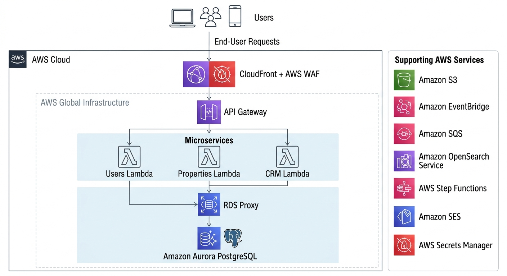
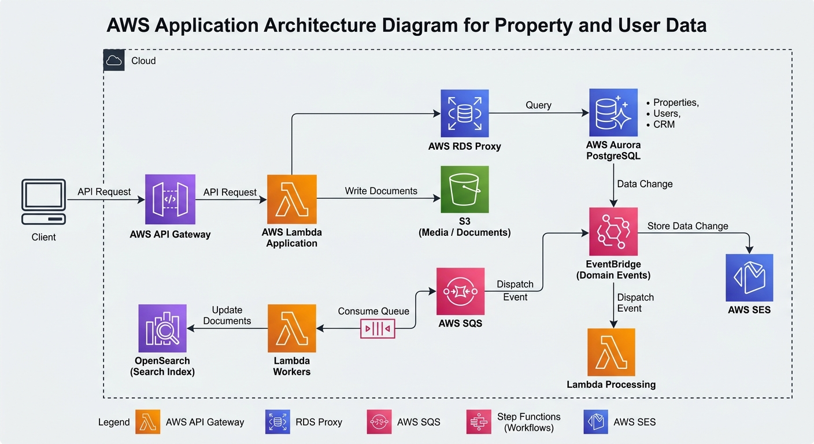
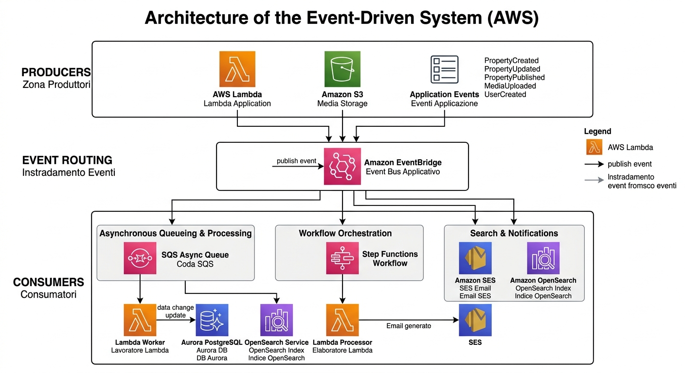
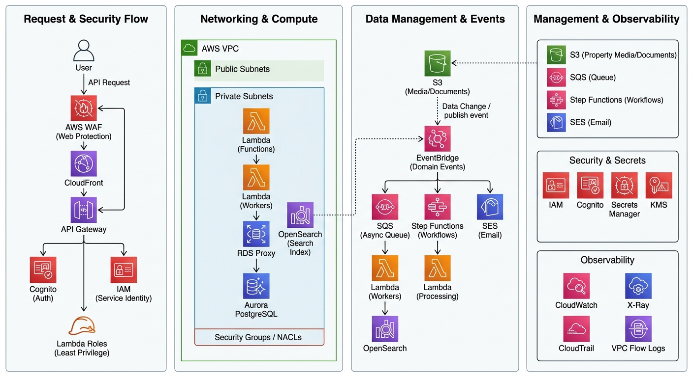

# Architettura

Questa sezione descrive l'architettura della piattaforma di gestione immobiliare e le principali scelte architetturali.

L'obiettivo è definire in modo chiaro:

* i principali componenti del sistema;
* i servizi AWS utilizzati;
* l'architettura di rete;
* la gestione dei dati;
* i flussi event-driven;
* gli aspetti di sicurezza;
* le relazioni tra i diversi componenti dell'infrastruttura.

## Diagrammi dell'architettura

### Architettura di alto livello

Panoramica dei principali componenti del sistema e delle loro relazioni.

### Architettura AWS

Vista dettagliata dei servizi AWS che compongono la piattaforma.

### Architettura di rete

VPC, subnet, confini di rete e risorse private.

### Flusso dei dati

Principali flussi dei dati tra API, Lambda, database, storage e motore di ricerca.

### Architettura Event-Driven

Routing degli eventi e gestione delle elaborazioni asincrone tramite EventBridge, SQS e Step Functions.

### Architettura di sicurezza

Gestione delle identità, controllo degli accessi, sicurezza di rete, crittografia, gestione dei segreti e audit.

## Componenti principali

### Frontend e accesso

* **Next.js** — applicazione frontend.
* **CloudFront** — distribuzione dei contenuti e CDN.
* **AWS WAF** — protezione del traffico HTTP/HTTPS.
* **Amazon Cognito** — autenticazione e gestione degli utenti.

### API e compute

* **API Gateway** — esposizione delle API.
* **AWS Lambda** — esecuzione della logica applicativa.
* **RDS Proxy** — gestione delle connessioni verso il database.

### Database e storage

* **Amazon Aurora PostgreSQL** — database relazionale principale.
* **Amazon S3** — archiviazione di immagini, documenti e altri file.
* **Amazon OpenSearch** — ricerca e indicizzazione dei dati.

### Eventi e processi asincroni

* **Amazon EventBridge** — gestione e routing degli eventi applicativi.
* **Amazon SQS** — code per l'elaborazione asincrona.
* **AWS Step Functions** — orchestrazione dei workflow.
* **Amazon SES** — invio delle comunicazioni email.

### Sicurezza e gestione dei segreti

* **AWS IAM** — gestione delle identità e delle autorizzazioni AWS.
* **AWS Secrets Manager** — gestione centralizzata dei segreti.
* **AWS KMS** — gestione delle chiavi di crittografia.

### Osservabilità e audit

* **Amazon CloudWatch** — log, metriche, dashboard e allarmi.
* **AWS X-Ray** — tracing delle richieste.
* **AWS CloudTrail** — audit delle operazioni effettuate sulle risorse AWS.
* **VPC Flow Logs** — monitoraggio del traffico di rete.

## Documentazione

La documentazione dell'architettura è suddivisa nei seguenti documenti:

* [Architettura di alto livello](./high-level.md)
* [Servizi AWS](./aws-services.md)
* [Architettura di rete](./networking.md)
* [Architettura dei dati](./data.md)
* [Architettura degli eventi](./events.md)
* [Architettura di sicurezza](./security.md)

## Principi architetturali

L'architettura segue alcuni principi fondamentali:

* utilizzo di servizi gestiti AWS dove appropriato;
* approccio serverless per il compute applicativo;
* separazione delle responsabilità tra i componenti;
* minimizzazione della superficie pubblica;
* gestione centralizzata dell'autenticazione e delle autorizzazioni;
* utilizzo di comunicazioni asincrone per i processi non sincroni;
* separazione tra dati transazionali e dati utilizzati per la ricerca;
* sicurezza basata sul principio del least privilege;
* osservabilità centralizzata;
* isolamento tra gli ambienti applicativi.

## Stato della documentazione

Questa sezione descrive l'architettura prevista della piattaforma.

L'infrastruttura AWS non è ancora implementata tramite Terraform. Le configurazioni IaC verranno definite in una fase successiva, sulla base delle decisioni architetturali documentate in questa repository.
