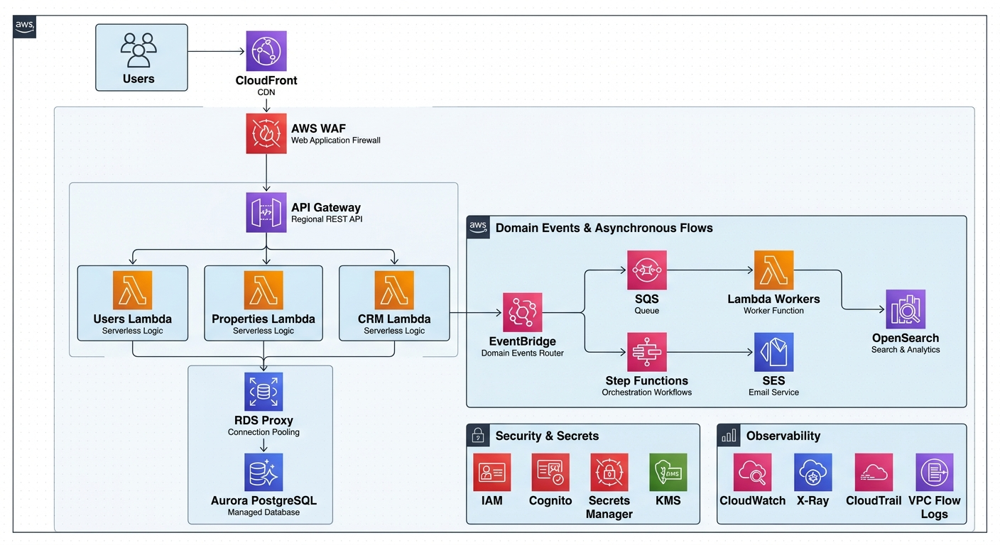

# AWS Services

## Overview

La piattaforma utilizza diversi servizi AWS, ognuno con una responsabilità specifica all'interno dell'architettura.

L'obiettivo è utilizzare servizi gestiti e Serverless dove appropriato, riducendo la necessità di gestire direttamente server e componenti infrastrutturali.

## Architecture Diagram



## Edge & Delivery

### Amazon CloudFront

CloudFront viene utilizzato come CDN e come punto di distribuzione del frontend.

Responsabilità principali:

* distribuzione degli asset statici;
* caching dei contenuti;
* riduzione della latenza;
* integrazione con AWS WAF;
* gestione del traffico verso il frontend.

### AWS WAF

AWS WAF protegge le applicazioni web da traffico indesiderato e attacchi comuni a livello HTTP/HTTPS.

Responsabilità principali:

* Web ACLs;
* IP filtering;
* rate limiting;
* protezione da pattern di attacco comuni;
* controllo del traffico applicativo.

## Identity & Access

### Amazon Cognito

Amazon Cognito gestisce l'autenticazione degli utenti della piattaforma.

Responsabilità principali:

* registrazione degli utenti;
* login;
* gestione delle sessioni;
* gestione dei token;
* integrazione con il frontend e API Gateway.

Cognito riguarda principalmente le identità degli utenti applicativi.

### AWS IAM

AWS IAM gestisce le identità e le autorizzazioni necessarie ai servizi AWS.

Viene utilizzato per:

* Lambda execution roles;
* accesso a S3;
* accesso a Secrets Manager;
* accesso a EventBridge;
* accesso a SQS;
* accesso ad altri servizi AWS.

L'accesso alle risorse deve seguire il principio di Least Privilege.

## API & Compute

### Amazon API Gateway

API Gateway espone le API backend utilizzate dal frontend e dai client autorizzati.

Responsabilità principali:

* API endpoints;
* routing delle richieste;
* integrazione con Lambda;
* gestione dell'autenticazione e autorizzazione;
* throttling;
* gestione del traffico API.

### AWS Lambda

Lambda costituisce il principale layer di compute applicativo.

Viene utilizzato per:

* business logic;
* API handlers;
* processing asincrono;
* event consumers;
* background workers;
* integrazione tra servizi AWS.

Le funzioni Lambda devono essere progettate con responsabilità specifiche e IAM roles dedicati.

## Database

### Amazon Aurora PostgreSQL

Aurora PostgreSQL costituisce il database relazionale principale.

Viene utilizzato per i dati transazionali dell'applicazione, inclusi:

* Users;
* Properties;
* CRM;
* relazioni tra entità;
* configurazioni applicative;
* dati transazionali.

Aurora deve essere distribuito all'interno di Private Subnets e non deve essere direttamente accessibile da Internet.

### Amazon RDS Proxy

RDS Proxy viene utilizzato tra Lambda e Aurora PostgreSQL.

Responsabilità principali:

* connection pooling;
* gestione delle connessioni concorrenti;
* riduzione del numero di connessioni dirette verso Aurora;
* maggiore stabilità durante picchi di esecuzioni Lambda.

Il flusso principale è:

```text
Lambda
   │
   ▼
RDS Proxy
   │
   ▼
Aurora PostgreSQL
```

## Storage

### Amazon S3

Amazon S3 viene utilizzato per l'archiviazione degli oggetti.

Esempi:

* property images;
* documenti;
* allegati;
* file caricati dagli utenti;
* altri contenuti non relazionali.

Il database conserva i metadati e i riferimenti agli oggetti, mentre i file vengono archiviati su S3.

Per l'accesso ai file possono essere utilizzati presigned URLs.

## Search

### Amazon OpenSearch

OpenSearch viene utilizzato come search and indexing layer.

Responsabilità principali:

* full-text search;
* ricerca filtrata;
* indexing delle proprietà;
* query ottimizzate per la ricerca;
* supporto alle funzionalità di discovery degli immobili.

Aurora PostgreSQL rimane il sistema principale per i dati transazionali.

OpenSearch mantiene invece una rappresentazione indicizzata dei dati necessari alle operazioni di ricerca.

## Event-Driven Architecture

### Amazon EventBridge

EventBridge costituisce il principale event bus dell'applicazione.

Viene utilizzato per:

* pubblicazione degli eventi;
* routing degli eventi;
* decoupling tra componenti;
* integrazione tra servizi.

Esempi di eventi:

```text
PropertyCreated
PropertyUpdated
PropertyPublished
PropertyDeleted
MediaUploaded
UserCreated
```

### Amazon SQS

SQS viene utilizzato per le elaborazioni asincrone.

Responsabilità principali:

* buffering;
* decoupling;
* gestione dei workload asincroni;
* retry;
* gestione dei messaggi non elaborati tramite Dead-Letter Queue.

Il pattern principale è:

```text
EventBridge
     │
     ▼
    SQS
     │
     ▼
Lambda Worker
```

### AWS Step Functions

Step Functions viene utilizzato per orchestrare workflow composti da più passaggi.

È adatto a processi che richiedono:

* più step;
* gestione dello stato;
* retry;
* error handling;
* branching;
* esecuzione sequenziale o parallela.

## Notifications

### Amazon SES

SES viene utilizzato per l'invio delle email generate dalla piattaforma.

Può essere integrato con Lambda, EventBridge e Step Functions.

Esempi:

* notifiche relative agli immobili;
* comunicazioni CRM;
* email transazionali;
* notifiche relative a workflow applicativi.

## Security & Secrets

### AWS Secrets Manager

Secrets Manager viene utilizzato per la gestione centralizzata dei secrets.

Può contenere:

* database credentials;
* API keys;
* application secrets;
* altri valori sensibili.

I secrets non devono essere salvati nel repository Git o direttamente all'interno del codice applicativo.

### AWS KMS

KMS viene utilizzato per la gestione delle encryption keys.

Può essere integrato con:

* S3;
* Aurora;
* Secrets Manager;
* altri servizi AWS che supportano encryption tramite KMS.

## Observability & Audit

### Amazon CloudWatch

CloudWatch viene utilizzato per:

* logs;
* metrics;
* dashboards;
* alarms;
* monitoring.

Lambda, API Gateway e altri servizi AWS possono inviare logs e metrics a CloudWatch.

### AWS X-Ray

X-Ray viene utilizzato per il distributed tracing.

Permette di seguire una richiesta attraverso diversi componenti dell'architettura e identificare problemi di latenza o errori.

### AWS CloudTrail

CloudTrail registra le operazioni effettuate tramite le API AWS.

Viene utilizzato principalmente per:

* audit;
* security investigations;
* tracking delle modifiche;
* compliance.

### VPC Flow Logs

VPC Flow Logs possono essere utilizzati per raccogliere informazioni sul traffico di rete all'interno della VPC.

Sono utili per troubleshooting, security analysis e network monitoring.

## Service Responsibilities

La seguente tabella riassume le principali responsabilità:

| Service           | Responsabilità                 |
| ----------------- | ------------------------------ |
| CloudFront        | CDN e distribuzione frontend   |
| WAF               | Web security                   |
| Cognito           | User authentication            |
| IAM               | Identity & access management   |
| API Gateway       | API management                 |
| Lambda            | Serverless compute             |
| RDS Proxy         | Database connection management |
| Aurora PostgreSQL | Relational database            |
| S3                | Object storage                 |
| OpenSearch        | Search & indexing              |
| EventBridge       | Event routing                  |
| SQS               | Asynchronous processing        |
| Step Functions    | Workflow orchestration         |
| SES               | Email delivery                 |
| Secrets Manager   | Secrets management             |
| KMS               | Encryption key management      |
| CloudWatch        | Logs, metrics e monitoring     |
| X-Ray             | Distributed tracing            |
| CloudTrail        | Audit                          |
| VPC Flow Logs     | Network monitoring             |

## Design Principles

L'utilizzo dei servizi AWS segue alcuni principi:

* Preferire servizi managed quando appropriato.
* Utilizzare Serverless compute per workload applicativi compatibili.
* Separare le responsabilità tra servizi.
* Utilizzare asynchronous processing quando non è necessario un flusso sincrono.
* Applicare Least Privilege agli accessi IAM.
* Mantenere i dati transazionali separati dagli indici di ricerca.
* Evitare l'esposizione pubblica delle risorse sensibili.
* Centralizzare logging, monitoring e auditing.

## Related Documentation

* [High-Level Architecture](./high-level.md)
* [Networking](./networking.md)
* [Data Architecture](./data.md)
* [Event-Driven Architecture](./events.md)
* [Security Architecture](./security.md)
