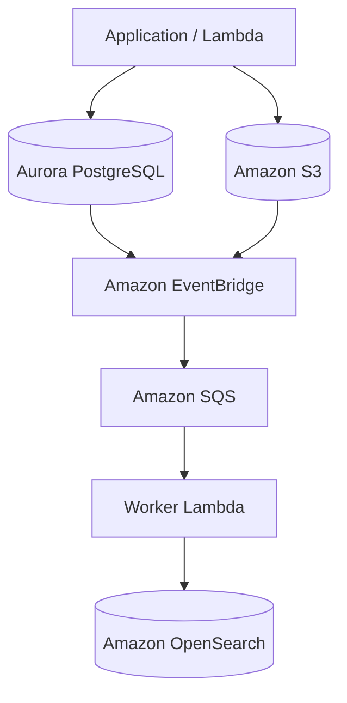

# Data Architecture

Questo documento descrive come vengono gestiti, persistiti e distribuiti i dati all'interno della piattaforma.

L'architettura distingue chiaramente tra:

* dati strutturati;
* file e contenuti multimediali;
* indici di ricerca;
* eventi utilizzati per propagare le modifiche.

L'obiettivo principale è mantenere una chiara separazione delle responsabilità tra i diversi sistemi di storage.

---

## Principi fondamentali

L'architettura dei dati segue i seguenti principi:

* **Aurora PostgreSQL è la fonte primaria dei dati applicativi strutturati**;
* **S3 è la fonte primaria dei file e dei contenuti multimediali**;
* **OpenSearch è un indice di ricerca e non la fonte primaria dei dati**;
* le modifiche rilevanti possono essere propagate attraverso eventi;
* i dati devono essere aggiornati in modo consistente tra i sistemi interessati;
* ogni componente deve avere una responsabilità chiara;
* i dati sensibili devono essere protetti tramite appropriati controlli di accesso.

---

## Vista generale



Il diagramma rappresenta il modello concettuale della gestione dei dati.

La configurazione effettiva dei flussi verrà definita in base alle singole operazioni applicative.

---

## Tipologie di dati

La piattaforma gestisce principalmente tre categorie di dati.

### Dati strutturati

Sono i dati che rappresentano le entità e le relazioni principali dell'applicazione.

Esempi:

* utenti;
* immobili;
* proprietà;
* lead;
* contatti;
* informazioni CRM;
* stati e configurazioni;
* relazioni tra entità.

Questi dati vengono memorizzati in **Aurora PostgreSQL**.

---

### File e contenuti multimediali

Sono i contenuti binari associati alle entità applicative.

Esempi:

* fotografie degli immobili;
* planimetrie;
* documenti;
* allegati;
* file generati;
* altri media.

Questi contenuti vengono memorizzati in **Amazon S3**.

Il database contiene invece i metadati necessari per riferirsi al file.

Esempio concettuale:

```text
Aurora PostgreSQL
┌──────────────────────────────┐
│ Property                     │
│ id                           │
│ title                        │
│ ...                          │
└──────────────┬───────────────┘
               │
               │ references
               ▼
Amazon S3
┌──────────────────────────────┐
│ property/{id}/image-01.jpg   │
│ property/{id}/image-02.jpg   │
│ property/{id}/document.pdf   │
└──────────────────────────────┘
```

---

### Dati di ricerca

OpenSearch contiene dati ottimizzati per le funzionalità di ricerca.

Questi dati sono derivati principalmente dai dati presenti in Aurora.

OpenSearch può contenere:

* campi indicizzabili;
* token e keyword;
* informazioni geografiche;
* campi utilizzati per filtri;
* dati denormalizzati utili alla ricerca.

La struttura dell'indice può quindi essere diversa dal modello relazionale presente in Aurora.

---

# Aurora PostgreSQL

Aurora PostgreSQL rappresenta il **database principale dell'applicazione**.

È la fonte primaria per i dati strutturati e relazionali.

## Responsabilità

Aurora gestisce:

* persistenza;
* relazioni tra entità;
* vincoli di integrità;
* transazioni;
* dati necessari alla logica applicativa.

Le operazioni che modificano lo stato principale dell'applicazione devono essere eseguite sul database relazionale.

---

## Source of Truth

Per i dati strutturati, Aurora rappresenta la **Source of Truth**.

Questo significa che:

```text
Aurora
   │
   ├──► API
   ├──► Eventi
   ├──► OpenSearch
   └──► altri consumer
```

Gli altri sistemi possono contenere copie o rappresentazioni derivate dei dati, ma non sostituiscono Aurora come fonte primaria.

---

## Transazioni

Quando un'operazione richiede la modifica di più dati correlati, Aurora deve essere utilizzato per garantire la consistenza transazionale.

Esempio:

```text
Create Property
      │
      ├── Create Property
      ├── Create Property Metadata
      └── Create related records
```

Le operazioni che fanno parte della stessa transazione devono essere gestite dal database relazionale.

La propagazione verso sistemi esterni, come OpenSearch, può avvenire successivamente tramite meccanismi asincroni.

---

# Amazon S3

S3 rappresenta lo storage principale per i file.

## Organizzazione

Gli oggetti dovrebbero essere organizzati attraverso una convenzione di naming coerente.

Esempio concettuale:

```text
properties/
  {property-id}/
    images/
      image-01.jpg
      image-02.jpg
    documents/
      floor-plan.pdf

users/
  {user-id}/
    documents/

crm/
  {entity-id}/
    attachments/
```

La struttura definitiva dei bucket e delle chiavi verrà definita durante l'implementazione.

---

## Metadata

Aurora può contenere i metadati associati agli oggetti S3.

Esempio:

```text
Media
├── id
├── property_id
├── object_key
├── content_type
├── size
├── created_at
└── status
```

Il campo `object_key` permette di identificare l'oggetto corrispondente in S3.

---

## Accesso ai file

L'applicazione non dovrebbe utilizzare il database per trasferire contenuti binari di grandi dimensioni.

Il flusso previsto è:

```text
Frontend
   │
   ▼
API
   │
   ▼
Generate upload authorization
   │
   ▼
S3
```

Quando appropriato, l'applicazione potrà utilizzare **presigned URL** per permettere al client di caricare o scaricare direttamente gli oggetti S3 senza far transitare il contenuto attraverso Lambda.

---

# OpenSearch

OpenSearch viene utilizzato come **search index**.

Non rappresenta la fonte primaria dei dati.

## Perché separare database e ricerca

Il modello relazionale e il modello di ricerca hanno esigenze differenti.

Aurora è ottimizzato per:

* transazioni;
* relazioni;
* consistenza;
* query strutturate.

OpenSearch è ottimizzato per:

* full-text search;
* filtri;
* ranking;
* aggregazioni;
* ricerca geografica;
* query su grandi volumi indicizzati.

Separare i due sistemi permette di ottimizzare ciascun componente per la propria responsabilità.

---

## Indicizzazione

Una modifica ai dati principali può generare un evento che viene successivamente elaborato per aggiornare OpenSearch.

Esempio:

```text
Aurora
   │
   │ PropertyCreated
   ▼
EventBridge
   │
   ▼
SQS
   │
   ▼
Worker Lambda
   │
   ▼
OpenSearch
```

Questo modello permette di separare la modifica del dato principale dall'aggiornamento dell'indice.

---

## Consistenza eventuale

La sincronizzazione tra Aurora e OpenSearch è **eventualmente consistente**.

Questo significa che dopo una modifica ad Aurora può esistere un breve intervallo durante il quale:

```text
Aurora = nuovo dato
OpenSearch = vecchio indice
```

Successivamente il worker aggiorna l'indice.

Il sistema applicativo deve quindi considerare OpenSearch come una rappresentazione derivata dei dati.

---

# Eventi e dati

Gli eventi rappresentano il meccanismo principale per propagare alcune modifiche verso sistemi secondari.

Esempio:

```text
Application
    │
    ▼
Aurora
    │
    ▼
Event
    │
    ▼
EventBridge
    │
    ▼
Consumers
```

Gli eventi possono essere utilizzati per:

* aggiornamento OpenSearch;
* notifiche;
* elaborazioni asincrone;
* workflow;
* sincronizzazioni;
* integrazioni future.

La definizione completa degli eventi è documentata in `architecture/events.md`.

---

# Modello di consistenza

La piattaforma utilizza diversi livelli di consistenza in base alla tipologia di dato.

| Sistema           | Consistenza               | Ruolo                    |
| ----------------- | ------------------------- | ------------------------ |
| Aurora PostgreSQL | Transazionale             | Source of Truth          |
| S3                | Persistenza degli oggetti | Source of Truth dei file |
| OpenSearch        | Eventual consistency      | Search Index             |
| SQS               | Persistenza messaggi      | Async processing         |
| EventBridge       | Event delivery            | Event propagation        |

---

# Flusso di creazione di un immobile

Un esempio completo può essere:

```text
User
 │
 ▼
Frontend
 │
 ▼
API Gateway
 │
 ▼
Properties Lambda
 │
 ├──────────────► Aurora PostgreSQL
 │                     │
 │                     ▼
 │                  Property
 │
 └──────────────► EventBridge
                       │
                       ▼
                      SQS
                       │
                       ▼
                  Worker Lambda
                       │
                       ▼
                  OpenSearch
```

Il dato principale viene prima persistito in Aurora.

L'aggiornamento dell'indice di ricerca viene successivamente gestito tramite il flusso asincrono.

---

# Flusso di caricamento di un'immagine

Un possibile flusso è:

```text
User
 │
 ▼
Frontend
 │
 ▼
API
 │
 ▼
Generate upload authorization
 │
 ▼
S3
 │
 ▼
MediaUploaded Event
 │
 ▼
EventBridge
 │
 ├──────────► Worker
 │
 └──────────► altri consumer
```

Il file viene memorizzato direttamente su S3.

I metadati relativi al file possono essere registrati in Aurora.

---

# Cancellazione dei dati

Le operazioni di cancellazione devono considerare tutti i sistemi che contengono dati derivati o associati.

Esempio:

```text
Delete Property
      │
      ├──► Aurora
      │
      ├──► EventBridge
      │       │
      │       ├──► OpenSearch
      │       └──► altri consumer
      │
      └──► S3
```

La strategia definitiva per la cancellazione degli oggetti S3 e degli indici verrà definita in base ai requisiti di business, audit e retention.

---

# Backup e retention

La strategia di backup deve distinguere tra:

* database;
* file;
* indici di ricerca;
* eventi e messaggi.

Aurora e S3 devono avere strategie di protezione e retention appropriate alla criticità dei dati.

OpenSearch, essendo un indice derivato, può avere una strategia differente: in caso di perdita dell'indice, questo deve poter essere ricostruito a partire dalle fonti primarie quando il modello dati lo permette.

Le policy definitive di backup e retention verranno definite durante la progettazione dell'infrastruttura.

---

# Sicurezza dei dati

L'accesso ai dati deve essere controllato attraverso:

* IAM;
* Security Group;
* policy S3;
* encryption at rest;
* encryption in transit;
* Secrets Manager;
* controlli applicativi.

I dati sensibili non devono essere inseriti nei log applicativi.

L'accesso alle risorse deve seguire il principio del **least privilege**.

---

# Decisioni ancora da definire

Durante la progettazione dell'infrastruttura dovranno essere definite:

* schema iniziale Aurora;
* strategia di migrazione del database;
* naming convention S3;
* struttura dei bucket;
* lifecycle policy S3;
* retention dei file;
* encryption strategy;
* struttura degli indici OpenSearch;
* mapping OpenSearch;
* strategia di reindex;
* gestione degli eventi persi;
* strategia di retry;
* strategia di cancellazione;
* backup e disaster recovery;
* eventuale utilizzo di un pattern Outbox per la pubblicazione affidabile degli eventi.

Questi aspetti verranno approfonditi nei documenti dedicati o durante l'implementazione.

---

## Documenti correlati

* [Architettura High Level](high-level.md)
* [Servizi AWS](aws-services.md)
* [Networking](networking.md)
* [Event Architecture](events.md)
* [Security](security.md)
