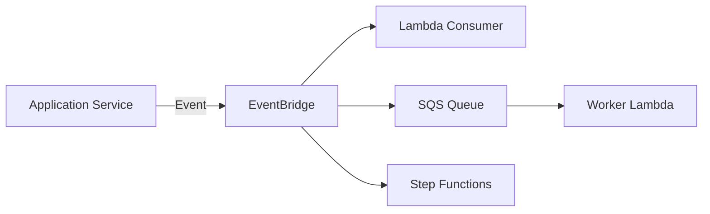

# Event Architecture

Questo documento descrive l'architettura event-driven della piattaforma e definisce come i componenti comunicano attraverso eventi e messaggi asincroni.

L'obiettivo è ridurre l'accoppiamento tra i servizi, separare le operazioni sincrone da quelle asincrone e rendere il sistema più resiliente e scalabile.

---

## Principi

L'architettura degli eventi segue questi principi:

* i servizi pubblicano eventi relativi ai cambiamenti di stato rilevanti;
* i producer non devono conoscere direttamente tutti i consumer;
* EventBridge viene utilizzato come event bus;
* SQS viene utilizzato quando è necessaria una coda persistente per l'elaborazione asincrona;
* i consumer devono essere idempotenti;
* gli errori temporanei devono poter essere ritentati;
* i messaggi che non possono essere elaborati devono essere isolati tramite Dead Letter Queue;
* gli eventi devono contenere informazioni sufficienti per essere elaborati dal consumer;
* gli eventi non devono contenere dati sensibili non necessari;
* i workflow complessi devono essere orchestrati tramite Step Functions.

---

# Modello generale

L'architettura event-driven può essere rappresentata come:



Il producer pubblica un evento senza dover conoscere direttamente i consumer.

EventBridge decide quali destinazioni devono ricevere l'evento sulla base delle regole configurate.

---

# Event Producer

Un **producer** è un componente che genera un evento in seguito a un'operazione significativa.

Esempi:

* Users Lambda;
* Properties Lambda;
* CRM Lambda;
* worker asincroni;
* altri servizi applicativi.

Esempio:

```text
Properties Lambda
       │
       │ PropertyCreated
       ▼
   EventBridge
```

Il producer è responsabile di pubblicare un evento che descrive ciò che è avvenuto.

Non deve essere responsabile di conoscere o gestire direttamente tutti i consumer.

---

# Event Consumer

Un **consumer** riceve un evento e reagisce eseguendo una determinata operazione.

Esempi:

```text
PropertyCreated
      │
      ├──► OpenSearch Indexer
      ├──► Notification Service
      └──► Analytics
```

L'aggiunta di un nuovo consumer non dovrebbe richiedere modifiche al producer.

Questo è uno dei principali vantaggi dell'utilizzo di EventBridge.

---

# Amazon EventBridge

EventBridge rappresenta il principale **event bus** della piattaforma.

Il suo compito è ricevere gli eventi e distribuirli ai consumer appropriati.

```text
                   ┌──► Lambda
                   │
Producer ──► EventBridge ──► SQS
                   │
                   └──► Step Functions
```

Il routing degli eventi viene gestito attraverso regole basate sul contenuto dell'evento.

---

# Event Bus

La piattaforma utilizzerà un event bus dedicato all'applicazione.

A livello concettuale:

```text
Application
     │
     ▼
Application Event Bus
     │
     ├──► Property events
     ├──► CRM events
     ├──► User events
     └──► Media events
```

La struttura definitiva degli event bus e l'eventuale separazione tra domini verranno definite durante l'implementazione.

---

# Event Naming

Gli eventi devono utilizzare una nomenclatura coerente e prevedibile.

Esempi:

```text
PropertyCreated
PropertyUpdated
PropertyPublished
PropertyDeleted

LeadCreated
LeadUpdated
LeadDeleted

MediaUploaded
MediaDeleted

UserCreated
UserUpdated
```

Il nome deve rappresentare un fatto che è già avvenuto.

È preferibile quindi utilizzare:

```text
PropertyCreated
```

invece di:

```text
CreateProperty
```

Il primo rappresenta un **evento**, mentre il secondo rappresenta un **comando**.

---

# Event Envelope

Gli eventi dovrebbero utilizzare una struttura comune.

Esempio concettuale:

```json
{
  "id": "event-id",
  "type": "PropertyCreated",
  "source": "properties-service",
  "time": "2026-09-23T10:00:00Z",
  "version": "1",
  "data": {
    "propertyId": "property-id"
  }
}
```

I campi principali sono:

| Campo     | Descrizione                        |
| --------- | ---------------------------------- |
| `id`      | Identificativo univoco dell'evento |
| `type`    | Tipo di evento                     |
| `source`  | Servizio che ha generato l'evento  |
| `time`    | Data e ora dell'evento             |
| `version` | Versione dello schema              |
| `data`    | Payload specifico dell'evento      |

La struttura definitiva dell'event envelope verrà formalizzata durante l'implementazione.

---

# Event ID

Ogni evento deve avere un identificativo univoco.

L'ID permette di:

* identificare un evento;
* tracciare un evento nei log;
* correlare operazioni;
* facilitare il debugging;
* supportare meccanismi di idempotenza.

Esempio:

```text
eventId = 8b7f...
```

Il consumer può utilizzare l'ID dell'evento per riconoscere eventuali elaborazioni duplicate.

---

# Versioning

Gli eventi devono essere versionabili.

Una modifica incompatibile allo schema non dovrebbe rompere consumer esistenti.

Esempio:

```text
PropertyCreated v1
PropertyCreated v2
```

La strategia di versioning definitiva verrà definita quando saranno stabiliti i contratti degli eventi.

---

# Event Payload

Gli eventi devono contenere solamente le informazioni necessarie al consumer.

Esempio:

```json
{
  "type": "PropertyCreated",
  "data": {
    "propertyId": "12345"
  }
}
```

Non è necessario inserire nell'evento l'intero record dell'immobile se il consumer può recuperare i dati necessari tramite il relativo identificativo.

Questo riduce:

* dimensione dei messaggi;
* accoppiamento tra servizi;
* rischio di propagare dati non necessari;
* problemi di versionamento.

Quando necessario, il consumer può recuperare i dati aggiornati dalla source of truth.

---

# EventBridge Rules

Le regole di EventBridge determinano quali consumer devono ricevere un determinato evento.

Esempio:

```text
PropertyCreated
      │
      ▼
EventBridge Rule
      │
      ├──► OpenSearch Queue
      │
      ├──► Notification Lambda
      │
      └──► Analytics
```

Il producer non deve conoscere queste destinazioni.

---

# SQS

SQS viene utilizzato quando il consumer deve elaborare gli eventi in maniera asincrona e controllata.

Un flusso tipico è:

```text
EventBridge
     │
     ▼
SQS
     │
     ▼
Worker Lambda
```

SQS fornisce un livello di disaccoppiamento tra la pubblicazione dell'evento e la sua elaborazione.

---

# Quando utilizzare SQS

SQS è particolarmente utile quando:

* l'elaborazione può essere ritardata;
* il consumer può essere temporaneamente indisponibile;
* è necessario gestire retry;
* possono verificarsi picchi di traffico;
* l'elaborazione può essere scalata indipendentemente dal producer.

Esempio:

```text
PropertyCreated
      │
      ▼
EventBridge
      │
      ▼
SQS
      │
      ▼
OpenSearch Worker
```

---

# Dead Letter Queue

Le code SQS che gestiscono elaborazioni importanti dovrebbero prevedere una **Dead Letter Queue (DLQ)**.

La DLQ contiene i messaggi che non sono stati elaborati correttamente dopo il numero massimo di tentativi configurato.

```text
                ┌──────────────┐
                │    SQS       │
                └──────┬───────┘
                       │
                  retry attempts
                       │
              ┌────────┴────────┐
              │                 │
           success             failure
              │                 │
              ▼                 ▼
           Worker              DLQ
```

La DLQ permette di:

* evitare retry infiniti;
* isolare i messaggi problematici;
* analizzare gli errori;
* effettuare eventualmente un replay controllato.

---

# Retry

I consumer devono essere progettati per gestire errori temporanei.

Esempi:

* timeout;
* errori temporanei di rete;
* throttling;
* indispon
