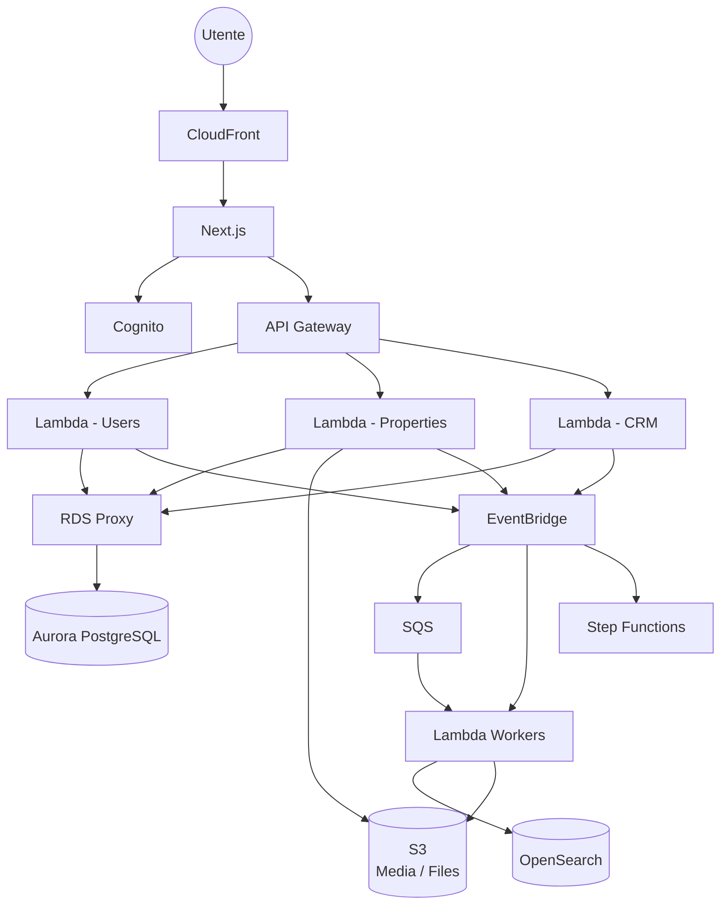

# Architettura High Level

Questo documento descrive l'architettura infrastrutturale della piattaforma a livello generale.

L'obiettivo è mostrare i principali componenti del sistema, le loro responsabilità e le modalità principali di comunicazione, senza entrare nel dettaglio delle singole configurazioni infrastrutturali.

---

## Vista generale



---

## Componenti principali

### Frontend

Il frontend della piattaforma è sviluppato con **Next.js**.

L'applicazione viene esposta tramite **Amazon CloudFront**, che rappresenta il punto di ingresso pubblico per il frontend e permette di distribuire i contenuti attraverso la rete CDN.

---

### Autenticazione

L'autenticazione degli utenti è gestita tramite **Amazon Cognito**.

Cognito si occupa dell'identità degli utenti e dell'emissione dei token utilizzati per accedere alle API protette.

Il frontend comunica con Cognito per i processi di autenticazione, mentre le API utilizzano le informazioni presenti nei token per identificare l'utente e applicare le relative autorizzazioni.

---

### API

Le API pubbliche della piattaforma sono esposte tramite **Amazon API Gateway**.

API Gateway rappresenta il punto di ingresso verso il backend e inoltra le richieste alle Lambda responsabili delle diverse aree funzionali.

A livello applicativo il backend viene inizialmente suddiviso in domini principali:

* Users;
* Properties;
* CRM.

Questa suddivisione permette di mantenere separate le responsabilità delle diverse aree funzionali.

---

### Backend

Il backend è basato su **AWS Lambda**.

Le Lambda eseguono la logica necessaria per gestire le richieste provenienti dalle API e interagiscono con i servizi infrastrutturali necessari.

La comunicazione con il database relazionale avviene attraverso **Amazon RDS Proxy**, evitando che le funzioni Lambda aprano direttamente connessioni persistenti verso Aurora PostgreSQL.

---

### Database

Il database principale della piattaforma è **Amazon Aurora PostgreSQL**.

Aurora PostgreSQL viene utilizzato per la persistenza dei dati strutturati dell'applicazione.

L'accesso al database viene mediato da **RDS Proxy**, che gestisce il connection pooling e contribuisce a rendere più efficiente l'accesso al database da parte delle funzioni Lambda.

---

### Storage

**Amazon S3** viene utilizzato per la gestione dei file e dei contenuti multimediali.

Tra i possibili contenuti gestiti rientrano:

* immagini degli immobili;
* documenti;
* allegati;
* altri file associati alle entità della piattaforma.

I file non vengono memorizzati direttamente nel database relazionale.

---

### Eventi

La piattaforma utilizza un'architettura **event-driven** basata su **Amazon EventBridge**.

I componenti possono pubblicare eventi relativi alle operazioni effettuate senza dover conoscere direttamente tutti i servizi che consumeranno tali eventi.

Questo permette di ridurre l'accoppiamento tra i componenti e facilita l'introduzione di nuove funzionalità asincrone.

Esempi di eventi possono essere:

```text
PropertyCreated
PropertyUpdated
PropertyPublished
PropertyDeleted

LeadCreated
LeadUpdated

MediaUploaded
```

La struttura definitiva degli eventi verrà definita nella documentazione dedicata all'event architecture.

---

### Elaborazione asincrona

Per le operazioni che non devono essere completate durante la richiesta HTTP viene utilizzata un'architettura asincrona basata su **Amazon SQS** e Lambda worker.

Un flusso tipico può essere:

```text
API
 │
 ▼
Lambda
 │
 ▼
EventBridge
 │
 ▼
SQS
 │
 ▼
Worker Lambda
 │
 ▼
OpenSearch
```

Questo modello permette di separare l'elaborazione della richiesta dall'elaborazione successiva dei dati.

---

### Ricerca

**Amazon OpenSearch** viene utilizzato per le funzionalità di ricerca che richiedono capacità superiori a quelle offerte dalle query relazionali tradizionali.

Il database Aurora rimane la fonte principale dei dati applicativi, mentre OpenSearch viene utilizzato come indice ottimizzato per la ricerca.

Un possibile flusso è:

```text
Aurora
   │
   ▼
EventBridge
   │
   ▼
SQS
   │
   ▼
Worker Lambda
   │
   ▼
OpenSearch
```

In questo modo la modifica dei dati principali e l'aggiornamento dell'indice di ricerca possono essere gestiti separatamente.

---

### Workflow

**AWS Step Functions** viene utilizzato per orchestrare processi composti da più operazioni o che richiedono una gestione esplicita dello stato.

Può essere utilizzato, ad esempio, per workflow che coinvolgono:

* più servizi;
* elaborazioni asincrone;
* retry;
* gestione degli errori;
* operazioni con più step.

I workflow specifici verranno documentati separatamente.

---

## Principio di comunicazione

L'architettura utilizza due modalità principali di comunicazione.

### Comunicazione sincrona

Utilizzata quando il client deve ricevere immediatamente una risposta.

```text
Frontend
   │
   ▼
API Gateway
   │
   ▼
Lambda
   │
   ▼
RDS Proxy
   │
   ▼
Aurora PostgreSQL
```

### Comunicazione asincrona

Utilizzata quando un'operazione può essere elaborata successivamente.

```text
Service
   │
   ▼
EventBridge
   │
   ├──────────► Lambda
   │
   ├──────────► SQS
   │                 │
   │                 ▼
   │              Worker
   │
   └──────────► Step Functions
```

La distinzione tra comunicazione sincrona e asincrona permette di mantenere le richieste utente rapide e di delegare le elaborazioni più lunghe ai componenti appropriati.

---

## Separazione delle responsabilità

I principali componenti hanno responsabilità distinte:

| Componente        | Responsabilità                         |
| ----------------- | -------------------------------------- |
| CloudFront        | Distribuzione del frontend             |
| Next.js           | Interfaccia utente                     |
| Cognito           | Identità e autenticazione              |
| API Gateway       | Esposizione e gestione delle API       |
| Lambda            | Logica backend                         |
| RDS Proxy         | Gestione delle connessioni al database |
| Aurora PostgreSQL | Persistenza dei dati                   |
| S3                | File e media                           |
| EventBridge       | Distribuzione degli eventi             |
| SQS               | Coda e processamento asincrono         |
| Lambda Workers    | Elaborazioni asincrone                 |
| OpenSearch        | Ricerca e indicizzazione               |
| Step Functions    | Orchestrazione dei workflow            |

---

## Principi architetturali

L'architettura segue alcuni principi fondamentali:

* utilizzare servizi AWS gestiti quando appropriato;
* preferire un approccio serverless;
* separare le responsabilità dei diversi componenti;
* utilizzare comunicazioni asincrone quando non è necessaria una risposta immediata;
* ridurre l'accoppiamento tra servizi;
* mantenere Aurora PostgreSQL come fonte primaria dei dati applicativi;
* utilizzare OpenSearch come indice di ricerca e non come database principale;
* rendere l'infrastruttura osservabile;
* applicare il principio del least privilege;
* mantenere l'infrastruttura riproducibile tramite Infrastructure as Code.

---

## Documenti correlati

* [Servizi AWS](aws-services.md)
* [Networking](networking.md)
* [Data Architecture](data.md)
* [Event Architecture](events.md)
* [Security](security.md)
