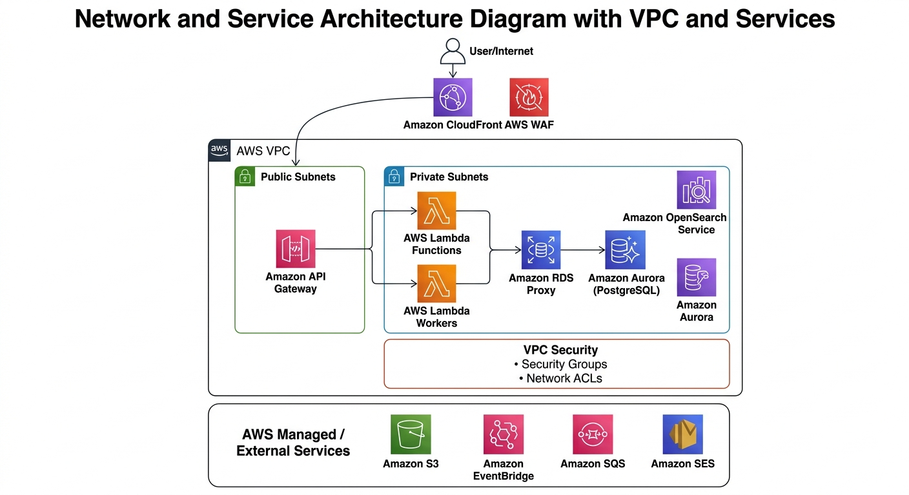

# Networking

## Overview

La piattaforma utilizza una AWS VPC dedicata per isolare le risorse che richiedono controllo sul traffico di rete.

L'architettura di networking segue questi principi:

* minimizzare la superficie pubblica;
* mantenere le risorse sensibili all'interno di Private Subnets;
* separare i componenti in base alla loro esposizione e responsabilità;
* controllare il traffico tramite Security Groups e Network ACLs;
* utilizzare AWS managed services quando possibile;
* evitare l'accesso diretto a database e risorse interne da Internet.

## Architecture Diagram



## VPC

La VPC costituisce il principale boundary di rete dell'infrastruttura.

La VPC deve essere configurata con un CIDR range dedicato e suddivisa in più Availability Zones per garantire resilienza e disponibilità.

Una configurazione iniziale può prevedere almeno due Availability Zones.

```text id="5kqubg"
AWS Region
│
└── VPC
    │
    ├── Availability Zone A
    │   ├── Public Subnet
    │   └── Private Subnet
    │
    └── Availability Zone B
        ├── Public Subnet
        └── Private Subnet
```

Il CIDR definitivo della VPC e la suddivisione delle subnet saranno definiti durante l'implementazione Terraform.

## Public Subnets

Le Public Subnets sono subnet associate a un route table che consente il routing verso un Internet Gateway.

Devono contenere esclusivamente risorse che necessitano realmente di accesso o routing pubblico.

L'architettura applicativa deve comunque minimizzare il numero di risorse direttamente esposte.

## Private Subnets

Le Private Subnets ospitano le risorse che non devono essere direttamente raggiungibili da Internet.

Tra queste possono rientrare:

* Aurora PostgreSQL;
* RDS Proxy;
* OpenSearch;
* Lambda functions configurate all'interno della VPC, quando necessario;
* altri componenti backend che richiedono network isolation.

Il database non deve avere un percorso diretto verso Internet.

## Internet Gateway

L'Internet Gateway fornisce connettività tra la VPC e Internet per le risorse che utilizzano le Public Subnets.

Il traffico pubblico deve essere limitato alle risorse che ne hanno effettivamente bisogno.

## NAT Gateway

Un NAT Gateway può essere utilizzato per consentire alle risorse nelle Private Subnets di effettuare connessioni in uscita verso Internet senza renderle direttamente raggiungibili dall'esterno.

Il suo utilizzo deve essere valutato in base alle effettive necessità delle Lambda e degli altri componenti privati.

In particolare, prima di introdurre NAT Gateway è opportuno valutare l'utilizzo di VPC Endpoints per i servizi AWS supportati.

## VPC Endpoints

I VPC Endpoints possono consentire alle risorse private di accedere a servizi AWS senza instradare il traffico attraverso Internet.

Possono essere valutati, ad esempio, per:

* Amazon S3;
* Amazon SQS;
* Amazon EventBridge;
* AWS Secrets Manager;
* Amazon CloudWatch;
* altri servizi AWS compatibili.

L'utilizzo degli endpoint verrà definito durante la fase di implementazione e ottimizzazione dell'infrastruttura.

## Routing

Le route tables definiscono il percorso del traffico all'interno della VPC.

Un modello concettuale è:

```text id="x8z5rq"
Public Subnet
      │
      ▼
Internet Gateway
      │
      ▼
  Internet


Private Subnet
      │
      ▼
 NAT Gateway
      │
      ▼
  Internet
```

Per i servizi AWS accessibili tramite VPC Endpoints:

```text id="y6n1sv"
Private Subnet
      │
      ▼
VPC Endpoint
      │
      ▼
AWS Service
```

## Security Groups

I Security Groups costituiscono il principale livello di controllo del traffico verso le risorse AWS che li supportano.

Le regole devono essere definite seguendo il principio di Least Privilege.

Esempio concettuale:

```text id="c6b1be"
Lambda
  │
  │ PostgreSQL
  ▼
RDS Proxy
  │
  │ PostgreSQL
  ▼
Aurora PostgreSQL
```

Aurora dovrebbe accettare connessioni solamente dalle risorse autorizzate, evitando regole che consentano accesso indiscriminato.

## Network ACLs

I Network ACLs possono fornire un ulteriore livello di controllo a livello di subnet.

Vengono utilizzati come layer aggiuntivo rispetto ai Security Groups.

La configurazione deve rimanere semplice e coerente con i Security Groups, evitando regole eccessivamente complesse che rendano difficile il troubleshooting.

## Lambda & VPC

Le Lambda functions devono essere inserite nella VPC solamente quando necessario.

Non tutte le funzioni Lambda devono necessariamente essere collegate alla VPC.

Le funzioni che devono accedere a risorse private come Aurora PostgreSQL o OpenSearch possono essere configurate all'interno delle Private Subnets.

Le Lambda che utilizzano esclusivamente servizi AWS pubblici possono essere mantenute fuori dalla VPC quando non è necessario un accesso privato.

Questa distinzione permette di ridurre la complessità del networking.

## Database Network Isolation

Aurora PostgreSQL deve essere distribuito in Private Subnets.

Il flusso applicativo previsto è:

```text id="r7f8fj"
Lambda
   │
   ▼
RDS Proxy
   │
   ▼
Aurora PostgreSQL
```

Non deve essere consentito un accesso diretto al database da Internet.

L'accesso deve essere limitato tramite Security Groups e IAM authentication o database credentials gestite tramite Secrets Manager, secondo la strategia che verrà definita durante l'implementazione.

## OpenSearch Network Isolation

OpenSearch deve essere protetto da accessi pubblici non necessari.

Quando configurato all'interno della VPC, l'accesso deve essere limitato ai componenti autorizzati.

Il pattern previsto è:

```text id="p1cyd6"
Lambda / Worker
       │
       ▼
OpenSearch
```

L'accesso al cluster deve essere regolato tramite network controls e access policies.

## S3 Network Access

Amazon S3 è un servizio managed e non viene rappresentato come una risorsa all'interno delle subnet della VPC.

Quando necessario, l'accesso da risorse private può essere effettuato tramite VPC Endpoint.

I bucket devono inoltre utilizzare policy e IAM permissions per limitare l'accesso agli oggetti.

## Availability Zones

Le risorse stateful e i componenti critici devono essere progettati considerando più Availability Zones.

In particolare:

* Aurora deve utilizzare una configurazione multi-AZ appropriata;
* le subnet private devono essere distribuite su più Availability Zones;
* i componenti di rete critici non devono introdurre un singolo punto di failure quando non necessario.

## DNS

La VPC utilizzerà il DNS fornito da AWS per la risoluzione dei nomi interni e dei servizi AWS.

Le configurazioni DNS specifiche verranno definite durante l'implementazione Terraform.

## Network Monitoring

Il traffico di rete può essere monitorato tramite VPC Flow Logs.

I log possono essere inviati verso servizi di observability come CloudWatch Logs o altri sistemi di analisi definiti successivamente.

Gli obiettivi principali sono:

* troubleshooting;
* security analysis;
* identificazione di traffico inatteso;
* analisi delle connessioni tra risorse.

## Network Security Principles

La configurazione di rete deve seguire questi principi:

* nessun accesso pubblico diretto al database;
* Private Subnets per le risorse sensibili;
* Security Groups con regole specifiche;
* Network ACLs come layer aggiuntivo;
* minimo numero possibile di risorse pubbliche;
* utilizzo di VPC Endpoints quando appropriato;
* monitoraggio tramite VPC Flow Logs;
* separazione tra ambienti;
* controllo esplicito dei flussi tra componenti.

## Open Decisions

Alcune decisioni verranno definite durante la fase di implementazione:

* CIDR definitivo della VPC;
* numero di Availability Zones;
* numero e dimensione delle subnet;
* utilizzo e topologia dei NAT Gateway;
* VPC Endpoints necessari;
* strategia DNS;
* configurazione definitiva dei Security Groups;
* configurazione dei Network ACLs;
* strategia di accesso VPC per Lambda;
* strategia di network isolation per OpenSearch.

## Related Documentation

* [High-Level Architecture](./high-level.md)
* [AWS Services](./aws-services.md)
* [Data Architecture](./data.md)
* [Event-Driven Architecture](./events.md)
* [Security Architecture](./security.md)
* [Architecture](./README.md)
