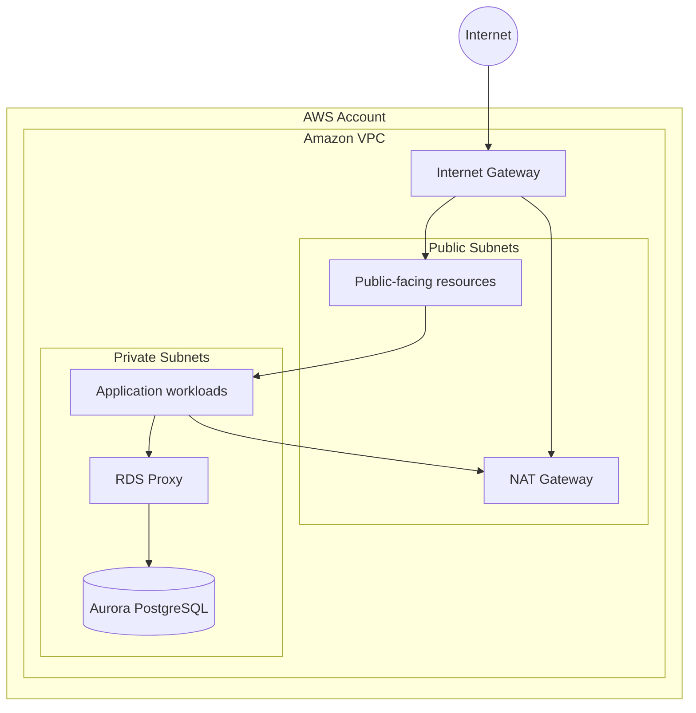

# Networking

Questo documento descrive l'architettura di rete della piattaforma e i principali confini di comunicazione tra i componenti.

L'obiettivo è definire:

* struttura della VPC;
* suddivisione delle subnet;
* accesso a Internet;
* comunicazione tra i servizi;
* isolamento dei componenti;
* principali controlli di rete.

Le configurazioni specifiche, come CIDR, numero di subnet e regole dettagliate dei Security Group, verranno definite durante l'implementazione dell'infrastruttura.

---

## Principi di networking

L'architettura di rete segue alcuni principi fondamentali:

* minimizzare l'esposizione pubblica delle risorse;
* mantenere i componenti infrastrutturali sensibili all'interno di subnet private;
* separare i componenti in base alla loro responsabilità;
* utilizzare Security Group come principale meccanismo di controllo del traffico;
* evitare accessi diretti a database e componenti interni da Internet;
* utilizzare endpoint privati AWS quando appropriato;
* mantenere il traffico tra i componenti il più possibile controllato e prevedibile.

---

## VPC

L'infrastruttura applicativa verrà ospitata all'interno di una **Amazon VPC** dedicata.

La VPC rappresenta il principale confine di rete dell'infrastruttura AWS.

Una rappresentazione concettuale è:



Il diagramma rappresenta il modello concettuale della rete e non costituisce ancora la configurazione definitiva.

---

## Subnet

La VPC sarà organizzata utilizzando subnet con differenti livelli di esposizione.

### Public Subnet

Le subnet pubbliche sono associate a una route table che permette l'accesso tramite Internet Gateway.

Il loro utilizzo deve essere limitato ai componenti che necessitano effettivamente di esposizione o accesso diretto a Internet.

Un esempio di componente che può essere collocato in questo livello è un NAT Gateway.

---

### Private Subnet

Le subnet private sono utilizzate per i componenti che non devono essere direttamente raggiungibili da Internet.

In particolare:

* database;
* proxy;
* workload applicativi che richiedono networking VPC;
* altri componenti infrastrutturali interni.

Il database Aurora deve essere raggiungibile solamente dai componenti autorizzati all'accesso al database.

---

## Availability Zone

La VPC sarà distribuita su più **Availability Zone** all'interno della regione AWS scelta.

L'obiettivo è evitare che un singolo failure domain rappresenti un punto singolo di guasto per i componenti che supportano la distribuzione multi-AZ.

A livello concettuale:

```text
                    VPC
                     │
          ┌──────────┴──────────┐
          │                     │
          ▼                     ▼
     Availability Zone A   Availability Zone B
          │                     │
     Private Subnet         Private Subnet
          │                     │
          └──────────┬──────────┘
                     │
                Aurora / DB
```

Il numero definitivo di Availability Zone e subnet verrà definito durante la progettazione Terraform.

---

## Internet Gateway

L'**Internet Gateway** fornisce il collegamento tra la VPC e Internet per le risorse che dispongono di un percorso di rete appropriato.

L'accesso Internet deve essere limitato alle risorse che ne hanno effettivamente bisogno.

Il database non deve essere direttamente esposto tramite Internet Gateway.

---

## NAT Gateway

Il **NAT Gateway** permette alle risorse presenti nelle subnet private di effettuare connessioni in uscita verso Internet senza renderle direttamente raggiungibili dall'esterno.

Un caso d'uso tipico è:

```text
Private Subnet
      │
      ▼
   Lambda / Workload
      │
      ▼
  NAT Gateway
      │
      ▼
   Internet
```

Il NAT Gateway non deve essere considerato un meccanismo per consentire connessioni in ingresso verso le risorse private.

La quantità e il posizionamento dei NAT Gateway saranno definiti in base ai requisiti di disponibilità, sicurezza e costo.

---

## Accesso ai servizi AWS

Non tutti i componenti devono raggiungere i servizi AWS passando attraverso Internet.

Quando appropriato, verranno utilizzati **VPC Endpoint** per permettere l'accesso privato ai servizi AWS supportati.

Esempi potenziali:

* Amazon S3;
* Amazon SQS;
* Amazon EventBridge;
* AWS Secrets Manager;
* Amazon CloudWatch.

La scelta degli endpoint verrà definita durante l'implementazione in base ai requisiti effettivi dei componenti.

---

## Security Group

I **Security Group** rappresentano il principale meccanismo di controllo del traffico tra le risorse all'interno della VPC.

Le regole devono seguire il principio del **least privilege**.

Ad esempio, il database dovrebbe accettare connessioni solamente dal componente autorizzato ad accedervi:

```text
Lambda
   │
   │ TCP / PostgreSQL
   ▼
RDS Proxy
   │
   │ TCP / PostgreSQL
   ▼
Aurora PostgreSQL
```

Non deve essere presente un accesso diretto da Internet ad Aurora.

---

## Database networking

Aurora PostgreSQL sarà posizionato all'interno di subnet private.

L'accesso al database seguirà una catena controllata:

```text
API Gateway
     │
     ▼
Lambda
     │
     ▼
RDS Proxy
     │
     ▼
Aurora PostgreSQL
```

Il database non sarà esposto direttamente come endpoint pubblico.

RDS Proxy fungerà da punto di accesso al database per i workload che necessitano di connessioni relazionali.

---

## Lambda e VPC

Non tutte le Lambda devono necessariamente essere inserite nella VPC.

Una funzione Lambda dovrebbe essere associata alla VPC quando deve raggiungere risorse private che richiedono networking VPC.

Esempi:

* Aurora;
* RDS Proxy;
* risorse private interne.

Le Lambda che utilizzano esclusivamente servizi AWS accessibili tramite API possono essere mantenute fuori dalla VPC quando questo semplifica l'architettura senza introdurre requisiti contrari.

La decisione verrà presa funzione per funzione in fase di implementazione.

---

## Flusso di rete principale

Il percorso principale per una richiesta applicativa può essere rappresentato come:

```text
                        Internet
                           │
                           ▼
                      CloudFront
                           │
                           ▼
                       Next.js
                           │
                           ▼
                     API Gateway
                           │
                           ▼
                        Lambda
                           │
                           ▼
                      RDS Proxy
                           │
                           ▼
                   Aurora PostgreSQL
```

Per operazioni asincrone:

```text
Lambda
  │
  ▼
EventBridge
  │
  ├──────────────► Lambda
  │
  ├──────────────► SQS
  │                  │
  │                  ▼
  │              Worker Lambda
  │
  └──────────────► Step Functions
```

---

## Flusso verso servizi esterni

Quando un workload privato deve comunicare con un servizio esterno tramite Internet, il traffico può seguire il seguente percorso:

```text
Private Subnet
      │
      ▼
NAT Gateway
      │
      ▼
Internet Gateway
      │
      ▼
Internet
```

L'accesso in uscita deve essere limitato alle esigenze effettive del workload.

---

## DNS

La risoluzione DNS interna alla VPC sarà gestita tramite i meccanismi DNS forniti da AWS.

I componenti interni dovranno utilizzare gli endpoint appropriati senza dipendere da indirizzi IP statici quando non necessario.

Gli endpoint pubblici e privati verranno distinti in base al servizio e al livello di esposizione richiesto.

---

## Logging e monitoring della rete

Le attività di rete devono essere osservabili quando necessario.

Gli strumenti che potranno essere utilizzati includono:

* VPC Flow Logs;
* CloudWatch;
* CloudTrail;
* AWS X-Ray per il tracing applicativo.

L'abilitazione e la retention dei log verranno definite nella configurazione infrastrutturale.

---

## Modello concettuale

La rete può essere riassunta nei seguenti livelli:

```text
┌──────────────────────────────────────────────┐
│                   Internet                   │
└──────────────────────┬───────────────────────┘
                       │
                       ▼
┌──────────────────────────────────────────────┐
│                 Edge Layer                   │
│        CloudFront / WAF / API Gateway        │
└──────────────────────┬───────────────────────┘
                       │
                       ▼
┌──────────────────────────────────────────────┐
│                Application Layer              │
│                  Lambda                      │
└──────────────────────┬───────────────────────┘
                       │
                       ▼
┌──────────────────────────────────────────────┐
│                   Data Layer                  │
│             RDS Proxy / Aurora               │
└──────────────────────────────────────────────┘
```

I servizi AWS gestiti che non richiedono accesso tramite rete privata verranno utilizzati attraverso le relative API, mentre per i servizi che necessitano di accesso privato potranno essere introdotti VPC Endpoint.

---

## Decisioni ancora da definire

Prima dell'implementazione Terraform dovranno essere definite almeno le seguenti informazioni:

* regione AWS;
* CIDR della VPC;
* numero di Availability Zone;
* CIDR delle subnet;
* strategia NAT Gateway;
* VPC Endpoint necessari;
* Security Group;
* Network ACL, se necessari;
* DNS e naming convention;
* VPC Flow Logs;
* strategia di accesso amministrativo;
* eventuale necessità di VPN o altri collegamenti privati.

Questi dettagli non vengono fissati in questa fase per evitare di trasformare la documentazione architetturale in una configurazione prematura.

---

## Documenti correlati

* [Architettura High Level](high-level.md)
* [Servizi AWS](aws-services.md)
* [Data Architecture](data.md)
* [Event Architecture](events.md)
* [Security](security.md)
