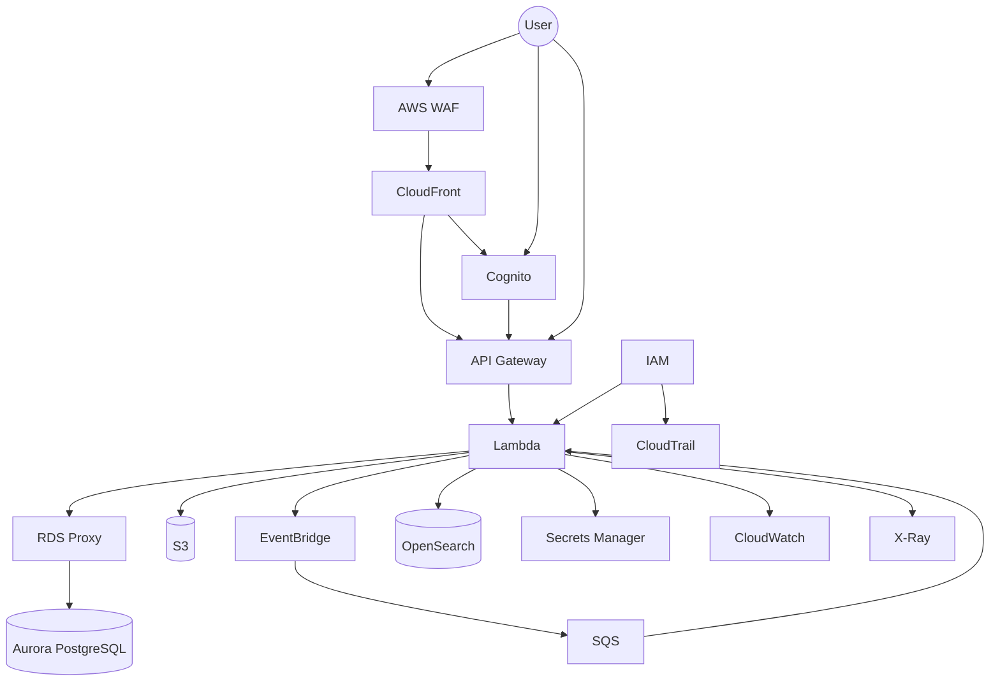

# Security Architecture

Questo documento descrive il modello di sicurezza della piattaforma e i principali meccanismi utilizzati per proteggere utenti, applicazioni, dati e infrastruttura AWS.

L'architettura di sicurezza segue un approccio **defense in depth**, distribuendo i controlli su più livelli:

* identità;
* autenticazione;
* autorizzazione;
* rete;
* applicazione;
* dati;
* segreti;
* monitoring;
* auditing.

---

## Principi di sicurezza

L'architettura segue i seguenti principi:

* **Least Privilege**;
* **Defense in Depth**;
* separazione delle responsabilità;
* minimizzazione della superficie esposta pubblicamente;
* autenticazione centralizzata;
* autorizzazioni esplicite;
* cifratura dei dati;
* gestione centralizzata dei secret;
* logging e auditing;
* isolamento degli ambienti;
* nessun secret nel codice o nel repository;
* accesso amministrativo controllato.

---

# Modello generale



Il diagramma rappresenta i principali livelli di sicurezza e osservabilità senza definire ancora le policy specifiche.

---

# Identity

La gestione delle identità deve essere centralizzata.

Per gli utenti applicativi viene utilizzato **Amazon Cognito**.

Per i servizi AWS viene utilizzato **AWS IAM**.

Questa separazione permette di distinguere:

```text
Human Identity
      │
      ▼
   Cognito

Service Identity
      │
      ▼
     IAM
```

---

# Authentication

## Amazon Cognito

Cognito gestisce l'autenticazione degli utenti della piattaforma.

Il flusso concettuale è:

```text
User
 │
 ▼
Next.js
 │
 ▼
Cognito
 │
 ▼
Authentication
 │
 ▼
Token
 │
 ▼
API Gateway
```

Il token ottenuto durante l'autenticazione viene utilizzato per accedere alle API protette.

---

## Token

Le API devono verificare:

* validità del token;
* issuer;
* audience/client;
* expiration;
* eventuali claim necessari.

Le autorizzazioni applicative non devono essere basate esclusivamente sul fatto che un token sia valido.

Autenticazione e autorizzazione rappresentano due concetti distinti.

---

# Authorization

L'autorizzazione deve essere applicata a più livelli.

```text
User
 │
 ▼
Authentication
 │
 ▼
API Authorization
 │
 ▼
Application Authorization
 │
 ▼
AWS IAM
 │
 ▼
Resource Access
```

Questo significa che:

* Cognito verifica l'identità;
* API Gateway protegge gli endpoint;
* il backend applica le regole applicative;
* IAM controlla l'accesso alle risorse AWS.

---

# Application Authorization

L'autenticazione dell'utente non implica automaticamente che possa eseguire qualsiasi operazione.

Il backend deve verificare le autorizzazioni applicative.

Esempi:

```text
User
 ├── can read property
 ├── can update property
 ├── can publish property
 └── can delete property
```

Le regole dipendono dal modello di autorizzazione che verrà definito per i diversi ruoli e domini applicativi.

---

# AWS IAM

IAM gestisce le identità e le autorizzazioni dei servizi AWS.

Le Lambda devono utilizzare IAM Role dedicati.

Esempio:

```text
Properties Lambda
      │
      ▼
Properties Lambda Role
      │
      ├──► Aurora / RDS Proxy
      ├──► S3
      └──► EventBridge
```

Una Lambda non deve utilizzare un ruolo con permessi globali verso tutte le risorse AWS.

---

## Least Privilege

Ogni ruolo deve avere solamente i permessi necessari.

Esempio concettuale:

```text
Properties Lambda
      │
      ├── Read/Write → Properties DB
      ├── Read/Write → Property S3 objects
      └── Publish    → Property events
```

Non dovrebbe avere automaticamente accesso a:

```text
✗ CRM resources
✗ User secrets
✗ unrelated S3 buckets
✗ unrelated queues
```

I permessi devono essere specifici per funzione e responsabilità.

---

# Network Security

La rete rappresenta un ulteriore livello di sicurezza.

Le risorse sensibili devono essere mantenute in subnet private quando appropriato.

In particolare:

* Aurora;
* RDS Proxy;
* risorse interne;
* altri componenti che non richiedono esposizione pubblica.

Il database non deve essere raggiungibile direttamente da Internet.

---

# Security Groups

I Security Group devono limitare il traffico tra i componenti.

Esempio:

```text
Lambda
   │
   │ allowed
   ▼
RDS Proxy
   │
   │ allowed
   ▼
Aurora
```

Non:

```text
Internet
   │
   X
Aurora
```

Le regole devono essere il più specifiche possibile.

---

# AWS WAF

AWS WAF protegge i punti di ingresso HTTP pubblici.

Può essere utilizzato per:

* filtrare richieste malevole;
* applicare rate limiting;
* bloccare pattern di traffico indesiderati;
* proteggere gli endpoint esposti.

Il flusso concettuale è:

```text
Internet
   │
   ▼
AWS WAF
   │
   ▼
CloudFront / API
   │
   ▼
Application
```

Le regole WAF saranno definite durante l'implementazione in base ai requisiti applicativi.

---

# S3 Security

I bucket S3 devono essere configurati secondo il principio del minimo accesso necessario.

Devono essere considerati almeno:

* Block Public Access;
* bucket policy;
* IAM;
* encryption;
* versioning quando appropriato;
* lifecycle policy;
* logging/auditing quando necessario.

L'accesso pubblico diretto ai bucket non deve essere utilizzato come meccanismo standard per distribuire file privati.

---

# File Upload

Per il caricamento dei file si può utilizzare un flusso basato su presigned URL.

```text
User
 │
 ▼
API
 │
 ▼
Authorization
 │
 ▼
Presigned URL
 │
 ▼
S3
```

Questo permette di mantenere il controllo applicativo sull'operazione evitando di far transitare necessariamente il file attraverso il backend.

Il backend deve verificare che l'utente abbia il diritto di caricare il file nella risorsa richiesta.

---

# Database Security

Aurora PostgreSQL deve essere accessibile solamente dai componenti autorizzati.

Il percorso previsto è:

```text
Lambda
 │
 ▼
RDS Proxy
 │
 ▼
Aurora
```

Il database deve essere:

* in subnet private;
* non pubblicamente accessibile;
* protetto tramite Security Group;
* cifrato;
* accessibile tramite credenziali gestite in maniera sicura.

---

# Secrets Management

I secret devono essere gestiti tramite **AWS Secrets Manager**.

Esempi:

* credenziali database;
* API key;
* secret di integrazioni;
* credenziali di servizi esterni.

Il codice applicativo non deve contenere secret.

Non devono essere presenti secret in:

```text
✗ Git
✗ README
✗ Terraform variables versionate
✗ source code
✗ Docker images
✗ log
```

---

# Encryption

La cifratura deve essere utilizzata sia **at rest** sia **in transit** quando appropriato.

## Encryption at Rest

Deve essere considerata per:

* Aurora;
* S3;
* OpenSearch;
* SQS;
* Secrets Manager;
* altri servizi che memorizzano dati.

Quando possibile verranno utilizzati servizi AWS con integrazione **AWS KMS**.

---

## Encryption in Transit

Le comunicazioni tra client e servizi pubblici devono utilizzare HTTPS/TLS.

Esempio:

```text
Browser
   │
   │ HTTPS
   ▼
CloudFront
   │
   │ HTTPS
   ▼
API Gateway
```

Anche le comunicazioni interne devono utilizzare protocolli sicuri quando supportati e appropriati.

---

# AWS KMS

AWS KMS può essere utilizzato per gestire le chiavi di cifratura dei servizi che supportano encryption tramite KMS.

La strategia definitiva dovrà definire:

* quali servizi utilizzano customer managed keys;
* quali utilizzano AWS managed keys;
* gestione dei permessi sulle chiavi;
* rotazione;
* accesso amministrativo.

Non è necessario introdurre customer managed keys per ogni singola risorsa senza un requisito specifico.

---

# Logging

I log applicativi e infrastrutturali devono essere raccolti centralmente.

CloudWatch rappresenta il principale sistema di logging operativo.

I log devono permettere di individuare:

* errori;
* anomalie;
* accessi;
* problemi di performance;
* failure nei workflow.

---

# Sensitive Data in Logs

I log non devono contenere dati sensibili non necessari.

Da evitare:

```text
✗ password
✗ access tokens
✗ secret
✗ API keys
✗ credenziali
```

Anche dati personali e informazioni sensibili devono essere registrati solamente quando necessario e secondo le policy applicabili.

---

# Audit

AWS CloudTrail viene utilizzato per registrare le attività effettuate tramite le API AWS.

Il suo scopo è supportare:

* auditing;
* investigazione;
* compliance;
* analisi degli accessi;
* ricostruzione delle modifiche infrastrutturali.

Esempio:

```text
Administrator
      │
      ▼
AWS API
      │
      ▼
CloudTrail
      │
      ▼
Audit Logs
```

---

# Observability

La sicurezza deve essere supportata da un sistema di osservabilità adeguato.

I principali strumenti sono:

| Strumento     | Responsabilità               |
| ------------- | ---------------------------- |
| CloudWatch    | Log, metriche e allarmi      |
| X-Ray         | Distributed tracing          |
| CloudTrail    | Audit AWS                    |
| VPC Flow Logs | Analisi del traffico di rete |
| WAF Logs      | Analisi delle richieste HTTP |

L'obiettivo è poter correlare un problema attraverso i diversi livelli dell'architettura.

---

# Security Monitoring

Dovranno essere definiti alert per eventi rilevanti.

Esempi:

* aumento anomalo degli errori API;
* aumento delle richieste bloccate dal WAF;
* errori di autenticazione;
* accessi anomali;
* errori di autorizzazione;
* crescita delle DLQ;
* anomalie nelle Lambda;
* problemi di accesso al database.

La configurazione concreta degli alert verrà definita durante l'implementazione.

---

# Environment Isolation

Gli ambienti devono essere isolati.

Il modello previsto è:

```text
Development
    │
    ├── AWS resources
    └── credentials

Staging
    │
    ├── AWS resources
    └── credentials

Production
    │
    ├── AWS resources
    └── credentials
```

Le risorse di produzione non devono essere utilizzate direttamente dagli ambienti inferiori.

Anche account AWS separati potranno essere valutati per aumentare l'isolamento tra gli ambienti.

La strategia definitiva verrà documentata in `environments/`.

---

# Accesso amministrativo

L'accesso amministrativo all'infrastruttura deve essere controllato e tracciabile.

Dovrebbero essere evitati:

* utenti IAM condivisi;
* credenziali statiche condivise;
* accessi permanenti non necessari;
* root account utilizzato per attività quotidiane.

L'accesso deve essere basato, quando possibile, su identità individuali e ruoli temporanei.

---

# CI/CD Security

GitHub Actions deve utilizzare credenziali AWS senza inserire access key statiche nel repository.

Quando supportato, deve essere preferito un meccanismo basato su **OIDC** e IAM Role.

Concettualmente:

```text
GitHub Actions
      │
      │ OIDC
      ▼
AWS IAM
      │
      ▼
Deployment Role
      │
      ▼
AWS Resources
```

Il deployment role deve avere solamente i permessi necessari alle operazioni CI/CD.

---

# Infrastructure as Code Security

Terraform deve essere trattato come codice infrastrutturale sensibile.

Devono essere considerati:

* controllo degli accessi al repository;
* review tramite Pull Request;
* gestione sicura del Terraform State;
* secret management;
* scanning;
* validazione delle policy;
* separazione dei permessi di deployment.

Il Terraform State non deve contenere secret non protetti né essere pubblicato nel repository Git.

---

# Security Boundaries

I principali confini di sicurezza possono essere rappresentati come:

```text
┌─────────────────────────────────────────────┐
│                  Internet                   │
└──────────────────────┬──────────────────────┘
                       │
                  WAF / CDN
                       │
┌──────────────────────▼──────────────────────┐
│                 AWS Edge                    │
│                                              │
│         CloudFront / API Gateway             │
└──────────────────────┬──────────────────────┘
                       │
                  Authentication
                       │
┌──────────────────────▼──────────────────────┐
│              Application Layer              │
│                                              │
│                   Lambda                    │
└──────────────────────┬──────────────────────┘
                       │
                  IAM / SG
                       │
┌──────────────────────▼──────────────────────┐
│                Data Layer                   │
│                                              │
│        RDS Proxy / Aurora / S3              │
└─────────────────────────────────────────────┘
```

Ogni livello applica controlli differenti.

---

# Threat Model

Prima dell'implementazione definitiva dovranno essere analizzati almeno i seguenti scenari:

* accesso non autorizzato agli account;
* furto di credenziali;
* abuso delle API;
* attacchi web;
* accesso non autorizzato al database;
* esposizione accidentale di bucket S3;
* compromissione di secret;
* abuso dei permessi IAM;
* modifica non autorizzata dell'infrastruttura;
* perdita o corruzione dei dati;
* eventi o messaggi elaborati in modo errato.

Il threat model dettagliato potrà essere sviluppato come documento separato se necessario.

---

# Security Checklist

Prima di considerare un ambiente pronto per il deployment devono essere verificati almeno:

* [ ] autenticazione configurata;
* [ ] autorizzazioni applicative definite;
* [ ] IAM Least Privilege;
* [ ] database non pubblico;
* [ ] Security Group configurati;
* [ ] S3 Block Public Access;
* [ ] encryption abilitata;
* [ ] secret gestiti tramite Secrets Manager;
* [ ] HTTPS/TLS configurato;
* [ ] WAF configurato dove necessario;
* [ ] CloudTrail configurato;
* [ ] CloudWatch configurato;
* [ ] logging sensibile escluso;
* [ ] monitoring e alert configurati;
* [ ] Terraform State protetto;
* [ ] CI/CD autenticato tramite meccanismo sicuro;
* [ ] ambienti isolati;
* [ ] accessi amministrativi tracciabili.

---

# Decisioni ancora da definire

Durante l'implementazione dovranno essere definite:

* modello dei ruoli applicativi;
* schema delle autorizzazioni;
* policy IAM;
* Cognito User Pool e configurazione;
* WAF rules;
* Security Groups;
* strategia KMS;
* encryption keys;
* retention dei log;
* CloudTrail strategy;
* VPC Flow Logs;
* accesso amministrativo;
* strategia AWS account;
* OIDC GitHub Actions;
* secret rotation;
* backup e disaster recovery;
* threat model dettagliato.

---

## Documenti correlati

* [Architettura High Level](high-level.md)
* [Servizi AWS](aws-services.md)
* [Networking](networking.md)
* [Data Architecture](data.md)
* [Event Architecture](events.md)
