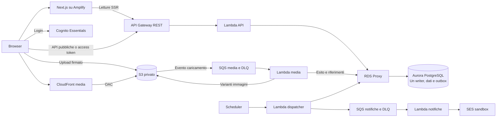

# Domora — Piano della demo AWS

**Stato: proposta di implementazione, 7 ottobre 2026.** Questo documento descrive la versione da realizzare per la presentazione scolastica. Applicazione e infrastruttura non sono ancora implementate. La [sintesi del progetto completo](../docs/16-sintesi-e-presentazione.md) rimane il riferimento per la produzione progettata; la demo mantiene le scelte centrali, con meno capacità e garanzie operative.

## 1. Il progetto in una pagina

Domora è un portale immobiliare per più agenzie. Un visitatore cerca annunci di vendita e affitto; un utente autenticato salva preferiti e chiede informazioni o una visita; l'agenzia pubblica annunci e gestisce le richieste ricevute.

La demo conserva **Next.js su Amplify, Cognito, API Gateway REST, Lambda, PostgreSQL su Aurora Serverless v2, RDS Proxy, S3 e CloudFront**. Per mostrare il lavoro asincrono conserva anche una piccola outbox SQL, SQS e worker Lambda. Le email usano SES nel sandbox, con destinatari verificati.

Si realizza **un solo ambiente in un solo account, a Francoforte (`eu-central-1`)**, per circa dieci ore complessive di prove e presentazione. Il database ha un solo writer; non si aggiunge il reader di riserva. Restano subnet private e una VPC su due zone, ma un solo NAT zonale serve le uscite: il guasto della sua zona non è coperto dalla demo.

La ricerca continua a usare SQL e indici PostgreSQL. Immobile, annuncio e contatto restano entità distinte; autenticazione, autorizzazioni e salvataggi sono reali. Non si cambia modello di persistenza soltanto per ridurre la fattura.

## 2. Cosa deve funzionare durante la presentazione

| Funzione | Versione della demo |
| --- | --- |
| Catalogo | Lista e dettaglio con fotografie, comune, vendita/affitto e prezzo |
| Ricerca | Filtri per comune, tipo di offerta e prezzo; ricerca testuale SQL essenziale |
| Accesso | Cognito Essentials, account già preparati; verifica email e TOTP configurati prima della presentazione |
| Pubblicazione | Operatore crea immobile e annuncio, carica fotografie, pubblica e ritira l'offerta |
| Preferiti | L'utente salva e rimuove annunci nella propria lista |
| Contatti | Messaggio iniziale e risposta dell'agenzia, conservati nel portale |
| Visite | Utente propone giorno/ora; agenzia accetta o rifiuta, senza calendario condiviso |
| Notifiche | Email generica di aggiornamento a indirizzi verificati, tramite outbox e coda |
| Isolamento | Ogni agenzia modifica solo i propri annunci e legge solo le proprie richieste |

Preparare due agenzie, due operatori e due interessati. Le agenzie e i ruoli vengono creati tramite seed amministrativo: non serve costruire una procedura di onboarding professionale. Un solo ruolo operativo per agenzia sostituisce responsabile, assegnazioni e riassegnazioni.

Il percorso da mostrare è: **creare una bozza → caricare una foto → pubblicare → cercare come interessato → salvare un preferito → inviare richiesta di visita → accettare come agenzia → verificare stato ed email → ritirare l'annuncio**. Su annuncio ritirato non si accettano nuove richieste; l'eventuale visita attiva viene annullata nella stessa transazione, dato il numero minimo di record.

## 3. Architettura e responsabilità

Il frontend mantiene Next.js e le letture SSR del catalogo. Le operazioni personali partono dal browser con access token Cognito. API Gateway verifica il token sulle route riservate; le Lambda controllano nel database utente, ruolo e agenzia corrente. Il frontend non accede direttamente al database.

Il backend è un'unica base di codice TypeScript, suddivisa per catalogo, gestione annunci e contatti. Si può iniziare con **una Lambda API**, più dispatcher e due worker, evitando una funzione distinta per ogni endpoint. Ogni esecuzione usa al massimo una connessione al proxy; le query sono parametrizzate.

Aurora conserva utenti applicativi collegati al `sub` Cognito, agenzie, immobili, annunci, media, preferiti, contatti, messaggi, visite e outbox. Si mantengono chiavi esterne e vincoli, compresa l'unicità del contatto per utente/annuncio e del preferito per utente/annuncio. Dati e indici SQL sono piccoli; fotografie e documenti non vanno nel database.

**Media:** upload diretto tramite autorizzazione firmata, bucket privato e stato `pending`. Un evento S3 passa nella coda media; il worker verifica il riferimento autorizzato, dimensione e decodifica effettiva, genera una variante e marca il file `ready`. Solo le varianti pronte possono essere associate alla pubblicazione. Per questa demo si accettano solo JPEG/PNG sintetici controllati, massimo 5 MB e 12 megapixel; niente PDF. La validazione non equivale a una scansione antivirus: GuardDuty viene omesso. Il worker non deve rielaborare gli eventi delle varianti: notifiche limitate al prefisso di ingresso.

**Distribuzione:** CloudFront legge da S3 con OAC; le API emettono URL firmati brevi solo per media di annunci visibili. Chiavi/versioni distinguono i file preparati. Si conservano le regole di cache dell'originale, usando il piano CloudFront a consumo, senza abbonamenti fissi.

**Notifiche:** il salvataggio del messaggio o della visita registra un evento nella stessa transazione SQL. Il dispatcher legge l'outbox ogni minuto e invia piccoli batch a SQS. Il worker invia l'email; la schermata legge sempre lo stato dal database. Identificativi evento e stati di elaborazione gestiscono i duplicati ordinari; non si promette invio email esattamente una volta. Un fallimento email non annulla una visita già salvata.

**Rete:** Aurora e proxy rimangono privati. API, dispatcher e worker che accedono al database usano le subnet applicative; un NAT zonale consente chiamate HTTPS a SQS, SES e Secrets Manager. Un gateway endpoint S3 evita il NAT per i file. Non si aggiungono interface endpoint, ALB o bastion. I segreti rimangono in Secrets Manager, con caching breve nel processo Lambda; i log non contengono password, token o messaggi privati.

## 4. Capacità ridotte e servizi alleggeriti

| Voce | Configurazione iniziale della demo |
| --- | --- |
| Dati | Due agenzie, quattro account, 50–100 annunci, alcune decine di richieste |
| Utenti simultanei | 1–5 persone; nessun test ai picchi di produzione |
| Database | Un writer Aurora PostgreSQL Serverless v2, range iniziale **0,5–4 ACU**, Standard |
| Dimensione dati SQL | Obiettivo inferiore a 200 MB inclusi indici; verificare il limite e il conteggio storage effettivo del piano |
| File | 100–300 immagini, al massimo circa 1 GB complessivo |
| API | 512 MB–1 GB; reserved concurrency iniziale 5, pool client massimo uno |
| Worker | Media: 2 GB; notifiche: 512 MB; reserved concurrency 2 ciascuno, batch SQS piccolo |
| Dispatcher | 512 MB, concorrenza 1; polling ogni minuto soltanto nella finestra di test |
| Traffico complessivo | Fino a 10.000 API, 1–5 GB distribuiti, non oltre 100 email |
| Monitoraggio | CloudWatch Logs con retention breve, metriche standard e pochi allarmi su errori, DLQ e database |
| Rilascio | Una configurazione Terraform, build Amplify e un job CodeBuild temporaneo per schema/seed nella VPC |

Con RDS Proxy attivo **non si conta sull'auto-pausa a zero di Aurora**: il proxy mantiene connessioni che impediscono la pausa. Si mantiene capacità durante le prove e si elimina l'ambiente al termine. [Limiti dell'auto-pausa Aurora](https://docs.aws.amazon.com/AmazonRDS/latest/AuroraUserGuide/aurora-serverless-v2-auto-pause.html).

Si omettono reader, secondo NAT, account di produzione, scanner malware, AWS Backup per S3, sonde Synthetics e pipeline di promozione fra ambienti. I backup automatici ordinari del database restano gestiti da Aurora; fixture e seed permettono di ricreare i dati della demo. Non si implementano procedure di disaster recovery.

WAF è **facoltativo**: una ACL con poche regole sullo stage REST può essere aggiunta per mostrarne il ruolo. Non occorre riprodurre tre ACL e l'associazione al frontend. Si mantengono autenticazione, autorizzazioni, limiti dei payload e throttling API; quest'ultimo riduce il traffico ma non costituisce un tetto di spesa.

La demo mostra flussi e separazione dei dati. Non dimostra disponibilità 99,9%, failover a dieci minuti, capacità ai volumi originali, protezione da upload ostili o recupero da perdita regionale.

## 5. Free Tier e budget

La proposta usa i **crediti dell'account di prova**, oltre alle franchigie applicabili: Aurora, proxy e NAT non vengono considerati gratuiti per il solo fatto di avere pochi utenti. AWS pubblicizza 100 USD iniziali e fino a 100 aggiuntivi per nuovi clienti idonei, con Free plan fino a sei mesi o esaurimento crediti. [AWS Free Tier](https://aws.amazon.com/free/).

AWS indica per Aurora PostgreSQL Serverless nel Free plan fino a **4 ACU e 1 GiB di storage per cluster**. Prima di creare risorse bisogna verificare disponibilità nell'account, versione motore, limite effettivo di storage e accesso a Proxy/NAT/integrazioni: pochi record non garantiscono da soli il rispetto della misura di storage gestita da AWS. Il piano gratuito non offre automaticamente tutte le funzionalità. [Offerta Aurora e RDS](https://aws.amazon.com/rds/free/), [servizi della nuova esperienza di registrazione](https://docs.aws.amazon.com/accounts/latest/reference/supported-services-sign-up-new.html).

Se Aurora non è utilizzabile nel piano disponibile, l'alternativa prevista è **RDS PostgreSQL `db.t4g.micro` Single-AZ**, mantenendo schema SQL, API e rete privata. È una sostituzione circoscritta del servizio database, da dichiarare nella presentazione. Se soltanto Proxy è bloccato, si può collegare la Lambda direttamente al database e abbassare concorrenza/pool; non si aggiunge un'altra tecnologia di persistenza. Non si passa automaticamente al Paid plan per completare la demo.

SES rimane nel sandbox, con mittente e destinatari verificati: fino a 200 messaggi nelle 24 ore e uno al secondo. Se l'invio non è disponibile, la funzione centrale resta la consultazione delle richieste nel portale; l'email viene esclusa dalla dimostrazione e dichiarata come integrazione prevista. [Sandbox SES](https://docs.aws.amazon.com/ses/latest/dg/request-production-access.html).

| Voce, 10 ore effettive | Stima USD prima di crediti e imposte |
| --- | ---: |
| Aurora, 0,5–2 ACU medie su un writer | 0,70–2,80 |
| Proxy sulla stessa capacità | 0,09–0,36 |
| Un NAT, un IPv4 e pochi dati | Circa 0,60–0,80 |
| Amplify, API, Lambda, media, code, log, segreti, build e storage | Riserva di 2–6 |
| **Totale orientativo arrotondato** | **4–10** |
| **Budget operativo prudenziale** | **25** |

Le tariffe Aurora/Proxy di riferimento a Francoforte sono 0,14 e 0,018 USD/ACU-ora; NAT costa 0,052 USD/ora più dati e IPv4. [Listino RDS](https://pricing.us-east-1.amazonaws.com/offers/v1.0/aws/AmazonRDS/current/eu-central-1/index.json), [prezzi VPC](https://aws.amazon.com/vpc/pricing/). Le altre voci sono una riserva, non un preventivo analitico. Se il writer resta a 4 ACU per tutte le dieci ore, il solo compute costa 5,60 USD e il totale aumenta. Il budget non è un limite automatico della fatturazione.

Dieci ore significano tempo di risorse attive, comprese preparazione, migrazioni e prove. Un mese di attesa con NAT e database accesi non rientra nella stima. Crediti validi possono coprire il consumo idoneo e portare l'esborso a zero; validità, saldo e copertura vanno controllati nell'account.

## 6. Ordine di realizzazione e prova finale

1. **Verifica dell'account:** crediti, regione, servizi e quote; confermare Aurora oppure la sostituzione RDS PostgreSQL prima di sviluppare il deploy.
2. **Percorso minimo:** PostgreSQL locale, schema/seed, Next.js, catalogo e filtri. Riutilizzare lo stesso schema nel cloud.
3. **Accesso e scritture:** Cognito, ruoli SQL applicativi, gestione annunci, preferiti, contatti e visita.
4. **Deploy AWS:** Terraform, VPC, database/proxy/NAT, Lambda e REST API, Amplify; migrazioni e seed con CodeBuild. Nessuna apertura pubblica di PostgreSQL.
5. **Media:** S3, CloudFront, coda e worker; pubblicazione subordinata a foto pronta. Aggiungere outbox, dispatcher, coda notifiche e SES dopo il percorso principale.
6. **Collaudo:** percorrere la storia completa; verificare un accesso incrociato fra agenzie negato, una richiesta privata di un altro utente negata e un annuncio ritirato escluso dal catalogo. Provare che un errore email non perda la richiesta.
7. **Presentazione e chiusura:** preparare account, dati e login; provare prima le pagine SSR e gli upload. Dopo la sessione eliminare l'ambiente e verificare NAT/IP, proxy, database, snapshot/backup residui, bucket/versioni, scheduler, log e hosting. Conservare soltanto artefatti necessari con costo dichiarato.

**Frase per la presentazione:** «La demo mantiene il modello relazionale, il percorso Next.js–API–Lambda–PostgreSQL e le integrazioni principali del progetto. Riduce capacità, ridondanza e strumenti operativi perché serve a dimostrare il flusso con pochi utenti per dieci ore; le garanzie di produzione rimangono oggetto della progettazione completa».
