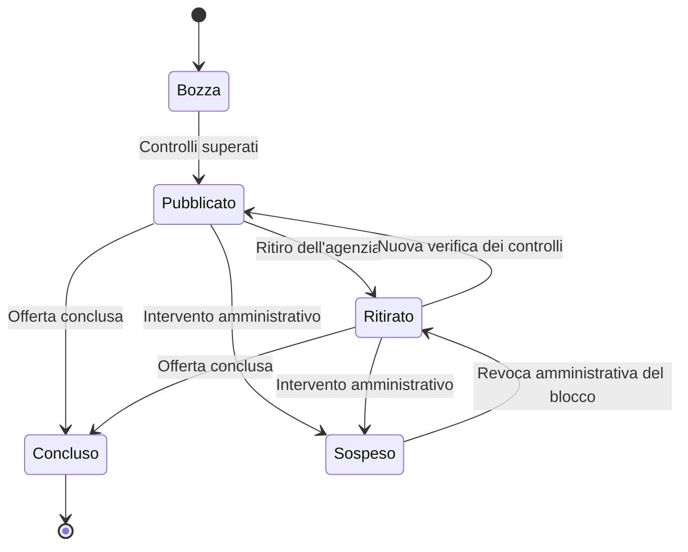

# Domora — Dall'immobile all'annuncio pubblicato

Questo flusso applica i [permessi](02-attori-e-permessi.md) al catalogo dell'agenzia. La pubblicazione non richiede approvazione preventiva di ogni annuncio: l'agenzia è abilitata prima di poter pubblicare.

## 1. Ingresso dell'agenzia

Il futuro responsabile, con account ed email verificata, presenta una richiesta con dati identificativi dell'agenzia e recapito professionale. L'amministratore esamina la richiesta, verifica la coerenza dei dati e il collegamento del referente con l'agenzia e registra approvazione o rifiuto motivato. Una richiesta rifiutata può essere corretta e ripresentata.

Si adotta una verifica manuale per la base del progetto. Fonti, evidenze richieste e loro conservazione sono ancora da definire; non si assume un servizio esterno di verifica dell'identità né una garanzia legale derivante dall'abilitazione.

Prima dell'abilitazione non sono disponibili le operazioni professionali. Dopo l'abilitazione il responsabile può invitare operatori e gestire il catalogo.

**Motivazione:** controllare l'ingresso dell'agenzia concentra il lavoro amministrativo su un passaggio preciso. Un servizio automatico introdurrebbe un'integrazione aggiuntiva, mentre approvare ogni annuncio creerebbe un processo editoriale continuo.

## 2. Inserimento dell'immobile e preparazione dell'annuncio

1. L'operatore inserisce la scheda dell'immobile nella propria agenzia oppure utilizza una scheda esistente.
2. Crea un annuncio in bozza, collegato all'immobile, scegliendo vendita o affitto.
3. Prepara titolo, descrizione, prezzo in euro, caratteristiche, zona pubblica e immagini.
4. Decide se pubblicare l'indirizzo esatto. Documenti e note interne rimangono separati.
5. Verifica il contenuto e richiede la pubblicazione.

L'annuncio contiene una propria versione dei campi pubblici. Modificare la scheda interna dell'immobile non modifica automaticamente gli annunci già pubblicati: l'operatore deve aggiornare esplicitamente il contenuto dell'annuncio.

**Motivazione:** separare dati interni e contenuto pubblico evita esposizioni involontarie e aggiornamenti impliciti. La versione pubblica è gestita nell'annuncio; non si introduce un sistema aggiuntivo di revisioni editoriali.

## 3. Controlli e pubblicazione

Per pubblicare, il sistema controlla agenzia attiva, permessi, stato dell'annuncio e completezza dei dati. Sono necessari titolo, descrizione, tipo di offerta, prezzo positivo, tipo di immobile, superficie positiva, zona e almeno un'immagine pronta e selezionata. Formati e limiti iniziali sono nei [requisiti di qualità](07-carico-e-requisiti-qualita.md); i controlli tecnici sono nel [percorso dei media](10-media-worker-e-notifiche.md).

Un file appena caricato non è automaticamente pronto: deve essere collegato all'immobile e superare i controlli di contenuto previsti. Se un'immagine selezionata è ancora in elaborazione o non valida, il sistema indica il problema e non pubblica il nuovo contenuto.

Il salvataggio dello stato pubblicato, del contenuto pubblico e della rappresentazione testuale per la ricerca avviene come un'unica operazione consistente. La conferma riguarda questo salvataggio; eventuali email e altre elaborazioni proseguono in background. La [scelta di persistenza](09-persistenza-e-ricerca.md) usa ricerca interna a PostgreSQL, senza un indice esterno da sincronizzare.

**Motivazione:** l'utente deve ricevere una conferma solo dopo il salvataggio effettivo. La ricerca interna aggiorna il contenuto nella transazione; separare le altre elaborazioni evita di bloccare la pubblicazione per la durata dell'invio email. Il lavoro successivo viene registrato con outbox transazionale; trasporto e tentativi sono descritti in [Media, worker e notifiche](10-media-worker-e-notifiche.md).

## 4. Stati dell'annuncio

| Stato | Significato | Visibile nel catalogo | Nuove richieste |
| --- | --- | --- | --- |
| Bozza | Contenuto in preparazione | No | No |
| Pubblicato | Offerta attualmente disponibile | Sì, se l'agenzia è attiva | Sì, se l'agenzia è attiva |
| Ritirato | Offerta rimossa dall'agenzia, riattivabile | No | No |
| Concluso | Offerta terminata, con esito venduto o affittato | No | No |
| Sospeso | Contenuto bloccato dall'amministratore | No | No |

Un annuncio concluso non viene riaperto: un successivo ritorno sul mercato genera un nuovo annuncio sullo stesso immobile. La revoca della sospensione porta a ritirato, senza ripubblicare automaticamente. Solo l'amministratore può rimuovere il blocco; l'agenzia può correggere il contenuto sospeso senza renderlo pubblico.

Per immobile e tipo di offerta è ammesso un solo annuncio non concluso, contando anche bozze, ritirati e sospesi. Vendita e affitto possono coesistere come annunci distinti. Un annuncio sospeso non può quindi essere aggirato creando un'altra offerta dello stesso tipo sulla stessa scheda.

**Motivazione:** cinque stati coprono preparazione, disponibilità, rimozione e intervento amministrativo. Si evita uno stato “in trattativa”, che richiederebbe regole aggiuntive sulla disponibilità. Il vincolo mantiene un unico percorso per l'offerta; il controllo di schede duplicate usate per aggirare un blocco resta amministrativo.

## 5. Modifiche e operazioni concorrenti

Le modifiche a un annuncio pubblicato sono preparate nell'interfaccia e diventano effettive solo dopo un salvataggio che supera gli stessi controlli della pubblicazione. Fino a quel momento rimane valido il contenuto precedente. Non esistono bozze persistenti parallele a un annuncio pubblicato nella base iniziale.

Il sistema rileva se un altro operatore ha modificato l'annuncio dopo il caricamento della schermata: in tal caso rifiuta il salvataggio e invita a ricaricare i dati. Questa verifica vale anche per cambi di stato, compresa una sospensione intervenuta nel frattempo.

**Motivazione:** un controllo di versione impedisce sovrascritture involontarie senza introdurre blocchi di editing o collaborazione in tempo reale. Rinunciare a revisioni parallele riduce la complessità, ma non permette di conservare lunghe modifiche incompiute su un annuncio già online.

## 6. Ritiro, sospensione e disabilitazione dell'agenzia

Ritiro, conclusione e sospensione aggiornano subito lo stato autorevole dell'annuncio e impediscono nuove richieste. La ricerca PostgreSQL verifica la visibilità nella stessa query che restituisce i risultati; una nuova query iniziata dopo il salvataggio esclude l'annuncio. Una richiesta già in corso può aver letto lo stato precedente, mentre un risultato già visualizzato non autorizza mai l'invio di una nuova richiesta senza ulteriori controlli.

La disabilitazione dell'agenzia è un blocco separato: nasconde tutti i suoi annunci e impedisce le operazioni professionali. Non cambia individualmente gli stati degli annunci. La riabilitazione rende nuovamente ammissibili quelli pubblicati, lasciando ritirati, conclusi e sospesi nei rispettivi stati.

**Motivazione:** lo stato dell'agenzia permette di bloccare il catalogo senza riscrivere ogni annuncio. Filtrare anche quello stato nella query rende il controllo parte del percorso pubblico; il suo costo è incluso nella ricerca, non delegato a una copia esterna.

Le richieste esistenti vengono conservate. Su annunci ritirati o conclusi i partecipanti autorizzati possono completare la conversazione; su annunci sospesi o agenzie disabilitate l'invio di messaggi è bloccato e l'interessato mantiene accesso al proprio storico. Ritiro, conclusione, sospensione e disabilitazione annullano le visite in attesa o accettate, con motivo e avviso ai partecipanti. La riattivazione non ripristina gli appuntamenti annullati. Permessi e dettagli sono nel [flusso di contatti e visite](04-contatti-e-visite.md).

## 7. Segnalazioni e casi di errore

Un utente registrato può segnalare un annuncio indicando una motivazione. La segnalazione è riservata all'amministratore e non sospende automaticamente il contenuto. L'amministratore esamina il caso e registra l'esito; in caso di sospensione comunica all'agenzia motivo e correzioni richieste.

**Motivazione:** una decisione amministrativa evita che una segnalazione arbitraria rimuova automaticamente un'offerta. L'account permette di gestire abusi senza aggiungere un flusso anonimo separato.

| Caso | Comportamento previsto |
| --- | --- |
| Dati incompleti o immagine non pronta | Pubblicazione rifiutata con indicazione del problema; bozza conservata |
| Permessi revocati o agenzia disabilitata | Operazione rifiutata, senza modifiche |
| Altro annuncio non concluso per lo stesso immobile e offerta | Creazione rifiutata; si utilizza l'annuncio esistente |
| Versione superata o stato cambiato | Salvataggio rifiutato; ricaricamento richiesto |
| Salvataggio fallito | Nessuna conferma di pubblicazione; contenuto precedente preservato |
| Risposta persa dopo un salvataggio riuscito | Il client rilegge lo stato; la ripetizione non deve creare un secondo annuncio |
| Email o altre elaborazioni successive fallite | Salvataggio mantenuto; elaborazione da recuperare e problema monitorato |

Non è previsto eliminare definitivamente una scheda o un annuncio tramite le normali operazioni del catalogo. Ritiro e conclusione ne gestiscono l'uscita dal mercato; conservazione e cancellazione seguono le proposte della [politica dei dati](12-sicurezza-e-protezione-dati.md), ancora da validare.

## 8. Collegamenti tecnici e punti aperti

Restano da progettare evidenze per l'abilitazione delle agenzie, conservazione dello storico e procedure di gestione delle segnalazioni. La zona pubblica e il comportamento dei risultati sono definiti in [Ricerca e preferiti](05-ricerca-e-preferiti.md); limiti dei media e obiettivi di propagazione sono nei [requisiti di qualità](07-carico-e-requisiti-qualita.md). Il modello dati descrive i vincoli; [persistenza](09-persistenza-e-ricerca.md) e [worker](10-media-worker-e-notifiche.md) descrivono transazioni, visibilità e recupero del lavoro.
