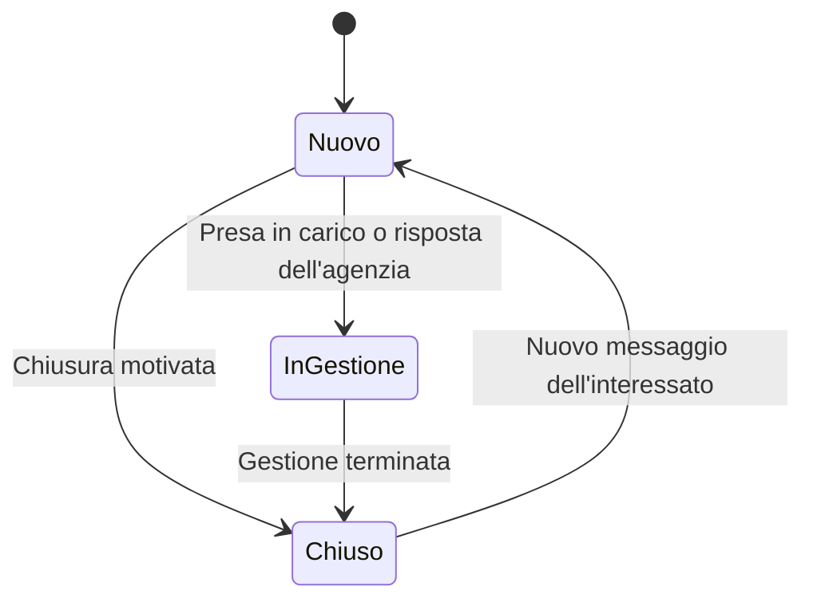

# Domora — Contatti e richieste di visita

Questo documento descrive il percorso dall'interesse per un annuncio alla gestione della richiesta da parte dell'agenzia. Applica i [permessi](02-attori-e-permessi.md) e gli [stati dell'annuncio](03-flusso-pubblicazione.md), senza introdurre un calendario o una chat in tempo reale.

## 1. Contatto, conversazione e visita

Il **contatto** è la pratica che collega un utente interessato a un annuncio e alla sua agenzia. Comprende stato di gestione, eventuale operatore assegnato e conversazione privata. La **conversazione** raccoglie i messaggi dell'interessato e del personale autorizzato. Una **richiesta di visita** è una richiesta specifica all'interno dello stesso contatto.

Per la stessa coppia utente–annuncio esiste un solo contatto. Successivi messaggi o richieste di visita lo riutilizzano. Un nuovo annuncio dello stesso immobile genera invece un contatto distinto: le richieste precedenti non vengono trasferite automaticamente.

**Motivazione:** un unico punto di gestione evita pratiche duplicate e conserva il contesto. Separare contatto e visita permette di continuare a chiedere informazioni anche dopo una visita rifiutata o annullata.

## 2. Invio e assegnazione

1. L'interessato accede con account ed email verificata e sceglie contatto o richiesta di visita dalla scheda pubblica.
2. Inserisce un messaggio; per una visita può indicare disponibilità preferite, senza prenotare uno slot.
3. Il backend verifica che l'annuncio sia ancora pubblicato e l'agenzia attiva. L'agenzia destinataria viene ricavata dall'annuncio.
4. Il sistema crea o riutilizza il contatto, salva il messaggio e l'eventuale richiesta di visita e conferma l'operazione.
5. Un nuovo contatto entra nella lista da assegnare del responsabile; un contatto esistente conserva l'assegnazione valida.
6. Un avviso email viene preparato in background per il responsabile, oppure per l'operatore già assegnato.

Il responsabile può rispondere direttamente o assegnare il contatto a un operatore attivo della stessa agenzia. Non è previsto un algoritmo automatico di distribuzione o un operatore proprietario dell'annuncio.

**Motivazione:** l'assegnazione manuale è coerente con il catalogo condiviso e non richiede regole su turni, disponibilità o carico degli operatori. Il limite è il passaggio iniziale attraverso il responsabile; il tempo di risposta dipende dall'organizzazione dell'agenzia.

La conferma indica che la richiesta è stata registrata, non che sia già stata letta o che la visita sia accettata. Se l'invio email fallisce, il contatto rimane visibile nella lista dell'agenzia e l'avviso viene recuperato separatamente.

## 3. Conversazione privata

L'interessato legge e risponde dalla propria area del portale. Dal lato dell'agenzia possono leggere e rispondere il responsabile e l'operatore assegnato. Ogni messaggio conserva autore e momento dell'invio; nella base iniziale non sono previsti modifica dei messaggi, allegati, ricevute di lettura o presenza online.

La pagina mostra i messaggi quando viene aperta o aggiornata. Le risposte arrivano al portale, non rispondendo direttamente all'email di avviso. L'agenzia può comunicare privatamente l'indirizzo della visita nella conversazione; ciò non modifica l'indirizzo pubblico dell'annuncio.

**Motivazione:** messaggi persistenti e avvisi email coprono la comunicazione essenziale senza infrastrutture di chat, gestione di allegati o ricezione automatica delle email. L'utente deve rientrare nel portale per rispondere.

Il contatto mantiene il riferimento all'annuncio anche dopo la sua uscita dal catalogo. Il pannello privato può mostrarne identificativo, titolo e tipo di offerta per riconoscere la pratica; non ripubblica la scheda nascosta né include dati interni dell'immobile. La conversazione non è una copia storica completa del contenuto dell'annuncio.

## 4. Stati del contatto

| Stato | Significato | Transizione principale |
| --- | --- | --- |
| Nuovo | Richiesta non ancora presa in carico | Operatore assegnato o responsabile avvia la gestione |
| In gestione | Il personale sta seguendo il contatto | Personale autorizzato chiude la pratica |
| Chiuso | Non sono previste altre attività sul contatto | Un nuovo messaggio dell'interessato lo riapre |

Assegnazione e stato sono distinti: assegnare non significa aver iniziato a gestire il contatto. Una prima risposta del personale porta automaticamente da nuovo a in gestione. Una chiusura registra una breve motivazione interna, visibile solo al personale autorizzato, per esempio richiesta risolta o interesse cessato.

Il personale può chiudere il contatto solo quando non esistono visite in attesa o accettate: prima deve risolverle o annullarle. Una risposta dell'agenzia su un contatto già chiuso non lo riapre; un nuovo messaggio dell'interessato lo riporta a nuovo e genera un avviso al personale competente.

**Motivazione:** tre stati descrivono il lavoro senza introdurre un processo di vendita. Il nuovo messaggio rende visibile il bisogno di un'ulteriore risposta. Non sono previste riaperture manuali separate: se occorre proseguire su iniziativa dell'agenzia, il personale può comunque rispondere nella conversazione.

## 5. Stati della visita

| Stato | Significato | Chi agisce |
| --- | --- | --- |
| In attesa | Richiesta ricevuta, appuntamento non confermato | Creata dall'interessato |
| Accettata | Agenzia conferma giorno e ora concordati | Operatore assegnato o responsabile |
| Rifiutata | Agenzia non accoglie la richiesta | Operatore assegnato o responsabile, con motivo visibile all'interessato |
| Annullata | Richiesta o appuntamento cancellato | Interessato, personale autorizzato o sistema nei casi di blocco dell'offerta |
| Completata | Agenzia registra che l'appuntamento si è svolto | Operatore assegnato o responsabile |

Una visita in attesa può essere accettata, rifiutata o annullata. Una visita accettata può essere annullata o completata; gli altri stati sono finali. Il completamento non è registrabile prima dell'orario concordato. Se la visita non si svolge, il personale la annulla indicando il motivo, senza introdurre uno stato aggiuntivo di mancata presenza. La cancellazione registra autore e motivo, distinguendo l'annullamento dell'utente da quello dell'agenzia o del sistema.

Prima dell'accettazione, giorno e ora vengono concordati nei messaggi. L'accettazione richiede un orario futuro, registra data, ora e fuso orario e li mostra a entrambi i partecipanti. Questi dati non riservano uno slot e non verificano conflitti con altri appuntamenti.

Per contatto è ammessa una sola visita attiva, cioè in attesa o accettata. Dopo rifiuto, annullamento o completamento, l'interessato può chiedere un'altra visita se l'annuncio è ancora pubblicato. Per cambiare una visita già accettata si annulla la precedente e se ne invia una nuova.

**Motivazione:** una visita attiva per contatto evita appuntamenti paralleli involontari. Lo stato completata permette di chiudere la gestione senza confondere un appuntamento svolto con uno cancellato. Annullare e ricreare rende esplicito il cambio di accordo, con un passaggio aggiuntivo rispetto a una modifica diretta.

## 6. Riassegnazione e perdita dell'accesso

Solo il responsabile assegna o riassegna il contatto. Il nuovo operatore vede lo storico necessario a proseguire il lavoro; il precedente perde l'accesso professionale. Stato del contatto, messaggi e visite non cambiano per il solo trasferimento.

Se l'operatore viene rimosso dall'agenzia, il contatto torna nella lista da assegnare e il responsabile viene avvisato. Le visite già concordate restano registrate: spetta al responsabile seguirle o annullarle. Ogni operazione controlla l'assegnazione corrente, anche se la schermata era stata aperta prima della riassegnazione.

**Motivazione:** la pratica appartiene all'agenzia, non all'account del dipendente. Conservare la conversazione permette continuità; verificare l'assegnazione evita accessi residui dopo il trasferimento.

## 7. Annunci non disponibili e blocchi

| Condizione | Nuovo contatto o nuova visita | Messaggi nei contatti esistenti | Visite in attesa o accettate |
| --- | --- | --- | --- |
| Annuncio pubblicato, agenzia attiva | Consentiti | Consentiti ai partecipanti autorizzati | Gestione ordinaria |
| Annuncio ritirato o concluso | Vietati | Consentiti per completare la gestione | Annullate dal sistema con motivo |
| Annuncio sospeso o agenzia disabilitata | Vietati | Sola lettura per i partecipanti ancora autorizzati | Annullate dal sistema con motivo |

La perdita di disponibilità annulla le visite attive, senza chiudere automaticamente i contatti né modificare visite già finali. L'annullamento deve risultare ai partecipanti nel portale e generare un avviso email. La procedura tecnica dovrà gestire anche un blocco che coinvolge molte richieste: le visite invalidate risultano subito non confermate, anche se l'aggiornamento dei singoli record prosegue in background. Tempi e condizioni sono nei [requisiti di qualità](07-carico-e-requisiti-qualita.md).

**Motivazione:** non mantenere appuntamenti confermati su offerte rimosse rende il comportamento prevedibile e limita accordi obsoleti. Il compromesso è dover concordare nuovamente una visita se l'annuncio torna disponibile. Ripubblicazione, revoca della sospensione e riabilitazione dell'agenzia non riattivano le visite annullate.

Un nuovo messaggio su un contatto chiuso può riaprirlo anche se l'annuncio è ritirato o concluso: riguarda la conversazione precedente, non una nuova offerta. Durante una sospensione o una disabilitazione, invece, i messaggi sono bloccati. L'interessato conserva accesso al proprio storico; il personale conserva accesso solo entro i permessi correnti e, in caso di agenzia disabilitata, perde l'accesso professionale anche in lettura.

## 8. Avvisi, errori e tracciabilità

Si inviano avvisi per nuova richiesta, assegnazione o riassegnazione, nuovo messaggio e cambi di stato della visita. Il portale mostra lo stato del contatto; la sua semplice chiusura interna non richiede una seconda email. Per un messaggio dell'agenzia si avvisa l'interessato; per un messaggio dell'interessato si avvisa l'assegnatario o, in sua assenza, il responsabile.

Le email contengono un avviso generico e un collegamento all'area autenticata, senza testo dei messaggi, indirizzi dell'immobile o documenti. Gli avvisi al personale verificano il destinatario corrente al momento dell'elaborazione; un'email già inviata non concede accesso dopo una revoca. La registrazione di un messaggio e il suo avviso sono operazioni distinte.

**Motivazione:** il portale rimane il luogo autorevole per stato e contenuti; l'email serve a richiamare l'attenzione. Un ritardo o un ordine diverso degli avvisi non deve cambiare lo stato della pratica.

| Caso | Comportamento previsto |
| --- | --- |
| Annuncio non più disponibile al momento dell'invio | Nuova richiesta rifiutata, nessuna conferma positiva |
| Invio ripetuto per errore di rete | La stessa operazione non crea contatti, messaggi o visite duplicati |
| Contatto già esistente | Riutilizzo della conversazione; messaggi realmente nuovi restano distinti |
| Visita attiva già presente | Nuova visita rifiutata, con rimando a quella esistente |
| Assegnazione o versione cambiata durante l'azione | Operazione rifiutata e ricaricamento richiesto |
| Salvataggio fallito | Nessuna conferma; contatto, messaggio e visita non restano creati solo in parte |
| Avviso email fallito | Dati preservati nel portale; recupero separato e monitoraggio |

La ripetizione della stessa operazione è riconosciuta tramite un identificativo di invio, non confrontando il testo: due messaggi identici possono essere intenzionali. Transizioni e controlli concorrenti dovranno impedire l'accettazione di una visita annullata o la creazione di richieste dopo il blocco dell'offerta.

Si tracciano invii, assegnazioni e cambi di stato con autore, momento e risultato. Limite dei messaggi e obiettivo organizzativo di risposta sono nei [requisiti di qualità](07-carico-e-requisiti-qualita.md); proposte di conservazione, cancellazione e limiti alla frequenza di invio sono nella [sicurezza](12-sicurezza-e-protezione-dati.md), con validazioni e verifiche ancora necessarie.
