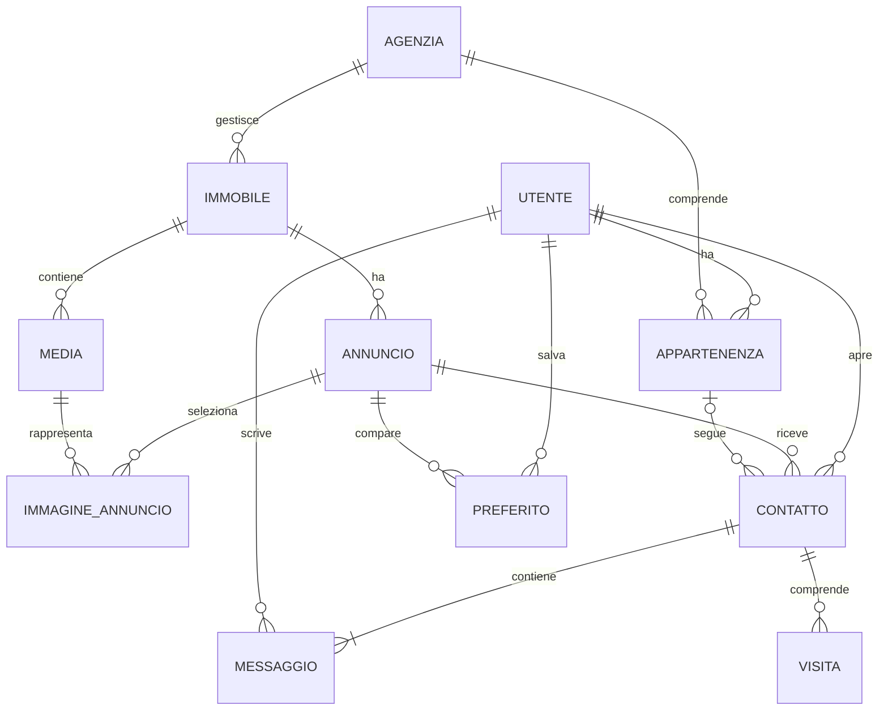

# Domora — Modello dei dati

Il modello traduce [attori e permessi](02-attori-e-permessi.md), [pubblicazione](03-flusso-pubblicazione.md), [contatti e visite](04-contatti-e-visite.md) e [ricerca e preferiti](05-ricerca-e-preferiti.md) in entità e vincoli. Definisce le informazioni da conservare e le operazioni da rendere consistenti; non è ancora uno schema SQL o una configurazione del database.

## 1. Criteri comuni

- Ogni entità ha un identificativo stabile, indipendente da nomi ed email.
- I dati aziendali appartengono a un'agenzia; i collegamenti fra entità non possono attraversare agenzie diverse.
- Ogni record modificabile conserva creazione, ultimo aggiornamento e una versione per rilevare modifiche concorrenti.
- Importi e superfici usano valori decimali esatti; il prezzo non usa approssimazioni numeriche che possano alterare i centesimi.
- I momenti degli eventi sono conservati come istanti riferiti a UTC; per gli appuntamenti si conserva anche il fuso locale concordato.
- Le relazioni devono preservare i riferimenti: ritiro di un annuncio e revoca di un operatore non cancellano contatti o messaggi.

**Motivazione:** identificativi, relazioni e vincoli stabili permettono di cambiare i dati descrittivi senza perdere collegamenti o autorizzazioni. Versioni e informazioni temporali aiutano a ricostruire le operazioni e a evitare sovrascritture.

## 2. Identità e agenzie

| Entità | Informazioni essenziali | Regole |
| --- | --- | --- |
| Utente | Identificativo, riferimento all'identità autenticata, nome visualizzato, stato dell'account | Password e token non sono dati del profilo applicativo; email verificata ottenuta dal sistema di identità |
| Agenzia | Denominazione, dati identificativi, recapiti professionali pubblici, stato | Stati: in verifica, rifiutata, attiva, disabilitata; solo attiva consente attività professionali |
| Appartenenza | Utente, agenzia, ruolo operatore o responsabile, stato attivo o revocato | Un utente può avere una sola appartenenza professionale attiva |
| Invito | Agenzia, email destinataria, ruolo proposto, autore, scadenza, stato | Stati: pendente, accettato, revocato, scaduto; accettabile una sola volta |

Il riferimento di autenticazione identifica l'account, non un indirizzo email modificabile. Le informazioni personali necessarie all'invio degli avvisi vengono risolte dal profilo verificato: il recapito dell'utente non viene copiato in ogni contatto.

Il privilegio di amministratore del portale è un'assegnazione separata dai ruoli aziendali. I dati di verifica dell'agenzia comprendono referente, esito, autore e motivazione della decisione; le evidenze eventualmente richieste saranno definite prima di introdurre altri campi o allegati.

Il profilo conserva anche stato di abilitazione dopo onboarding e limite temporale delle autenticazioni ammesse, secondo la [sicurezza](12-sicurezza-e-protezione-dati.md). Non memorizza il segreto TOTP o i refresh token: questi appartengono al sistema di identità e alla sessione del client.

**Motivazione:** l'appartenenza rende revocabile il ruolo senza cancellare l'utente. Conservare le appartenenze revocate permette di identificare gli autori delle attività precedenti. L'agenzia usa un solo ciclo di abilitazione, senza un'entità aggiuntiva di richiesta scollegata dalla sua scheda.

Una richiesta rifiutata può tornare in verifica; la decisione precedente resta nello storico. Il primo responsabile viene attivato con l'approvazione dell'agenzia. L'ultimo responsabile attivo non può essere revocato senza sostituzione; una disabilitazione dell'agenzia ne blocca l'accesso professionale senza revocare tutte le appartenenze.

## 3. Immobili, annunci e file

| Entità | Informazioni essenziali | Regole |
| --- | --- | --- |
| Immobile | Agenzia, tipologia, comune, indirizzo interno, superficie, locali dove pertinenti, note interne | Scheda aziendale; nessun riconoscimento automatico fra agenzie |
| Annuncio | Immobile, tipo di offerta, stato, contenuto pubblico, prezzo, scelta sull'indirizzo, prima pubblicazione, esito di conclusione | Un solo annuncio non concluso per immobile e tipo di offerta |
| Media | Immobile, autore del caricamento, tipo immagine o documento, riferimento al file, formato, dimensione, stato | File collegato alla stessa agenzia dell'immobile; nessun contenuto binario nel record |
| Immagine dell'annuncio | Annuncio, media, ordine di visualizzazione | Solo immagini pronte dello stesso immobile; la prima è l'immagine principale |

Il contenuto pubblico dell'annuncio conserva titolo, descrizione e una copia esplicita di tipologia, superficie, locali, comune e indirizzo destinato alla pubblicazione. Non viene ricostruito automaticamente dalla scheda interna a ogni consultazione. L'indirizzo copiato nell'annuncio è riservato se la relativa scelta di pubblicazione è disattivata.

Il prezzo è in euro: totale richiesto per la vendita, canone mensile per l'affitto. Spese aggiuntive facoltative sono indicate separatamente nella descrizione; non si progetta un calcolo del costo complessivo o della rata. Gli annunci conclusi hanno esito venduto o affittato coerente con il tipo di offerta.

Le tipologie iniziali sono appartamento, casa indipendente, ufficio, locale commerciale, terreno e magazzino. Il numero dei locali è facoltativo per gli edifici e non applicabile ai terreni; un filtro sui locali esclude i record privi di quel dato. La superficie è dichiarata dall'agenzia in metri quadrati: il portale non certifica la misura né la converte fra criteri commerciali e catastali.

**Motivazione:** un elenco ristretto rende filtri e validazione comprensibili. La copia dei campi pubblici rende esplicita la scelta di pubblicazione. Il costo è una duplicazione controllata e la necessità di aggiornare l'annuncio quando cambiano dati interni.

I media attraversano gli stati atteso, in elaborazione, pronto, rifiutato o errore. Atteso indica un caricamento preparato ma non ancora confermato; pronto indica che il file è collegato e ha superato i controlli. Un errore tecnico è distinto da un contenuto rifiutato: il primo può essere ritentato, il secondo richiede una correzione o un nuovo file.

Un'immagine usata da più annunci non viene sovrascritta: una sostituzione genera un nuovo media e un nuovo collegamento. Il media conserva chiave, versione del caricamento accettato, checksum, esiti dei controlli e riferimenti ai derivati verificati, secondo il [percorso dei file](10-media-worker-e-notifiche.md). I documenti non possono comparire fra le immagini pubbliche. La rimozione fisica di un file deve verificare che non abbia riferimenti ancora necessari.

**Motivazione:** riferimenti a file stabili impediscono che un upload cambi involontariamente il contenuto di annunci già pubblicati. L'associazione separata permette di scegliere ordine e immagini per ciascuna offerta senza duplicare necessariamente il file.

## 4. Contatti, messaggi, visite e preferiti

| Entità | Informazioni essenziali | Regole |
| --- | --- | --- |
| Contatto | Annuncio, utente interessato, stato, appartenenza assegnata facoltativa, motivo di chiusura | Unico per utente e annuncio; assegnatario attivo nella stessa agenzia |
| Messaggio | Contatto, autore, contesto interessato o personale, testo, momento dell'invio | Non modificabile nelle operazioni ordinarie; nessun allegato |
| Visita | Contatto, stato, disponibilità iniziali, istante e fuso dell'appuntamento, autore e motivo dell'esito | Una sola visita in attesa o accettata per contatto |
| Preferito | Utente, annuncio, momento del salvataggio | Coppia unica; nessuna copia del contenuto pubblico |

La conversazione è l'insieme ordinato dei messaggi di un contatto: non richiede una seconda entità con gli stessi partecipanti. L'assegnazione punta all'appartenenza professionale, non solo all'utente, per distinguere il rapporto con l'agenzia dal suo account personale.

Il messaggio registra il contesto dell'autore al momento dell'invio. Per un messaggio professionale conserva anche il riferimento all'appartenenza, così una revoca non cambia retroattivamente chi ha risposto. Un messaggio dell'interessato non acquisisce privilegi professionali anche se il suo autore lavora in un'agenzia.

**Motivazione:** evitare una conversazione separata riduce entità prive di autonomia nel prodotto attuale. Riferimenti e contesto espliciti conservano l'identità dell'autore senza dedurre il suo ruolo passato dai permessi correnti.

Una visita accettata richiede un istante concordato futuro e un fuso orario riconoscibile; il completamento richiede che l'orario sia trascorso. Gli stati finali conservano motivo e autore quando previsti dal flusso, anche dopo la riassegnazione. La pratica privata può richiamare titolo e tipo dell'annuncio corrente per identificarlo, ma non conserva una copia completa dell'offerta a ogni messaggio.

## 5. Relazioni principali

Il diagramma mostra il nucleo operativo; inviti, segnalazioni, storico e cataloghi di riferimento sono descritti nelle rispettive sezioni.

Le molteplicità del diagramma comprendono lo storico: un utente può avere più appartenenze registrate ma una sola attiva; un contatto può avere più visite nel tempo ma una sola attiva. Un contatto nasce sempre con almeno un messaggio.

## 6. Località, segnalazioni e storico

**Località.** Un paese ha un codice stabile; ciascun comune ha un identificativo interno, paese e denominazione. I filtri usano identificativi, non nomi come chiavi. Comuni omonimi restano distinguibili e una rinomina non rompe i riferimenti. L'elenco è gestito dal portale, senza chiamate a un fornitore durante ogni ricerca.

La fonte iniziale e i paesi effettivamente coperti sono ancora aperti: dovranno essere scelti verificando copertura, possibilità di riuso e aggiornamento. Non si dichiara già disponibile un catalogo completo europeo. Le località dismesse non vengono eliminate se hanno riferimenti; una modifica territoriale richiede un aggiornamento esplicito dei dati interessati.

**Segnalazione.** Collega annuncio e utente segnalante e registra motivo, stato aperta o chiusa, amministratore che la esamina ed esito. Non cambia da sola lo stato dell'annuncio. La conservazione dell'evidenza del contenuto contestato sarà definita nella gestione amministrativa e nella politica dei dati.

**Storico delle operazioni.** Registra risorsa, azione, autore o sistema, momento, esito e motivazione dove richiesta. Deve rendere ricostruibili transizioni, assegnazioni e interventi amministrativi. Non costituisce un sistema per ripristinare automaticamente ogni versione completa di immobili, annunci o conversazioni.

**Motivazione:** cataloghi controllati evitano varianti nei filtri; segnalazioni e storico rendono tracciabile il lavoro senza introdurre gestione documentale o versionamento editoriale completo. Per conservazione e accesso si distinguono contenuti operativi, dati personali ed evidenze amministrative.

## 7. Vincoli e operazioni consistenti

Un vincolo non deve dipendere soltanto da un controllo nel browser. Il salvataggio deve impedire violazioni anche se arrivano due operazioni contemporaneamente.

| Operazione | Informazioni da mantenere consistenti |
| --- | --- |
| Accettare un invito | Validità e destinatario dell'invito, unica appartenenza attiva, ruolo assegnato, invito utilizzato |
| Pubblicare o aggiornare un annuncio | Versione, agenzia attiva, contenuto valido, immagini pronte, vincolo sull'offerta e stato |
| Aprire un contatto | Annuncio disponibile, coppia utente–annuncio unica, primo messaggio ed eventuale visita |
| Rispondere a un contatto | Permessi e assegnazione correnti, messaggio, eventuale presa in carico o riapertura |
| Accettare o chiudere una visita | Stato precedente valido, disponibilità dell'offerta e assenza di conflitti sullo stesso contatto |
| Chiudere un contatto | Permessi, stato e assenza di visite attive |
| Revocare un'appartenenza | Revoca, tutela dell'ultimo responsabile e rimozione delle assegnazioni non più valide |
| Bloccare un'offerta | Visibilità e nuove operazioni bloccate, annullamento delle visite e avvisi da recuperare |
| Aggiungere un preferito | Annuncio disponibile e coppia utente–annuncio unica |

Per operazioni piccole si richiede un salvataggio indivisibile: se una parte fallisce, non resta un risultato parziale. Blocchi di un'agenzia e annullamenti su molti contatti possono richiedere elaborazione progressiva: il blocco deve essere effettivo prima di confermare altre azioni, mentre il lavoro restante deve essere registrato e recuperabile.

Una rapida riabilitazione non deve far dimenticare gli annullamenti dovuti al blocco precedente. La realizzazione dovrà conservare un riferimento al cambio di disponibilità, evitando che la sola lettura dello stato corrente faccia rivivere appuntamenti già invalidati. Generazioni di disponibilità e recupero degli annullamenti sono descritti nella [persistenza](09-persistenza-e-ricerca.md) e nei [worker](10-media-worker-e-notifiche.md).

**Motivazione:** la consistenza protegge le regole anche con utenti concorrenti. Evitare una singola operazione enorme per disabilitare un'agenzia limita la complessità operativa, ma richiede tracciamento e recupero espliciti del lavoro successivo.

## 8. Dati autorevoli e copie derivate

| Categoria | Responsabilità |
| --- | --- |
| Utenti applicativi, agenzie, catalogo, contatti e vincoli | Persistenza transazionale autorevole |
| Credenziali e verifica dell'identità | Sistema di autenticazione, collegato al profilo applicativo |
| Contenuto binario dei media | Archivio di file, collegato tramite metadati |
| Rappresentazione per la ricerca | Campi pubblici e rappresentazione testuale interna a PostgreSQL, aggiornata nella stessa transazione |
| Cache e miniature | Rappresentazioni derivate, con visibilità da controllare |

La [scelta di persistenza](09-persistenza-e-ricerca.md) usa filtri e indice testuale interni a PostgreSQL, senza una copia in OpenSearch. Il testo ricercabile deriva solo da titolo e descrizione pubblici; non comprende indirizzo riservato, messaggi, documenti interni o recapiti personali. I risultati usano la proiezione pubblica corrente; le immagini sono referenziate, non memorizzate come file nell'indice.

Il lavoro asincrono richiede informazioni di supporto per riconoscere invii ripetuti, aggiornamenti da consegnare e tentativi di notifica. Per ogni invio ripetibile occorre distinguere utente, operazione e identificativo di invio; una stessa chiave con contenuto diverso non deve riutilizzare un risultato precedente. Si adotta un'outbox transazionale per registrare il lavoro nella stessa transazione dei dati; consegna e worker sono descritti in [Media, worker e notifiche](10-media-worker-e-notifiche.md).

**Motivazione:** separare dato autorevole e copie derivate chiarisce dove applicare i vincoli e da dove recuperare dopo un guasto. Lo schema di ricerca può cambiare senza diventare il modello principale del prodotto.

## 9. Limiti e lavoro successivo

Il modello concettuale è definito; restano da realizzare schema fisico, indici, vincoli e contratti degli eventi, scegliere la fonte geografica e validare la conservazione. Protezione e percorso di cancellazione sono documentati nella [sicurezza](12-sicurezza-e-protezione-dati.md). I limiti funzionali iniziali di file e testi sono definiti nei requisiti di qualità.

Non si introducono entità per proprietari degli immobili, quote di proprietà, contratti, pagamenti o calendari: non sono necessarie al percorso attualmente progettato. Non sono previste cancellazioni definitive nelle normali operazioni del catalogo; ciò non implica conservazione illimitata o impossibilità di gestire una successiva richiesta di cancellazione.

Lo [scenario quantitativo e gli obiettivi di qualità](07-carico-e-requisiti-qualita.md) fissano ipotesi di carico e limiti iniziali di file e testi. La [parte di persistenza](09-persistenza-e-ricerca.md) sceglie Aurora, proxy, ricerca interna e outbox; [media e worker](10-media-worker-e-notifiche.md) definiscono consegna e controlli. Schema tecnico, dimensionamento e politiche dei dati restano da completare.
