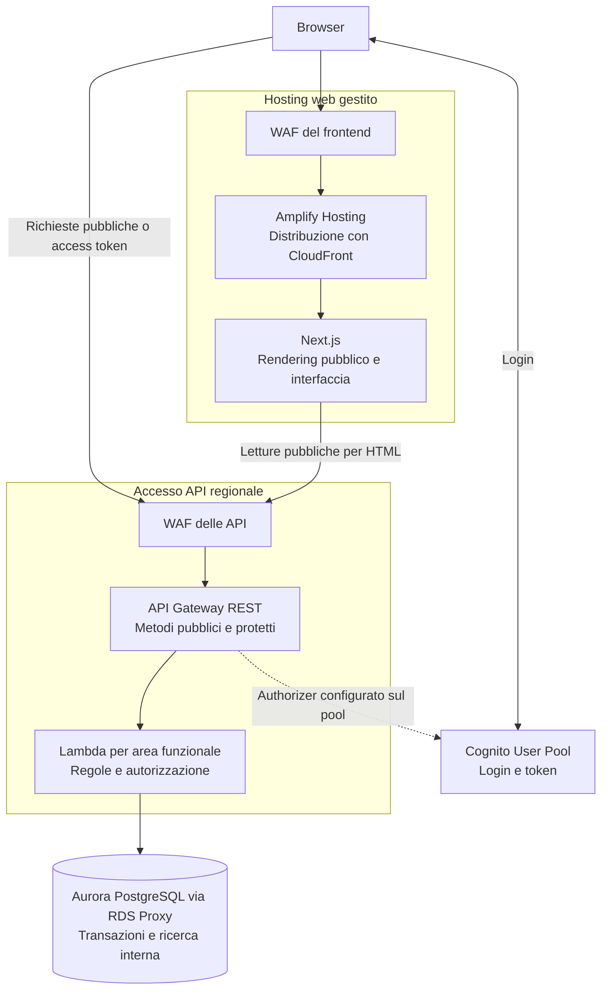

# Domora — Accesso, frontend e API su AWS

Questa è la prima parte dell'architettura AWS: spiega dove viene eseguita l'interfaccia, come arrivano le richieste e dove si applicano autenticazione e regole del portale. Database e ricerca sono progettati nella [persistenza](09-persistenza-e-ricerca.md); file e processi asincroni in [Media, worker e notifiche](10-media-worker-e-notifiche.md). Nessuna configurazione è stata implementata.

**Stato:** scelte di base adottate nel mandato di progettazione, con alternative e limiti espliciti. Fonti tecniche consultate il **7 ottobre 2026**; nessuna risorsa creata o prestazione misurata.

## 1. Decisione e requisiti che la guidano

Si adotta **Next.js su AWS Amplify Hosting**, **Amazon Cognito User Pools** per gli account e **Amazon API Gateway REST regionale con AWS Lambda** per le API. AWS WAF protegge separatamente frontend e API. Il backend mantiene moduli funzionali e una base di codice condivisa; non si introduce una rete di microservizi indipendenti.

| Esigenza di Domora | Conseguenza architetturale |
| --- | --- |
| Catalogo pubblico con schede accessibili da collegamenti diretti | Pagine pubbliche con contenuto HTML generato alla richiesta |
| Pannelli riservati, preferiti e contatti | Interfaccia autenticata, API protette e controlli sulla risorsa |
| Media giornaliera di 2,3 richieste API/s e picco di 200 | Compute a richiesta da valutare con capacità e limiti delle dipendenze |
| Ritiro e sospensione devono prevalere su copie obsolete | Nessuna cache condivisa del contenuto degli annunci nella base |
| Progetto con complessità contenuta | Hosting gestito; nessun cluster applicativo da amministrare |
| Letture entro 1 secondo e modifiche entro 2 al percentile 95 | Controllo di latenza, avvii delle funzioni e accessi ai dati |

La generazione HTML delle schede è una scelta progettuale aggiuntiva: rende il contenuto disponibile senza aspettare l'esecuzione del JavaScript del browser e facilita la consultazione da crawler. Non si promettono posizionamento nei motori di ricerca o risultati commerciali. Questa esigenza giustifica l'hosting dinamico rispetto alla sola esportazione statica.

## 2. Vista del percorso e confini



Il collegamento tratteggiato indica l'integrazione dell'authorizer con il pool di utenti, non una richiesta di login completa a ogni chiamata API. Nel disegno non sono ancora rappresentati upload, immagini e worker.

Amplify usa CloudFront per la distribuzione: non aggiungiamo una seconda distribuzione davanti al frontend. L'API regionale ha invece il proprio ingresso, senza passare obbligatoriamente dal server Next.js. I servizi gestiti pubblici non sono collocati in subnet pubbliche della VPC; la rete privata riguarderà le risorse dati e le Lambda che devono raggiungerle. [Distribuzione e cache di Amplify](https://docs.aws.amazon.com/amplify/latest/userguide/caching.html).

## 3. Frontend: perché Amplify Hosting

Next.js è il framework dell'interfaccia, non un servizio AWS che distribuisce da solo l'applicazione. Amplify Hosting ne gestisce distribuzione e compute per il **rendering lato server**, o SSR: la pagina pubblica viene composta prima di inviare l'HTML al browser. AWS documenta supporto per pagine statiche, SSR e percorsi dinamici; la compatibilità della versione va verificata prima dell'implementazione. [Supporto Next.js di Amplify](https://docs.aws.amazon.com/amplify/latest/userguide/ssr-amplify-support.html).

| Tipo di pagina | Comportamento scelto |
| --- | --- |
| Informazioni generali del portale | Contenuti statici distribuibili dalla cache |
| Scheda pubblica dell'annuncio | SSR con lettura corrente delle API e verifica di visibilità |
| Ricerca | Primo risultato generato dal server; filtri e pagine successive interrogano le API dal browser |
| Preferiti, contatti e pannelli aziendali | Interfaccia caricata nel browser, dati ottenuti dalle API autenticate |

Next.js non accede direttamente al database o alla ricerca e non replica le regole di pubblicazione. Per le pagine pubbliche richiama gli stessi metodi di lettura usati dal browser; la logica di dominio rimane nelle API. I pannelli privati non renderizzano dati personali in una pagina condivisa in cache.

**Motivazione:** questa separazione evita due backend con regole differenti. Amplify chiude il problema dell'esecuzione di Next.js senza aggiungere gestione di container, bilanciatore e capacità web. Introduce però un servizio ulteriore, compute SSR e una dipendenza dalle funzionalità supportate dal provider.

### Alternative considerate

| Alternativa | Vantaggio | Perché non adottata nella base |
| --- | --- | --- |
| Next.js esportato come sito statico su S3 e CloudFront | Hosting semplice; nessun compute SSR | Il contenuto dinamico delle schede richiederebbe caricamento nel browser o generazione e invalidazione delle pagine |
| Next.js su ECS/Fargate con bilanciatore | Controllo del runtime e del ciclo del processo | Richiede gestione di immagini container, repliche, health check e scaling anche per il solo frontend |
| Amplify Hosting | Hosting dinamico gestito e distribuzione integrata | Scelta adottata, accettando i limiti del framework e il costo SSR |

Al momento della consultazione, AWS dichiara supporto SSR per Next.js 12–15 e indica limiti come assenza di streaming e di rigenerazione incrementale su richiesta. Domora non dipende da queste funzionalità. La versione definitiva dovrà essere supportata dal provider e mantenuta con aggiornamenti di sicurezza: non si seleziona automaticamente l'ultima versione del framework.

## 4. Cache: prestazioni senza contenuti rimossi

Si distingue la cache degli **asset statici** dalla cache del **contenuto applicativo**.

| Contenuto | Politica di base |
| --- | --- |
| JavaScript, CSS e asset con nome versionato | Cache lunga; nuova versione con nuovo riferimento |
| HTML delle schede, risultati e risposte con contenuti degli annunci | `Cache-Control: no-store`; nessuna copia condivisa riutilizzata senza controllo |
| Dati di preferiti, contatti e pannelli | `no-store`; mai in una cache condivisa |
| Immagini degli immobili | Strategia separata nella parte media; non trattate come asset immutabili dell'applicazione |

Per le schede pubbliche si disabilitano sia la cache persistente delle letture Next.js sia quella della pagina. Non si usa una pagina prerenderizzata dell'annuncio o la vecchia risposta come ripiego quando l'API non è disponibile. Amplify rispetta gli header delle route dinamiche; Next.js consente letture esplicite con `cache: 'no-store'`. Si dovranno verificare output, eventuali header personalizzati e cache del browser in produzione. [Cache Amplify](https://docs.aws.amazon.com/amplify/latest/userguide/caching.html), [Fetch di Next.js](https://nextjs.org/docs/app/api-reference/functions/fetch).

La navigazione del browser deve richiedere dati correnti quando riapre una scheda: un contenuto precaricato non sostituisce questa verifica. Il servizio non può cancellare contenuti già visualizzati sul dispositivo, ma deve controllare le successive esposizioni. Prefetch automatici delle schede saranno limitati o disabilitati nella base, per evitare letture aggiuntive non conteggiate.

**Motivazione:** il controllo della visibilità già scelto sarebbe inutile se una cache rispondesse prima del backend. Rinunciare inizialmente alla cache dei dati aumenta le letture e il costo, ma mantiene comprensibile il comportamento di ritiro e sospensione. Ottimizzazioni successive richiederebbero invalidazione e garanzie esplicite.

## 5. Ingresso API: perché REST regionale

Si sceglie il prodotto **REST API di API Gateway**, con endpoint regionale. “REST API” e “HTTP API” sono due prodotti AWS distinti: entrambi possono offrire interfacce HTTP, ma non le stesse funzionalità. La documentazione AWS indica integrazione diretta con WAF per REST API e non per HTTP API. [Confronto ufficiale](https://docs.aws.amazon.com/apigateway/latest/developerguide/http-api-vs-rest.html).

| Alternativa | Vantaggio | Compromesso per Domora |
| --- | --- | --- |
| API Gateway REST regionale | WAF sullo stage e integrazione Cognito | Più funzionalità e prezzo superiore a HTTP API; cache API lasciata disattivata |
| API Gateway HTTP API | Prodotto più essenziale e meno costoso, authorizer JWT | Per la protezione WAF servirebbe un ingresso compatibile aggiuntivo e la gestione del possibile aggiramento dell'origine |
| Bilanciatore e backend container | Processo persistente e controllo delle connessioni | Cambia il modello compute e introduce gestione delle repliche |

**Decisione:** preferire il WAF direttamente sull'ingresso API, evitando una seconda catena CloudFront–origine solo per ottenere questo controllo. Il costo maggiore deve essere incluso nella stima; non si scelgono REST API per vendere API key o per esigenze di integrazione esterna, assenti dal perimetro.

Il frontend e l'API useranno domini HTTPS distinti. [Regione e rete](11-regione-e-rete.md) sceglie Francoforte, DNS e collocazione dei certificati; nomi e configurazioni effettive seguiranno nel rilascio. Le chiamate del browser richiedono CORS, cioè la dichiarazione delle origini web autorizzate a leggere le risposte: si consentono solo gli origin previsti per ambiente. CORS non impedisce chiamate da programmi esterni e non sostituisce autenticazione o autorizzazione.

La REST API usa integrazione Lambda proxy: la funzione riceve richiesta e contesto autenticato e restituisce stato e risposta. API Gateway distingue metodi pubblici e protetti; il backend valida comunque input e regole di dominio. File e documenti continuano a passare direttamente all'archivio tramite URL temporanei, non nel payload delle API applicative.

## 6. Identità: Cognito e autorizzazione applicativa

Si adotta un **Cognito User Pool** per registrazione, verifica email, login e recupero dell'accesso. Non si usa un Identity Pool per assegnare credenziali AWS al browser: gli utenti richiamano API e URL autorizzati, senza ricevere accesso generale alle risorse.

Il login iniziale usa l'interfaccia gestita di Cognito e il flusso **authorization code con PKCE**. Il browser ottiene prima un codice, poi lo scambia dimostrando di essere il client che ha iniziato il login. Il client pubblico non contiene un segreto. PKCE limita l'uso di un codice intercettato; non sostituisce protezione del browser, controllo del redirect e della sessione. [Flusso Cognito](https://docs.aws.amazon.com/cognito/latest/developerguide/token-endpoint.html).

Le API protette ricevono un **access token**, che autorizza l'accesso all'API, nell'header `Authorization`. I metodi configurano l'authorizer Cognito e uno scope applicativo richiesto: non si usa l'ID token del profilo come credenziale generica per ogni operazione. Gli scope rappresentano l'accesso generale all'API; appartenenza, assegnazione e stato delle risorse sono verificati dalle Lambda sui dati correnti. [Authorizer Cognito per REST API](https://docs.aws.amazon.com/apigateway/latest/developerguide/apigateway-integrate-with-cognito.html).

Un token ancora valido non conserva un ruolo aziendale revocato: ogni operazione professionale verifica l'appartenenza attiva. Analogamente, conoscere l'identificativo di un contatto non concede accesso alla conversazione. I gruppi di Cognito non diventano la copia autorevole dell'assegnazione dei contatti o dei ruoli aziendali modificabili.

**Motivazione:** usare un sistema gestito per le credenziali evita di costruire un sistema password nel backend. Mantenere i permessi aziendali nel modello applicativo rende effettive revoche e riassegnazioni senza attendere la scadenza dei token.

La base usa email, password e MFA TOTP obbligatoria, senza login social non richiesti dal perimetro. La [sicurezza](12-sicurezza-e-protezione-dati.md) definisce onboarding, token in memoria, durata e rotazione e revoca applicativa delle sessioni. Non si aggiunge un backend intermedio per le sessioni; nessun token deve finire in URL, log o bundle pubblico. L'identificativo interno dell'utente resta collegato all'identità stabile del pool.

## 7. Compute: Lambda e moduli funzionali

Le richieste sono operazioni brevi: letture, validazioni, transazioni e registrazione di messaggi. Non richiedono un processo applicativo sempre acceso, connessioni di chat persistenti o elaborazioni video. Si mantiene quindi Lambda come compute delle API.

La base usa una funzione per area, con handler interni per i metodi: **catalogo pubblico**, **gestione agenzia e annunci**, **contatti e visite**, **profilo e preferiti**, **amministrazione**. Il confine definitivo dei pacchetti sarà stabilito nel rilascio. Modello, validazioni e accesso ai dati sono moduli condivisi; le funzioni non si chiamano in catena per eseguire una normale transazione.

**Motivazione:** questa separazione permette permessi AWS e limiti di esecuzione per area senza creare una Lambda per ogni endpoint. Non si definiscono microservizi autonomi con database separati: le regole che coinvolgono più entità restano transazioni del nucleo applicativo.

| Modello compute | Quando sarebbe adatto | Valutazione nella base |
| --- | --- | --- |
| Lambda | Operazioni brevi, traffico variabile, integrazione con eventi | Scelto; avvii, connessioni e limiti devono essere progettati |
| ECS/Fargate | Processi persistenti, controllo del runtime e workload continuativi | Alternativa valida se misure o requisiti rendessero Lambda inadeguata; non necessaria per i flussi attuali |
| EC2 gestita direttamente | Esigenze specifiche sul sistema operativo | Non emergono esigenze che giustifichino gestione e manutenzione delle macchine |

Fargate riduce la gestione dei server ma richiede comunque progettazione del servizio container, repliche e bilanciamento. Il confronto non assume che usare container significhi amministrare necessariamente macchine virtuali. [Bilanciamento dei servizi ECS](https://docs.aws.amazon.com/AmazonECS/latest/developerguide/service-load-balancing.html).

### Capacità e latenza

Una stima iniziale della concorrenza è `richieste/s × durata media in secondi`. A 200 richieste/s e 0,3 secondi medi ipotetici sarebbero circa 60 esecuzioni contemporanee; a 1 secondo medio circa 200. Questi valori sono esempi di sensibilità, non benchmark o limiti da configurare. Il percentile 95 non va sostituito alla durata media nella formula. [Concorrenza Lambda](https://docs.aws.amazon.com/lambda/latest/dg/configuration-concurrency.html).

Si usano limiti di concorrenza per proteggere database e ricerca, preservando capacità per le funzioni prioritarie. Le soglie dovranno sostenere il picco ammesso, non limitarlo per far sembrare corretto il dimensionamento.

La **reserved concurrency** riserva e limita la capacità concorrente di una funzione, ma non tiene caldi gli ambienti. La **provisioned concurrency** prepara ambienti in anticipo, riducendo la latenza di avvio e introducendo un costo dedicato. Si valuterà per il catalogo e i contatti se i test mostrano che gli avvii impediscono il rispetto del percentile 95; non si promette il target contando solo richieste già calde.

Le Lambda che raggiungono dati privati saranno collegate a subnet private su più zone. Essere collegate a una VPC non dà automaticamente accesso Internet. Metterle in una subnet pubblica non risolve questo accesso. La [rete](11-regione-e-rete.md) sceglie NAT regionale e gateway S3 per i percorsi in uscita, senza dichiararli già verificati nell'account. [Rete delle Lambda in VPC](https://docs.aws.amazon.com/lambda/latest/dg/configuration-vpc-internet.html).

## 8. Protezione degli ingressi e gestione degli errori

Il frontend usa l'integrazione WAF di Amplify; le API una web ACL regionale associata allo stage REST. Sono due associazioni con ambiti differenti, non una sola scatola WAF che protegge implicitamente ogni servizio. La protezione delle operazioni di login Cognito va valutata separatamente. [WAF per Amplify](https://docs.aws.amazon.com/amplify/latest/userguide/WAF-integration.html), [WAF per REST API](https://docs.aws.amazon.com/apigateway/latest/developerguide/apigateway-control-access-aws-waf.html).

WAF filtra traffico HTTP indesiderato; API Gateway limita il traffico per stage e metodo; le Lambda verificano input, account e risorse. WAF non controlla l'appartenenza all'agenzia e un limite per IP non identifica necessariamente una persona. Rate limit per account e criteri antiabuso sono definiti nella [sicurezza](12-sicurezza-e-protezione-dati.md).

Il throttling di API Gateway è applicato secondo obiettivi di limitazione, non costituisce un tetto economico rigido. Quote, concorrenza, allarmi e costi restano da verificare nell'ambiente effettivo. [Throttling delle REST API](https://docs.aws.amazon.com/apigateway/latest/developerguide/api-gateway-request-throttling.html).

| Condizione | Risposta funzionale |
| --- | --- |
| Token mancante o non valido su metodo protetto | Accesso non autenticato; richiesta di login |
| Utente autenticato senza permesso | Accesso negato, senza contenuti riservati |
| Annuncio non pubblicabile o risorsa privata altrui | Risposta non disponibile, senza rivelare dettagli nascosti |
| Dati non validi | Errore correggibile con campi coinvolti |
| Versione superata o visita attiva già presente | Conflitto e richiesta di rilettura dello stato |
| Traffico limitato | Risposta temporanea di limitazione, ripetibile con attesa |
| Dipendenza guasta | Errore temporaneo, non una falsa lista vuota |
| Risposta persa dopo una scrittura riuscita | Rilettura o ripetizione con lo stesso identificativo di invio |

Il contratto API assegnerà codici HTTP e formato unico degli errori. Ogni richiesta avrà un identificativo correlabile; i log non registreranno token o testo delle conversazioni. Non si ritentano automaticamente scritture generiche senza il meccanismo contro effetti duplicati previsto dai flussi.

## 9. Due esempi da seguire nella presentazione

**Consultazione di un annuncio.** Il browser chiede la pagina; Amplify esegue Next.js, che richiama il metodo pubblico del catalogo. La Lambda legge contenuto e stato correnti, verifica agenzia e visibilità e restituisce i soli campi pubblici. Next.js compone l'HTML senza conservarlo come copia riutilizzabile. Un annuncio già sospeso prima della nuova query produce una pagina non disponibile; la ricerca interna verifica gli stessi stati.

**Invio di un contatto.** L'utente effettua il login con Cognito e il browser invia richiesta e access token alla REST API. WAF filtra la richiesta, l'authorizer verifica la credenziale e la Lambda controlla account, annuncio e agenzia. La transazione crea o riutilizza il contatto e registra il messaggio; solo dopo il salvataggio viene confermato l'invio. L'avviso email è lavoro successivo, la cui consegna affidabile sarà progettata nella parte asincrona.

```mermaid
sequenceDiagram
    participant B as Browser autenticato
    participant G as API Gateway e WAF
    participant L as Lambda contatti
    participant D as Dati transazionali
    B->>G: Richiesta, access token, identificativo di invio
    G->>G: Filtro WAF e authorizer Cognito
    G->>L: Richiesta con identita verificata
    L->>D: Controlli correnti e salvataggio consistente
    D-->>L: Salvataggio confermato
    L-->>G: Esito della richiesta
    G-->>B: Contatto registrato
    Note over L,D: Avviso registrato nell’outbox; consegna separata tramite coda
```

## 10. Impatto sul carico, disponibilità e verifiche

Le 200.000 richieste API giornaliere comprendono letture richieste dal browser **o** dal server SSR: non si sommano automaticamente due letture per la stessa visualizzazione. L'HTML generato trasporta già il dato iniziale; il browser non lo ricarica senza necessità. Prefetch, duplicazioni involontarie e bot possono aumentare il traffico e devono essere considerati nei test.

Richieste web e invocazioni SSR si misurano separatamente dalle API. Come scenario iniziale, se il 30% delle richieste API è costituito da letture iniziali servite via SSR, si hanno circa 60.000 rendering giornalieri e 60 rendering/s nel picco da 200 API/s, assumendo la stessa distribuzione. È un'ipotesi aggiuntiva da verificare, non una quota garantita di Amplify.

La pagina SSR dipende da hosting, API e dati: il suo tempo complessivo può superare il secondo previsto per la sola API. Si aggiunge come obiettivo iniziale una risposta HTML pubblica entro **2 secondi al percentile 95**, misurata dall'ingresso web alla risposta completa, senza rete del visitatore e download di immagini. Non si sommano percentili delle singole dipendenze per dichiararlo rispettato.

Il controllo di disponibilità del catalogo deve includere la pagina pubblica e una ricerca reale; quello dell'accesso deve includere Cognito e un metodo protetto. Avere una Lambda funzionante non basta a dichiarare disponibile il portale. La regione, le quote SSR, API e identità e la ridondanza dei dati devono essere verificate rispetto al 99,9% e al recupero locale.

Prima di un'eventuale implementazione occorrerà verificare:

- Compatibilità della versione Next.js e degli header di cache con il provider.
- Nessun contenuto personale condiviso e nessuna scheda gia bloccata servita a nuove richieste da cache o prefetch.
- Carico di API e SSR, comprendendo avvii a freddo, errori e accessi ai dati.
- Revoca e riassegnazione effettive anche con token ancora validi.
- Protezioni applicate a entrambi gli ingressi, anche chiamando direttamente l'API.
- Quote della regione scelta e costo di hosting, SSR, WAF, API, Lambda ed eventuale capacità preparata.

**Conclusione progettuale:** la scelta elimina la gestione di server applicativi nella base e mantiene un unico luogo per le regole. Accetta costo e dipendenza dell'hosting gestito e rinuncia alla cache dei dati per una visibilità più semplice da controllare. Non dimostra ancora latenza, disponibilità o convenienza economica: questi risultati dipendono dalle parti dati e rete e dalla verifica del dimensionamento.

La [parte di persistenza e ricerca](09-persistenza-e-ricerca.md) definisce Aurora, connessioni, transazioni e ricerca interna PostgreSQL. Media e processi asincroni seguiranno come parti dedicate.
