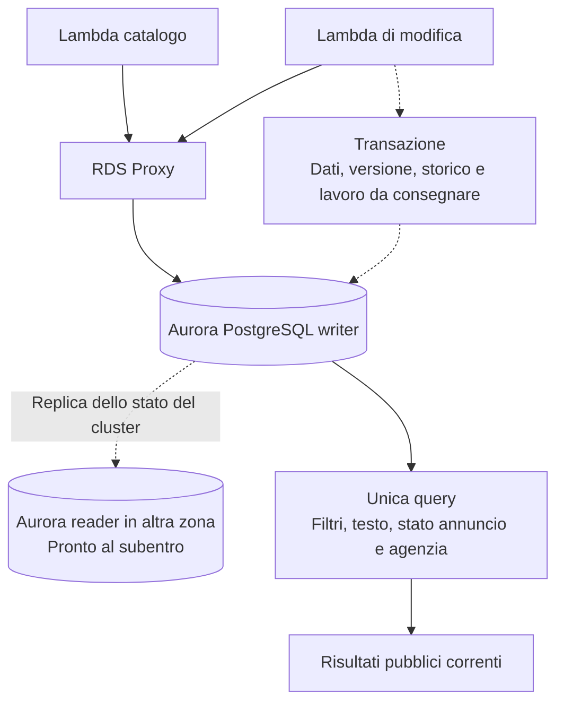

# Domora — Persistenza e ricerca

Questa parte collega il [modello dei dati](06-modello-dati.md) alle [API](08-accesso-frontend-e-api.md) e ai [requisiti di qualità](07-carico-e-requisiti-qualita.md). Decide dove applicare transazioni, vincoli e ricerca. File ed elaborazioni asincrone sono descritti in [Media, worker e notifiche](10-media-worker-e-notifiche.md).

**Stato:** scelte di base motivate, con documentazione ufficiale consultata il **7 ottobre 2026**. Nessuna configurazione attivata o prestazione misurata.

## 1. Decisione

Si adotta **Aurora PostgreSQL con capacità Serverless v2**, un writer e un reader pronto al subentro in un'altra zona, con **RDS Proxy** per le connessioni delle Lambda. Nella base iniziale, tutte le operazioni applicative leggono e scrivono sul writer attraverso il proxy.

La ricerca usa **filtri relazionali e full-text search di PostgreSQL**, cioè ricerca testuale con normalizzazione delle parole e ordinamento per pertinenza. Non si introduce OpenSearch nella base. La rappresentazione testuale è derivata dai campi pubblici dell'annuncio e aggiornata nella stessa transazione del contenuto.

**Motivazione complessiva:** il prodotto richiede relazioni, unicità, controllo delle transizioni e ricerca essenziale. Un unico motore dati elimina la sincronizzazione del catalogo con un secondo servizio. La capacità variabile di Aurora viene scelta per un carico molto diverso fra media e picco, senza assumerne già la convenienza economica.

Questa decisione sostituisce l'orientamento iniziale verso un indice OpenSearch separato. Rimangono le API modulari e i flussi utente; cambia la realizzazione della ricerca, non il suo comportamento funzionale.

## 2. Alternative di persistenza

| Soluzione | Adeguatezza | Compromesso |
| --- | --- | --- |
| RDS PostgreSQL Multi-AZ con standby | Relazioni, ricerca testuale e recupero locale; alternativa valida e più essenziale nel controllo della capacità | Capacità delle istanze scelta in anticipo; standby non disponibile per distribuire le letture |
| Aurora PostgreSQL con istanze provisioned | Stesse funzionalità applicative, storage distribuito e replica pronta | Capacità compute dimensionata in anticipo per writer e reader |
| Aurora PostgreSQL Serverless v2 | Funzionalità PostgreSQL e capacità compute variabile entro limiti configurati | Costo minimo persistente, range da dimensionare e scaling da verificare |
| DynamoDB | Adatto a modelli con accessi per chiave progettati esplicitamente | Richiederebbe riprogettazione di relazioni, filtri e ricerca; non emerge un requisito che giustifichi questa complessità |

RDS PostgreSQL Multi-AZ replica su uno standby per disponibilità; quello standby non è un reader applicativo. È distinto da un cluster Multi-AZ con istanze leggibili, che non viene aggiunto come terza variante nella base. [RDS Multi-AZ con standby](https://docs.aws.amazon.com/AmazonRDS/latest/UserGuide/Concepts.MultiAZSingleStandby.html).

**Perché Aurora Serverless v2:** evita di scegliere una classe compute fissa come unica capacità per tutta la giornata. Minimo e massimo si esprimono in unità di capacità Aurora, o ACU; il range deve essere adeguato a memoria, connessioni e picchi. Non si deduce da 200 richieste/s senza conoscere le query. Writer e reader hanno un costo proprio: serverless non significa costo nullo quando l'applicazione è poco usata. [Capacità e scaling Aurora](https://docs.aws.amazon.com/AmazonRDS/latest/AuroraUserGuide/aurora-serverless-v2.how-it-works.html).

La produzione mantiene capacità minima non nulla e nessuna pausa automatica: si privilegiano latenza e subentro. La scelta sarà riesaminata se la stima economica e i test mostrano che una configurazione RDS o Aurora provisioned sostiene lo scenario con un compromesso migliore. Non si sostiene che Aurora sia indispensabile per 50.000 annunci.

## 3. Disponibilità e connessioni

Aurora distingue storage distribuito e istanze compute. Conservare i dati su più zone non equivale ad avere un'istanza alternativa già pronta: si prevede quindi un reader in un'altra zona, con priorità di promozione elevata e capacità coerente con il carico dopo il subentro. [Disponibilità Aurora](https://docs.aws.amazon.com/AmazonRDS/latest/AuroraUserGuide/Concepts.AuroraHighAvailability.html).

RDS Proxy raccoglie le connessioni delle Lambda e riusa connessioni verso il database. Non rende illimitata la capacità del writer e non permette di ignorare transazioni lunghe o sessioni che rimangono legate a una connessione. Il comportamento di pooling e pinning va verificato con il driver effettivo. [RDS Proxy per Aurora](https://docs.aws.amazon.com/AmazonRDS/latest/AuroraUserGuide/rds-proxy.html).

La base usa l'endpoint di scrittura del proxy anche per le letture: schede, ruoli, assegnazioni e ricerca devono vedere lo stato autorevole. Il reader è destinato al subentro, non a una distribuzione automatica del carico. La replica è asincrona sul piano delle letture: non si usa per decidere se un annuncio appena sospeso sia pubblicabile.

**Motivazione:** un solo percorso evita di introdurre consistenza diversa secondo l'endpoint interrogato. Il compromesso è concentrare il lavoro sul writer e pagare capacità di riserva; tale capacità protegge il servizio, non raddoppia il throughput ordinario.

Le Lambda e il proxy accedono a risorse private tramite subnet su più zone. Si usano TLS e ruoli database con permessi limitati; credenziali e rotazione saranno dettagliate nella sicurezza. Nessun browser o frontend SSR riceve credenziali del database.

Failover, timeout e connessioni devono essere verificati rispetto all'RTO locale di dieci minuti. Una transazione interrotta non va dichiarata riuscita. Se il client non conosce l'esito del commit, rilegge lo stato o ripete la stessa operazione con lo stesso identificativo, senza duplicare gli effetti.

## 4. Separazione aziendale e vincoli

Si usa uno schema applicativo condiviso fra agenzie, con identificativo di agenzia sui record aziendali e collegamenti coerenti con tale identificativo. Non si crea un database per ogni agenzia.

**Motivazione:** mille database o schemi separati renderebbero migrazioni e gestione più complesse senza un requisito che li imponga. Lo schema condiviso richiede controlli espliciti e verifiche di isolamento; la separazione logica non è una separazione fisica delle infrastrutture.

| Regola funzionale | Realizzazione prevista |
| --- | --- |
| Un'appartenenza professionale attiva per utente | Vincolo univoco condizionato allo stato attivo |
| Un annuncio non concluso per immobile e tipo di offerta | Vincolo univoco condizionato allo stato diverso da concluso |
| Un contatto per utente e annuncio | Vincolo univoco sulla coppia |
| Una visita in attesa o accettata per contatto | Vincolo univoco condizionato agli stati attivi |
| Un preferito per utente e annuncio | Vincolo univoco sulla coppia |
| Collegamenti entro la stessa agenzia | Chiavi esterne coerenti con agenzia e risorsa |
| Modifiche concorrenti | Aggiornamento condizionato alla versione letta |
| Transizioni autorizzate | Controlli applicativi dentro la transazione, con protezione dei record coinvolti |

I vincoli condizionati saranno realizzati con indici univoci parziali dove appropriato. Le transizioni non dipendono solo da un controllo iniziale seguito da una scrittura separata. Lo schema fisico specificherà chiavi, indici e condizioni, senza introdurre adesso una DDL completa. [Indici parziali PostgreSQL](https://www.postgresql.org/docs/current/indexes-partial.html).

Il backend applica i controlli sui dati correnti. Le query aziendali passano da moduli di accesso che richiedono sempre il contesto di agenzia verificato; le risposte pubbliche usano una proiezione esplicita dei soli campi pubblici. Non si espone direttamente una riga completa dell'immobile o dell'annuncio.

La row-level security, cioè policy del database che limitano le righe accessibili, resta una difesa da valutare nel dettaglio dello schema. Non viene dichiarata già attiva: con connessioni riutilizzate occorre gestire correttamente il contesto e i ruoli. I test di isolamento sono obbligatori indipendentemente dall'eventuale adozione di queste policy. [Row security PostgreSQL](https://www.postgresql.org/docs/current/ddl-rowsecurity.html).

## 5. Ricerca: confronto e scelta proporzionata

| Soluzione | Vantaggio | Limite nella base |
| --- | --- | --- |
| Filtri e full-text search PostgreSQL | Un solo dato autorevole, transazioni e controllo della visibilità nella query | Ricerca e operazioni aziendali condividono capacità compute |
| Dominio gestito OpenSearch | Capacità di ricerca separata e strumenti dedicati di analisi e ranking | Secondo servizio, ridondanza, aggiornamenti affidabili, riconciliazione e recupero |
| OpenSearch Serverless | Capacità gestita senza scegliere le istanze del dominio | Restano un secondo sistema, costi di capacità e sincronizzazione dei dati |

PostgreSQL supporta ricerca su documenti derivati da campi testuali e ordinamento per pertinenza; gli indici GIN sono adatti alla ricerca full-text. Non si implementa la ricerca testuale come scansione indiscriminata con `LIKE` su tutte le descrizioni. [Full-text search](https://www.postgresql.org/docs/current/textsearch-intro.html), [Indici testuali](https://www.postgresql.org/docs/current/textsearch-indexes.html).

**Decisione:** usare PostgreSQL per la ricerca iniziale. Non sono richiesti autocomplete, suggerimenti, tolleranza avanzata agli errori, aggregazioni complesse o ricerca geografica. Il solo numero degli annunci non dimostra il bisogno di OpenSearch; introdurlo aggiungerebbe un sistema da mantenere coerente con un database che resta comunque necessario al controllo della visibilità.

L'alternativa OpenSearch rimane documentata, ma non si implementa un secondo percorso di ricerca come fallback. Sarà rivalutata solo se test realistici non rispettano i requisiti dopo ottimizzazione e dimensionamento ragionevoli, oppure se vengono approvate funzionalità di ricerca che ne giustificano il costo. [OpenSearch Serverless](https://docs.aws.amazon.com/opensearch-service/latest/developerguide/serverless-overview.html).

## 6. Come viene eseguita una ricerca

1. La Lambda del catalogo valida filtri, ordinamento e riferimento di prosecuzione.
2. Costruisce una query parametrizzata con campi e criteri consentiti; non accetta SQL dal client.
3. La query combina offerta, località, caratteristiche e ricerca testuale con stato pubblicato e agenzia attiva.
4. Restituisce soltanto la proiezione pubblica e la pagina richiesta.
5. La Lambda costruisce il riferimento di prosecuzione e la risposta; non conserva una copia condivisa dei risultati.

La query usa il writer e vede una fotografia consistente al proprio inizio. Una sospensione già confermata prima dell'inizio della query esclude l'annuncio; una richiesta già in corso al momento della sospensione può aver letto lo stato precedente. Il servizio non promette di ritirare una risposta già partita. Nuovi contatti e modifiche verificano nuovamente lo stato dentro la propria transazione. [Isolamento delle transazioni PostgreSQL](https://www.postgresql.org/docs/current/transaction-iso.html).

**Motivazione:** filtrare contenuto e disponibilità nella stessa query evita il passaggio “indice esterno → controllo di ogni candidato”. Il carico rimane nel database, ma si elimina una fonte di risultati obsoleti e una dipendenza nel percorso pubblico.

La rappresentazione testuale viene ricavata solo da titolo e descrizione pubblici e aggiornata atomicamente con l'annuncio. Le impostazioni linguistiche saranno esplicite e coerenti fra documento e query; non si applica automaticamente l'italiano a tutte le offerte europee. Lingue e paesi iniziali restano da definire; la ricerca non comprende traduzione automatica.

Il ranking attribuisce maggiore importanza al titolo rispetto alla descrizione. Filtri e ordinamenti usano gli indici relazionali scelti sullo schema fisico; si valutano piani delle query su distribuzioni realistiche, non si crea automaticamente un indice per ogni combinazione di filtri.

La prosecuzione usa il criterio di ordinamento e un identificativo stabile come spareggio. Un cursore opaco, controllato dal server e legato ai filtri, evita salti tramite offset profondi; non mantiene una transazione aperta fra pagine. Con dati modificati durante la navigazione valgono i limiti già dichiarati nel [flusso di ricerca](05-ricerca-e-preferiti.md).

Il diagramma distingue il percorso delle connessioni dal contenuto della transazione. Il reader non è un secondo motore di ricerca e non è una seconda regione.

## 7. Scritture, concorrenza e lavoro asincrono

Pubblicazione e modifica salvano contenuto, stato, versione e rappresentazione testuale come un'unica transazione. Per questo non esistono eventi di indicizzazione da recuperare o una finestra di ritardo fra catalogo e motore di ricerca separato: le nuove query vedono i dati dopo il commit.

Il precedente obiettivo di aggiornamento entro sessanta secondi è sostituito, per la ricerca, dalla visibilità transazionale dopo il commit. Gli obiettivi di latenza restano; un risultato già aperto nel browser non si aggiorna automaticamente.

Invio di contatti, visite e messaggi combina controlli correnti, eventuali vincoli univoci, registrazione dell'operazione ripetibile e salvataggio dei dati. Le operazioni che competono con ritiro, revoca o riassegnazione proteggono i record comuni secondo un ordine uniforme. Non basta leggere lo stato all'inizio della Lambda e presumere che non cambi prima del commit.

**Motivazione:** vincoli e transazioni impediscono duplicati, mentre la protezione dei record risolve le competizioni fra operazioni entrambe formalmente valide. Il dettaglio di lock, isolamento e timeout dovrà evitare transazioni lunghe o attese incontrollate; non si rende tutto il database seriale per semplicità.

Le email e gli annullamenti massivi richiedono comunque lavoro successivo. Si adotta una **outbox transazionale**: una tabella di operazioni da consegnare, scritta nella stessa transazione dei dati. Un processo separato legge le operazioni e le inoltra ai worker; un errore di consegna non elimina la registrazione del lavoro. Il trasporto e i tentativi saranno definiti nella parte asincrona. [Pattern outbox AWS](https://docs.aws.amazon.com/prescriptive-guidance/latest/cloud-design-patterns/transactional-outbox.html).

La registrazione include identificativo, tipo, risorsa, versione, momento e stato di consegna. Contiene riferimenti, non il testo dei messaggi o le credenziali. La consegna può ripetersi: i consumer devono gestire duplicati e stato corrente. Non si dichiara una consegna esattamente una volta né che l'outbox possa rendere atomico l'invio a un fornitore email.

I cambi di disponibilità conservano un contatore distinto dalla versione generica delle modifiche. Le visite attive registrano il contesto di disponibilità dell'annuncio e dell'agenzia: una revoca lo invalida anche se segue una rapida riattivazione. Il lavoro di annullamento viene registrato nell'outbox e portato a termine; i pannelli non mostrano nel frattempo l'appuntamento come confermato.

## 8. Backup e recupero

Si prevede backup automatico con ripristino a un punto nel tempo, o PITR, e conservazione iniziale di **sette giorni**. È un compromesso operativo per recuperare errori riconosciuti entro una settimana, non la durata di conservazione dei dati personali del portale. Snapshot prima di interventi rischiosi e loro scadenza saranno parte del piano operativo.

Aurora espone il punto più recente effettivamente ripristinabile: il target RPO di quindici minuti va verificato rispetto a quel punto e al momento dell'incidente. Il PITR crea un cluster ripristinato; la procedura deve includere collegamento dell'applicazione, controlli e riconciliazione. Non basta dichiarare il backup attivo per promettere l'RTO di quattro ore. [Ripristino Aurora](https://docs.aws.amazon.com/AmazonRDS/latest/AuroraUserGuide/aurora-pitr.html).

La ricerca interna viene recuperata con dati e indici del database: non richiede ricostruire un servizio OpenSearch prima di riaprire il catalogo. Rimangono identità, file e configurazione. Dopo un ripristino, l'outbox e gli avvisi richiedono verifica: lavoro già eseguito esternamente può riapparire nei dati recuperati e non deve essere ripetuto alla cieca.

**Motivazione:** recuperare un solo sistema per dati e ricerca semplifica le dipendenze. L'outbox protegge il lavoro nel funzionamento ordinario, ma un ritorno a un punto precedente deve tenere conto degli effetti che il ripristino non può annullare.

## 9. Dimensionamento e verifiche ancora necessarie

Nel picco si progettano circa novanta ricerche/s, novanta altre letture/s e venti modifiche/s. Questi valori non corrispondono direttamente a query/s: ogni operazione può eseguire più query. Si elimina il controllo separato di almeno 1.800 candidati/s, ma filtri e ranking richiedono comunque CPU, memoria e I/O.

| Verifica | Evidenza richiesta |
| --- | --- |
| Catalogo e storico | Piani delle query su 100.000 annunci, di cui 50.000 pubblicati, con distribuzioni non uniformi |
| Ricerca senza filtri e con testo frequente | Latenza al percentile 95 e consumo del writer, includendo ordinamento e paginazione |
| Picco misto | Ricerca entro 1 secondo senza impedire messaggi e modifiche entro 2 secondi |
| Scaling e connessioni | Range ACU, capacità minima, limiti del proxy e concorrenza Lambda coerenti |
| Concorrenza | Nessun duplicato e nessuna accettazione di visite invalidate con operazioni simultanee |
| Guasto di zona | Promozione, ripresa delle connessioni ed esiti delle transazioni rispetto all'RTO |
| Recupero da backup | RPO, durata effettiva, coerenza dei file e verifica degli effetti esterni |
| Isolamento fra agenzie | Nessun collegamento o accesso a dati altrui attraverso query e identificativi alterati |

Il [dimensionamento e confronto economico](15-dimensionamento-e-costi.md) propone 2–16 ACU per istanza in produzione e un reader in promotion tier 1, senza auto-pausa. Confronta anche RDS PostgreSQL Multi-AZ, meno costoso nel candidato esaminato ma da provare allo stesso carico. Versione PostgreSQL, schema fisico e indici restano da fissare; range e prestazioni non sono verificati da benchmark. Un costo eccessivo o prestazioni insufficienti richiedono una decisione rivista, non una garanzia scritta senza evidenza.

La scelta mantiene un solo sistema per dati e ricerca e concentra la complessità dove il prodotto la richiede: transazioni, permessi e lavoro recuperabile. La parte [media, worker e notifiche](10-media-worker-e-notifiche.md) completa consegna e gestione dei file; seguono rete, sicurezza e operazioni.
