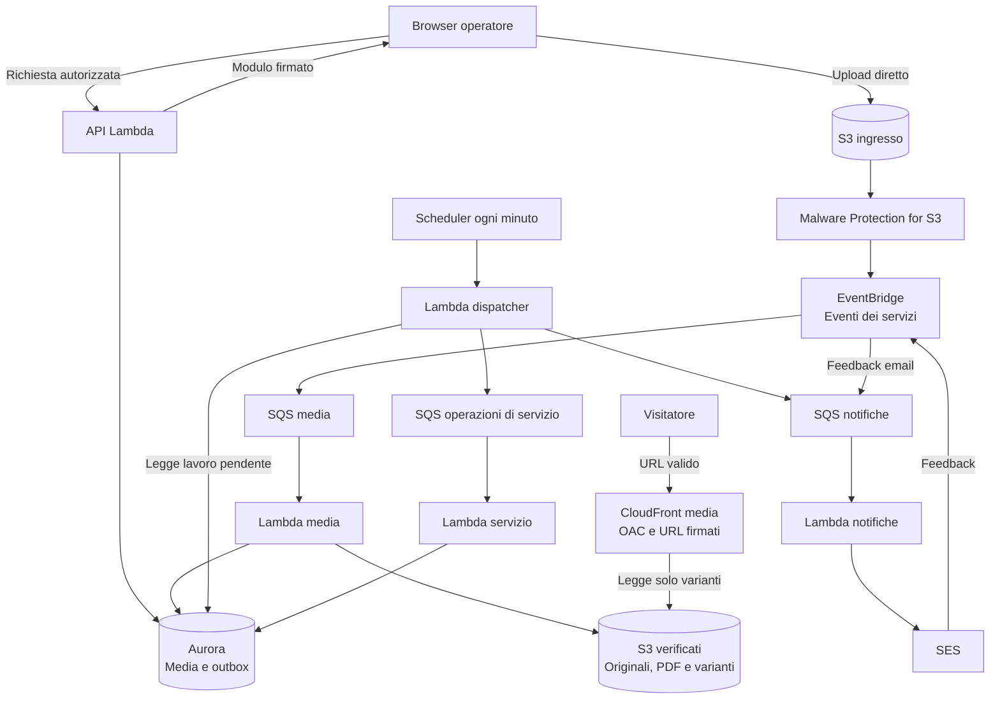

# Domora — Media, worker e notifiche

Questa parte completa i percorsi di caricamento dei file e di lavoro in background, collegandoli a [pubblicazione](03-flusso-pubblicazione.md), [contatti](04-contatti-e-visite.md), [ricerca](05-ricerca-e-preferiti.md) e [persistenza](09-persistenza-e-ricerca.md).

**Stato:** scelte di base motivate; fonti AWS consultate il **7 ottobre 2026**. Nessun upload, scansione o invio email eseguito. Il documento descrive il servizio progettato, non risorse già attive.

## 1. Componenti e responsabilità

| Componente | Responsabilità | Motivo della scelta |
| --- | --- | --- |
| S3 | Conservare file in ingresso e contenuti verificati | Evitare file binari nel database e nel percorso API |
| GuardDuty Malware Protection for S3 | Scansionare i file caricati | Evitare di gestire un motore antivirus e i suoi aggiornamenti nelle Lambda |
| CloudFront per i media | Distribuire solo le varianti delle immagini con accesso temporaneo | Separare traffico immagini e API mantenendo l'origine privata |
| SQS Standard | Accumulare e ritentare lavoro separato per area | Un errore dei file non deve bloccare email o annullamenti |
| Lambda worker | Eseguire validazione, elaborazione e aggiornamenti brevi | Coerenza con il compute già scelto, senza processi sempre accesi |
| SES | Inviare gli avvisi email | Servizio gestito, con esiti e limiti verificabili |
| EventBridge | Instradare risultati della scansione e feedback SES | Collegare eventi dei servizi AWS ai worker interessati |
| EventBridge Scheduler | Avviare consegna outbox e riconciliazione periodica | Rendere recuperabile il lavoro senza un processo di polling permanente |

Non si usa un bus applicativo per ogni messaggio: il dispatcher dell'outbox consegna direttamente alle code note. EventBridge serve qui per gli eventi dei servizi. Non si introduce Step Functions: i processi attuali sono rappresentabili con stati, code e operazioni brevi; una lunga orchestrazione non ha ancora un caso concreto.

**Compromesso:** la scansione gestita aggiunge un controllo e un costo espliciti; non è una garanzia assoluta di sicurezza. Una semplice verifica di estensione o formato non copre il contenuto potenzialmente dannoso dei documenti caricati.

## 2. Storage separato per funzione

Per ogni ambiente si prevedono due bucket privati:

- **Ingresso:** upload non verificati, con versioning e accesso riservato a scanner e worker.
- **Contenuti verificati:** originali accettati, documenti interni e varianti delle immagini, con prefix e permessi distinti.

Entrambi usano Block Public Access e cifratura. Si adotta inizialmente la cifratura gestita S3; chiavi KMS personalizzate saranno considerate solo se la sicurezza richiederà controllo ulteriore. [Rete](11-regione-e-rete.md) e [sicurezza](12-sicurezza-e-protezione-dati.md) definiscono percorsi e segreti; nomi effettivi e policy eseguibili restano da configurare.

CloudFront può leggere soltanto il prefix delle varianti distribuibili, tramite **Origin Access Control**, cioè autenticazione della distribuzione verso l'origine S3. Il bucket non è un sito web pubblico; la policy permette quel percorso e nega l'accesso anonimo diretto. Originali e PDF non sono raggiungibili dalla distribuzione media. [Origine S3 privata con OAC](https://docs.aws.amazon.com/AmazonCloudFront/latest/DeveloperGuide/private-content-restricting-access-to-s3.html).

**Motivazione:** separare ingresso e dati verificati impedisce di pubblicare un file prima dei controlli. Prefix e ruoli separano ulteriormente immagini e documenti senza moltiplicare i bucket per ogni agenzia.

## 3. Upload diretto e versione del file

1. L'operatore richiede di aggiungere un media a un immobile. L'API verifica agenzia, appartenenza, permessi e limiti.
2. Crea il record media in stato atteso, con identificativo e chiave S3 determinata dal backend.
3. Restituisce un modulo di upload firmato S3, valido per **dieci minuti**, con chiave esatta, formato dichiarato e limite di dimensione.
4. Il browser carica direttamente nel bucket di ingresso, senza transitare il file attraverso API Gateway, Lambda o Next.js.
5. Il backend registra il caricamento effettivo e la versione dell'oggetto; il media passa in elaborazione. La conferma del client è un segnale da verificare, non una prova sufficiente.

Si sceglie un **presigned POST**, che consente condizioni come intervallo di dimensione del contenuto. Questo limita il trasferimento, mentre la validazione successiva verifica formato e dimensione effettivi. CORS consente soltanto le origini previste per ambiente. [Policy POST S3](https://docs.aws.amazon.com/AmazonS3/latest/developerguide/sigv4-HTTPPOSTConstructPolicy.html).

Una firma non è necessariamente monouso: un accesso temporaneo può essere riutilizzato prima della scadenza. Si registra quindi la prima versione accettata per quell'intento di upload e si elabora esattamente quella versione; versioni successive non sostituiscono il contenuto scelto. Il client non può scegliere una chiave di un file già pubblicato. [URL temporanei S3](https://docs.aws.amazon.com/AmazonS3/latest/userguide/using-presigned-url.html).

**Motivazione:** la chiave unica evita collisioni, ma da sola non impedisce sovrascritture durante la validità dell'upload. Versione fissata e promozione in un'area non scrivibile dal client preservano il file realmente controllato.

Se il browser chiude la pagina dopo l'upload, eventi e riconciliazione devono comunque riconoscere l'oggetto tramite la chiave preparata. Un risultato riferito a un altro bucket, chiave o versione non modifica quel media.

## 4. Scansione e preparazione dei media

Si abilita Malware Protection for S3 sul bucket di ingresso. Il risultato arriva sul bus EventBridge predefinito, viene filtrato per account, bucket e piano previsti e inoltrato alla coda media. Il risultato contiene anche la versione dell'oggetto; il worker la confronta con il media registrato. [Funzionamento della scansione](https://docs.aws.amazon.com/guardduty/latest/ug/how-malware-protection-for-s3-gdu-works.html), [Eventi e versione](https://docs.aws.amazon.com/guardduty/latest/ug/monitor-with-eventbridge-s3-malware-protection.html).

Il tagging del risultato è abilitato come supporto alla riconciliazione; il client non può impostare o modificare i tag di scansione. La sola etichetta inviata dal browser non costituisce un risultato attendibile.

| Esito | Comportamento |
| --- | --- |
| Nessuna minaccia rilevata | Proseguire con validazione del formato e preparazione |
| Minaccia rilevata | Media rifiutato, nessuna distribuzione o download ordinario |
| File non supportato o protetto da password | Media rifiutato con indicazione comprensibile |
| Accesso negato o errore di scansione | Stato errore e segnalazione tecnica; non considerato pronto |
| Nessun risultato disponibile | Media in elaborazione, riconciliazione e allarme sul ritardo |

Il worker verifica contenuto reale, formato e dimensione, non soltanto il MIME dichiarato. Per le immagini decodifica con limiti di risorse, ammette al massimo **40 megapixel** e genera variante per scheda e dettaglio, senza metadati EXIF pubblici. L'originale resta privato. Formati di uscita e qualità saranno impostati per avvicinarsi all'ipotesi media di 150 KB, senza garantire quella dimensione per ogni immagine.

Per i documenti si ammettono PDF entro il limite già definito, leggibili e non cifrati. Non si introducono anteprima web, estrazione del testo o elaborazione OCR. Una scansione negativa non certifica che ogni documento sia innocuo: gli allegati restano interni e si scaricano come file, senza visualizzazione incorporata nell'applicazione.

Solo dopo scansione favorevole, validazione e scrittura dei contenuti verificati il media diventa pronto. Un guasto dopo aver scritto una variante ma prima del commit può lasciare un oggetto da riconciliare; non autorizza la pubblicazione. Il worker ripetuto riconosce media, versione e derivati già creati.

**Motivazione:** il limite di pixel impedisce che un file piccolo compresso richieda memoria sproporzionata. Varianti preparate in background evitano trasformazioni a ogni visita. PDF interni senza anteprima mantengono limitato il percorso documentale.

Il target immagini di due minuti comprende attesa della scansione e coda: va misurato sull'intero percorso, non solo sulla Lambda. In caso di indisponibilità dello scanner si ritarda la pubblicazione del nuovo media; si mantengono utilizzabili immagini già pronte.

## 5. Distribuzione e cessazione dell'accesso

Le API pubbliche, dopo aver verificato la visibilità dell'annuncio, generano **URL CloudFront firmati per cinque minuti** per ciascuna variante richiesta. Anche il visitatore anonimo li riceve: la condizione verificata è che l'immagine appartenga a un'offerta pubblicabile, non che il visitatore abbia un account. CloudFront richiede la firma prima di servire l'oggetto, anche se è già nella cache. [URL firmati CloudFront](https://docs.aws.amazon.com/AmazonCloudFront/latest/DeveloperGuide/private-content-signed-urls.html).

Catalogo e dettaglio includono nella propria risposta le firme delle varianti necessarie; non richiedono una chiamata API separata per ogni immagine. Il rinnovo raggruppa le varianti richieste e ricontrolla la visibilità delle offerte. L’ipotesi di dieci API per sessione include questi percorsi: durata della firma e sessioni più lunghe possono aumentare il consumo reale.

La firma vale per il singolo oggetto, senza wildcard su tutti i file dell'agenzia. Chi possiede un URL valido può usarlo o condividerlo fino alla scadenza; non identifica una persona. Chiavi private del firmatario restano nel backend e seguono la gestione descritta nella [sicurezza](12-sicurezza-e-protezione-dati.md).

La distribuzione media è distinta dall'hosting Amplify: non è un secondo CDN davanti al frontend, ma un percorso dedicato ai file del portale. Si conservano in cache CDN le varianti con nomi stabili e non sovrascritti. Al browser si restituisce `Cache-Control: no-store` tramite response headers policy, separando il comportamento del browser dalla cache interna della distribuzione. L'interfaccia carica direttamente questi URL: non li passa attraverso un ottimizzatore immagini Next.js o un altro proxy che possa creare copie accessibili senza firma. [Header della risposta CloudFront](https://docs.aws.amazon.com/AmazonCloudFront/latest/DeveloperGuide/modifying-response-headers.html).

Dopo ritiro, sospensione o blocco dell'agenzia non vengono emessi nuovi URL. Quelli già emessi possono iniziare un download per il tempo residuo, al massimo cinque minuti; un trasferimento iniziato prima della scadenza può terminare successivamente. Non si promette revoca istantanea né cancellazione di immagini già ricevute. La cache CDN non estende la validità della firma.

**Motivazione:** firme brevi e controllo alla loro emissione mantengono la distribuzione efficiente senza interrogare il database per ogni byte trasferito. Il compromesso è una finestra esplicita di accesso residuo. Il blocco di schede, contatti e visite resta immediato secondo le regole transazionali, senza attendere la scadenza delle immagini.

Quando una firma scade durante la consultazione, il browser richiede URL nuovi; il backend ricontrolla annuncio e agenzia. Si emettono firme per le immagini effettivamente richieste, evitando rinnovi periodici di tutte le immagini su pagine inattive. Le letture per rinnovo vanno incluse nei test e nella stima del carico API.

Gli originali e i PDF sono scaricabili solo dal personale autorizzato tramite URL S3 temporanei di cinque minuti, dopo controllo della risorsa. Una revoca professionale blocca nuove emissioni, ma non annulla automaticamente un URL già emesso. Download e firme non vengono registrati con il loro valore completo nei log.

## 6. Dall'outbox alle code

EventBridge Scheduler avvia ogni minuto una Lambda dispatcher, con finestra flessibile disattivata. La frequenza è compatibile con avvisi entro cinque minuti e annullamenti ordinari entro cinque minuti, ma non equivale a un'esecuzione garantita al secondo esatto. Ritardi e invocazioni fallite sono monitorati e recuperati. [Schedule periodici](https://docs.aws.amazon.com/scheduler/latest/UserGuide/schedule-types.html).

Il dispatcher preleva piccoli gruppi di record outbox con una presa in carico temporanea, senza mantenere una transazione aperta durante l'invio a SQS. Marca il lavoro consegnato soltanto dopo la risposta positiva della coda. Se si interrompe dopo l'invio ma prima dell'aggiornamento, lo stesso lavoro potrà essere consegnato di nuovo.

**Motivazione:** marcare prima dell'invio rischierebbe di perdere lavoro. Marcare dopo può duplicarlo, ma un worker idempotente rende la ripetizione gestibile. La presa in carico scade per evitare record bloccati dopo un crash.

Si adottano tre code Standard, ciascuna con propria coda errori, o DLQ:

| Coda | Ingresso | Worker |
| --- | --- | --- |
| Media | Risultati scanner e lavoro di recupero | Validazione, varianti e aggiornamento stato |
| Notifiche | Outbox e feedback SES, distinti per tipo | Risoluzione destinatario, invio e registrazione esiti |
| Operazioni di servizio | Outbox | Annullamenti di visite e riconciliazioni |

Non si richiede ordine globale: si usano identificativi, versioni e stato corrente. Un annullamento riferito a un cambio di disponibilità può rimanere valido anche se un evento successivo riabilita l'annuncio; il worker non lo scarta solo perché arriva dopo.

Lambda legge SQS tramite event source mapping; la consegna può ripetersi. Si gestiscono risposte parziali ai batch per non ritentare record già elaborati insieme a uno fallito. Le code, le regole e lo scheduler hanno anche protezione degli errori di consegna prima del worker: una DLQ del consumer non copre tutti gli errori a monte. [Lambda con SQS](https://docs.aws.amazon.com/lambda/latest/dg/with-sqs.html).

## 7. Tentativi, priorità e riconciliazione

Si imposta un limite iniziale di cinque ricezioni prima della DLQ e una retention di quattordici giorni sia sulle code operative sia sulle DLQ. I tempi della Lambda e il visibility timeout saranno dimensionati per tipo di lavoro; AWS raccomanda di considerare almeno sei volte il timeout della funzione e l'eventuale finestra di batch. La configurazione dovrà rispettare queste condizioni e i target di latenza. [Configurazione SQS–Lambda](https://docs.aws.amazon.com/lambda/latest/dg/services-sqs-configure.html).

La DLQ isola il messaggio, non cancella il dovere di completare un annullamento o analizzare un errore. Si genera un allarme e si ripete il lavoro solo dopo averne verificato la causa; stati applicativi e versioni proteggono il replay. Le outbox consegnate e i registri di lavorazione non vengono eliminati prima della finestra necessaria al recupero e all'analisi, da definire nella conservazione.

La coda operazioni di servizio ha priorità e concorrenza riservata rispetto alle immagini. Ogni worker ha limiti compatibili con connessioni Aurora, memoria, scansioni e quote SES. Non si aumentano tutti i consumer indiscriminatamente quando il database è saturo.

La riconciliazione periodica riutilizza dispatcher e coda di servizio per individuare upload senza esito, file non collegati, outbox rimaste da consegnare e visite invalidate non materializzate. Controlla anche lavoro consegnato alla coda ma senza esito applicativo, senza considerare accettazione SQS come prova di completamento. Usa gruppi limitati e checkpoint, non una scansione completa di tutti gli oggetti a ogni minuto. Nel bucket di ingresso si abbandonano upload non completati dopo ventiquattro ore; un file in lavorazione non viene cancellato come semplice temporaneo. Cleanup ed esiti di scansione devono riferirsi alla versione esatta.

**Motivazione:** eventi e tentativi coprono il funzionamento ordinario; la riconciliazione risolve le differenze fra database, file e consegna senza presumere che ogni segnale arrivi una sola volta. Processi limitati evitano di competere con le API per tutta la capacità.

## 8. Invio email e limite della deduplicazione

Il worker notifiche recupera il contesto corrente e determina il destinatario autorizzato. Per i messaggi avvisa interessato, assegnatario o responsabile secondo il flusso dei contatti. Il collegamento porta al login o all'area privata; l'email non contiene messaggi, indirizzi degli immobili o documenti.

Si usa SES tramite API e ruolo IAM, con dominio mittente verificato, autenticazione email e quote adeguate. Accesso di produzione, limiti e configurazione DKIM/SPF/DMARC saranno verificati nella parte operativa. L'uso di SES non promette che ogni messaggio venga consegnato nella posta in arrivo. [Consegna email SES](https://docs.aws.amazon.com/ses/latest/dg/send-email-concepts-deliverability.html).

Prima dell'invio si registra una notifica univoca per operazione, tipo di avviso e destinatario, con stato da inviare, in invio, accettata, fallita o esito incerto. Una presa in carico impedisce che due worker inviino contemporaneamente lo stesso avviso. La risposta positiva SES conserva l'identificativo del provider e indica accettazione, non lettura.

Se SES accetta l'email ma il worker perde la risposta o non registra l'esito, non si può rendere atomica questa operazione con la transazione PostgreSQL. Un tentativo ambiguo passa a esito incerto: si cerca il feedback e, se manca, si segnala per riconciliazione senza inviare nuovamente alla cieca. Un crash dopo la presa in carico richiede la stessa cautela, anche se l'invio potrebbe non essere partito.

**Motivazione:** la deduplicazione protegge i duplicati ordinari, ma non dimostra una consegna esattamente una volta. Privilegiare la verifica dei tentativi incerti limita email duplicate, accettando che un avviso possa ritardare o mancare; la richiesta rimane disponibile nel portale.

Un esito incerto non viene conteggiato come invio riuscito nel target di cinque minuti e resta fra gli avvisi da verificare.

Un configuration set SES pubblica feedback su EventBridge, instradato alla coda notifiche. I messaggi includono un riferimento tecnico alla notifica per correlare gli esiti senza pubblicare dati personali nei tag. Delivery significa consegna al server destinatario, non lettura; bounce permanenti e complaint sospendono ulteriori avvisi a quel recapito fino a gestione o correzione. Il feedback è trattato come informazione ripetibile e non sempre ordinata. [Feedback SES con EventBridge](https://docs.aws.amazon.com/ses/latest/dg/event-publishing-add-event-destination-eventbridge.html).

## 9. Vista dei percorsi

Ogni coda operativa ha una DLQ; il diagramma non le espande per mantenere leggibili i percorsi. Le Lambda con accesso Aurora usano RDS Proxy, omesso qui e già descritto nella persistenza. Lo scanner gestito non è una Lambda che esegue codice antivirus del progetto.

## 10. Protezione dei file e recupero

Il bucket dei contenuti verificati usa versioning e un piano AWS Backup per S3, con recovery point periodici ogni **dodici ore** e conservazione iniziale di **sette giorni**. Frequenza e finestra di completamento devono produrre un punto utilizzabile non più vecchio di ventiquattro ore; un backup fallito o troppo lento genera allarme. Si prevedono backup e restore di originali e documenti; le varianti sono ricreabili, ma la loro rigenerazione contribuisce al tempo di riapertura degli annunci. [Backup S3](https://docs.aws.amazon.com/aws-backup/latest/devguide/s3-backups.html).

Questa scelta aggiunge AWS Backup alla protezione operativa; non trasforma il versioning in una copia indipendente. Il [piano di recupero](13-osservabilita-e-piano-operativo.md) definisce procedura e prove; prerequisiti effettivi, policy del vault e autorizzazioni devono essere configurati e verificati. Un backup nella stessa regione non costituisce una strategia regionale di emergenza.

La conservazione di sette giorni dei recovery point è distinta da retention applicativa e cleanup. Dopo un recupero database, si confrontano riferimenti, versioni e file: i media assenti non restano pronti e gli annunci privi dei requisiti non tornano online automaticamente. Il restore S3 non preserva necessariamente gli identificativi di versione originali: si verifica il contenuto tramite checksum e si aggiornano i riferimenti alle versioni ripristinate. Si verificano anche stato di scansione e accessi, non soltanto il numero degli oggetti.

**Motivazione:** versioning aiuta a recuperare sostituzioni o cancellazioni, mentre backup con politica dedicata permette di progettare un recupero verificabile. Si mantiene un solo archivio operativo regionale, accettando il rischio geografico già dichiarato.

## 11. Verifiche prima di dichiarare il percorso completo

- Upload interrotto, ripetuto e di versione successiva: nessuna sostituzione di un file già verificato.
- Formato falso, PDF cifrato, immagine troppo grande e risultato scanner mancante: nessun media pronto per errore.
- Eventi duplicati o non ordinati e crash dopo invio SQS: esiti coerenti e lavoro recuperabile.
- Blocco dell'annuncio: nessuna nuova firma, download residui limitati alla finestra dichiarata.
- Revoca del personale: nessun nuovo download di documenti autorizzato con vecchi permessi.
- Guasto SES, timeout incerto e feedback ripetuto: nessuna promessa di invio esattamente una volta.
- Picco e arretrato: annullamenti prioritari e rispetto dei target di recupero.
- Restore di file e database: riferimenti e contenuti riconciliati prima di riaprire il catalogo.

Il [dimensionamento](15-dimensionamento-e-costi.md) propone timeout, concorrenza e costo; restano da verificare capacità, quote e operatività nell’account, realizzare policy IAM e validare la conservazione. [Regione e rete](11-regione-e-rete.md) distingue ingressi gestiti, risorse private e percorsi dei worker, con riscontri regionali e traffico da giustificare.
