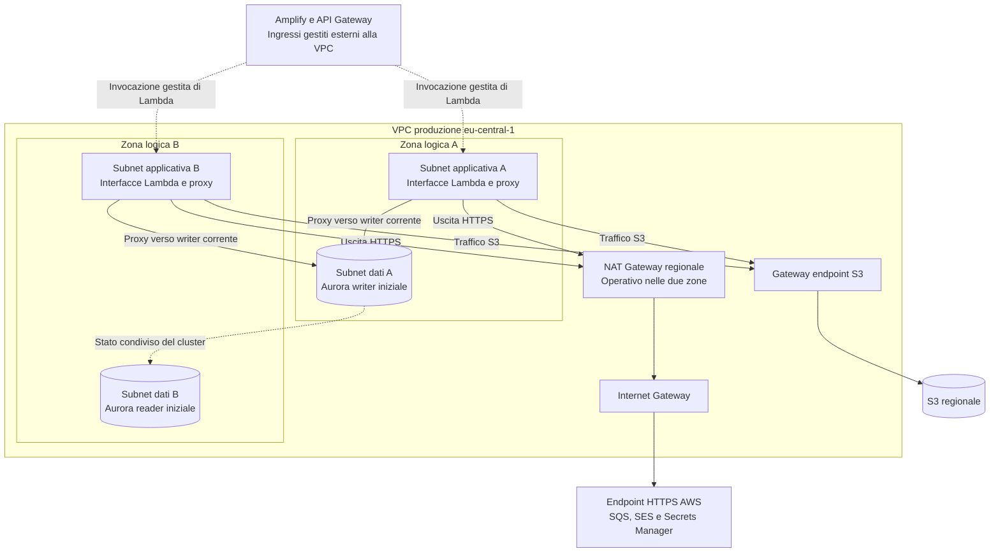

# Domora — Regione e rete

Questa parte colloca nella rete i componenti scelti per [accesso e API](08-accesso-frontend-e-api.md), [persistenza](09-persistenza-e-ricerca.md) e [media e worker](10-media-worker-e-notifiche.md). Distingue accesso pubblico, connessioni private e traffico in uscita.

**Stato:** scelte di base motivate; fonti AWS consultate il **7 ottobre 2026**. Indirizzi e percorsi sono una progettazione locale, non risorse create. Quote e disponibilità effettiva delle zone richiedono verifica nell'account prima di un'eventuale implementazione.

## 1. Regione operativa e alternative

Si sceglie **Europe (Frankfurt), `eu-central-1`**, per le risorse regionali: API, Cognito, Lambda, Aurora, proxy, bucket S3, code, SES, scansione malware, scheduler e backup. La base mantiene una sola regione operativa e due zone di disponibilità per la VPC.

| Candidata | Valutazione |
| --- | --- |
| Francoforte, `eu-central-1` | Scelta del referente; compatibilità documentata dei componenti e collocazione europea |
| Irlanda, `eu-west-1` | Alternativa compatibile inizialmente proposta; sostituita dalla preferenza del referente per Francoforte |
| Milano, `eu-south-1` | Alternativa da valutare se il pubblico o un requisito di collocazione si concentrasse sull'Italia; non è il perimetro geografico attualmente deciso |

**Motivazione:** serve una regione concreta per rete, versioni, quote e costi. La scelta segue la preferenza esplicita del referente per Francoforte, verificata come candidata compatibile, senza attribuirle primati di prezzo o latenza non misurati. La latenza verso i paesi effettivamente serviti andrà verificata; scegliere la regione non decide quali paesi o lingue supporti il prodotto.

### Riscontri regionali rilevanti

| Componente | Riscontro nella documentazione |
| --- | --- |
| Amplify | Francoforte presente fra gli endpoint regionali; supporto del framework da verificare con la versione adottata |
| Aurora PostgreSQL Serverless v2 | Disponibile in Francoforte con versioni supportate elencate da AWS |
| RDS Proxy | Disponibile in Francoforte con matrice di compatibilità del motore |
| SES | Endpoint API HTTPS in Francoforte; quote di invio e accesso produzione dipendono dall'account |
| Malware Protection for S3 | Disponibilità nelle regioni commerciali GuardDuty, inclusa Francoforte |
| AWS Backup per S3 | Supporto regionale indicato per Francoforte |

Fonti: [Amplify](https://docs.aws.amazon.com/general/latest/gr/amplify.html), [Aurora Serverless v2](https://docs.aws.amazon.com/AmazonRDS/latest/AuroraUserGuide/Concepts.Aurora_Fea_Regions_DB-eng.Feature.ServerlessV2.html), [RDS Proxy](https://docs.aws.amazon.com/AmazonRDS/latest/AuroraUserGuide/Concepts.Aurora_Fea_Regions_DB-eng.Feature.RDS_Proxy.html), [SES](https://docs.aws.amazon.com/general/latest/gr/ses.html), [disponibilità della scansione S3](https://docs.aws.amazon.com/guardduty/latest/ug/doc-history.html), [AWS Backup](https://docs.aws.amazon.com/aws-backup/latest/devguide/backup-feature-availability.html).

Questi riscontri non sono un test dell'account né dimostrano la disponibilità complessiva del portale. Prima del provisioning si verifica anche la combinazione di versioni, zone, quote e funzionalità; una tabella di endpoint non garantisce da sola ogni modalità del servizio.

CloudFront distribuisce contenuti attraverso una rete globale; non è una risorsa dentro una delle due zone della VPC. Anche gestione di certificati e policy globali può richiedere una regione di controllo differente. La collocazione del dato autorevole in Francoforte non significa che ogni copia distribuita o email rimanga materialmente lì. I contenuti distribuiti da CDN sono soltanto quelli dichiarati pubblici; la valutazione dei dati personali e dei fornitori seguirà nella sicurezza.

## 2. Confini: cosa è nella VPC e cosa no

Una **VPC** è la rete privata AWS del progetto. Una **subnet** è una sua porzione collocata in una singola zona; una **zona di disponibilità** è un dominio di guasto distinto all'interno della stessa regione.

| Categoria | Collocazione |
| --- | --- |
| Aurora writer e reader | Subnet dati private in due zone differenti |
| RDS Proxy | Interfacce private nella VPC, con subnet su due zone |
| Lambda API, dispatcher e worker che accedono ad Aurora | Configurate per accedere alla VPC tramite subnet applicative private |
| Amplify e compute Next.js gestito | Hosting del provider, esterno alla VPC del progetto; richiama API HTTPS |
| API Gateway, Cognito, SQS, SES, EventBridge e Scheduler | Servizi gestiti regionali, non server collocati nelle subnet del progetto |
| S3, scansione gestita e AWS Backup | Servizi gestiti, non risorse compute dentro le subnet |
| CloudFront e WAF del frontend/media | Percorsi di distribuzione e protezione esterni alla VPC |

Non si crea una subnet pubblica per ospitare API Gateway. Il suo ingresso pubblico richiama Lambda tramite l'integrazione AWS, senza una connessione in ingresso verso l'indirizzo privato della funzione. Analogamente Scheduler, EventBridge e il servizio di polling SQS invocano le Lambda tramite il piano gestito.

Il collegamento VPC permette al codice Lambda di raggiungere il proxy; non trasforma la funzione in un server pubblico né le assegna automaticamente Internet. [Accesso VPC delle Lambda](https://docs.aws.amazon.com/lambda/latest/dg/configuration-vpc.html).

**Motivazione:** mettere ogni logo AWS dentro la VPC confonderebbe accessi gestiti e traffico IP. La rete privata protegge le risorse che ne hanno bisogno, mentre autenticazione, IAM e policy dei servizi proteggono gli ingressi e le operazioni gestite.

## 3. Subnet e indirizzamento

La VPC di produzione usa IPv4 con CIDR **`10.40.0.0/20`**, un intervallo privato con spazio per le subnet iniziali e una crescita contenuta. Gli ambienti successivi avranno VPC e intervalli separati, senza route fra loro nella base.

| Zona logica | Subnet | CIDR | Funzione |
| --- | --- | --- | --- |
| A | Applicativa A | `10.40.0.0/24` | Accesso VPC delle Lambda e interfacce del proxy |
| B | Applicativa B | `10.40.1.0/24` | Accesso VPC delle Lambda e interfacce del proxy |
| A | Dati A | `10.40.2.0/24` | Aurora writer iniziale |
| B | Dati B | `10.40.3.0/24` | Aurora reader iniziale |

Le etichette A e B sono logiche. Nell'account si selezionano due AZ effettivamente disponibili e si registrano i loro identificativi, senza assumere che il nome di zona identifichi la stessa posizione in account diversi. Dopo un failover il writer può essere nella zona B: policy e connessioni non dipendono dal suo indirizzo IP iniziale.

**Motivazione:** quattro subnet distinguono esecuzione e dati senza creare un livello di rete per ogni funzione o agenzia. Il CIDR lascia margine senza introdurre peering o collegamenti aziendali non richiesti. La capacità IP delle subnet va verificata sulle interfacce effettive, non equiparata al numero di account o di invocazioni Lambda.

La base non crea subnet pubbliche: il NAT regionale scelto nella sezione successiva non le richiede. Un futuro componente che necessitasse di subnet pubbliche richiederebbe una modifica motivata, non una risorsa predisposta automaticamente.

## 4. Uscita: NAT regionale e gateway endpoint S3

Si adotta un **NAT Gateway in modalità regionale**, collegato alla VPC e con presenza attiva nelle due zone prima dell'apertura del servizio. Il NAT consente al codice nelle subnet private di iniziare connessioni verso endpoint HTTPS pubblici senza renderlo raggiungibile direttamente dall'esterno.

La modalità regionale è distinta da un NAT zonale condiviso: usa una risorsa logica con operatività su più zone e non richiede subnet pubbliche dedicate. L'Internet Gateway della VPC e la tabella di instradamento del NAT completano il percorso di uscita; non sono un percorso in ingresso verso Aurora. [NAT regionale](https://docs.aws.amazon.com/vpc/latest/userguide/nat-gateways-regional.html).

Si sceglie la gestione automatica degli indirizzi e dell'espansione. AWS segnala che l'espansione in una zona appena utilizzata può richiedere tempo: il progetto non aspetta questa espansione dopo un guasto. Rete e interfacce applicative sono predisposte su entrambe le zone e si verifica l'operatività del NAT in ciascuna prima di dichiarare il servizio pronto. Il test di perdita di zona include anche l'uscita dei worker.

Per il traffico S3 nella stessa regione si aggiunge un **gateway endpoint**, associato alle tabelle delle subnet applicative. Evita il percorso NAT per download, promozione e preparazione dei file, senza costo aggiuntivo specifico dell'endpoint; rimangono i costi S3 e del trasferimento applicabili. [Gateway endpoint S3](https://docs.aws.amazon.com/vpc/latest/privatelink/vpc-endpoints-s3.html).

### Alternative per il traffico in uscita

| Soluzione | Vantaggio | Compromesso |
| --- | --- | --- |
| NAT regionale e gateway S3 | Un percorso HTTPS generale su due zone, senza subnet pubbliche per NAT | Costo zonale e traffico elaborato; operatività e supporto del provisioning da verificare |
| Un NAT zonale per zona, più gateway S3 | Percorsi espliciti per zona | Due NAT e subnet pubbliche dedicate; alternativa valida se la modalità regionale non è utilizzabile |
| Un solo NAT zonale condiviso | Meno risorse iniziali | Dipendenza dalla sua zona; non adottata per produzione |
| Interface endpoint per ogni servizio necessario | Percorsi privati più mirati | Supporto da verificare per ciascuna API, costi per endpoint e zona e gestione DNS aggiuntiva |
| Worker fuori VPC con un secondo servizio per i dati | Accesso ai servizi senza NAT del progetto | Richiederebbe nuove chiamate interne o duplicazione della logica di accesso Aurora |

**Motivazione della scelta:** le Lambda devono già accedere al database e a più API di servizi AWS. Si mantiene un percorso in uscita unico, evitando di creare endpoint privati per ogni servizio senza confronto economico. Il traffico file, potenzialmente più voluminoso, usa il gateway S3. Il NAT regionale semplifica la configurazione, ma non implica che due zone costino come una sola. [Prezzi e componenti di costo VPC](https://aws.amazon.com/vpc/pricing/).

Nella base non si aggiungono interface endpoint. La stima dei costi potrà motivarne alcuni se vantaggiosi o necessari ai controlli di sicurezza; ciascuno dovrà coprire l'API realmente usata. Un endpoint SMTP, per esempio, non va dato per equivalente alle API HTTPS SES scelte per gli avvisi.

## 5. Route e DNS

| Tabella | Route previste |
| --- | --- |
| Applicativa A e B | Rete VPC locale; prefix list S3 verso gateway endpoint; `0.0.0.0/0` verso NAT regionale |
| Dati A e B | Rete VPC locale; nessuna route predefinita verso Internet o NAT |
| NAT regionale | Route di uscita verso Internet Gateway, secondo la configurazione gestita del servizio |

La route S3 più specifica prevale sulla route predefinita. Il traffico Lambda–proxy–Aurora rimane nella rete privata, senza NAT. La replica e i backup gestiti di Aurora non richiedono di trasformare la subnet dati in una subnet con uscita generale.

Si abilita il DNS della VPC per risolvere endpoint del proxy e dei servizi. L'applicazione usa nomi dei servizi, non indirizzi delle istanze. Non si crea una zona DNS privata personalizzata senza un nome interno che la richieda.

**Motivazione:** subnet dati senza route esterna e accesso tramite proxy rendono i percorsi minimi riconoscibili. Il routing stabilisce dove può passare il traffico; non sostituisce i permessi dell'identità che esegue l'operazione.

## 6. Security group e permessi di rete

I **security group** controllano le connessioni delle risorse private. Si usano gruppi per responsabilità, con riferimenti fra gruppi invece di intervalli troppo ampi.

| Gruppo | Ingresso | Uscita necessaria |
| --- | --- | --- |
| Lambda API | Nessuna porta applicativa in ingresso | TCP 5432 verso gruppo proxy; HTTPS 443 verso S3 e endpoint necessari |
| Lambda dispatcher e worker | Nessuna porta applicativa in ingresso | TCP 5432 verso gruppo proxy; HTTPS 443 verso S3 e API necessarie |
| Job CodeBuild di migrazione | Nessuna porta applicativa in ingresso | TCP 5432 verso gruppo proxy; HTTPS 443 per artefatti e servizi necessari |
| Proxy | TCP 5432 dai gruppi Lambda autorizzati e dal gruppo del job di migrazione | TCP 5432 verso gruppo database |
| Database | TCP 5432 dal gruppo proxy | Risposte alle connessioni consentite; nessuna uscita applicativa generale |

Le regole sono stateful: consentono il ritorno delle connessioni ammesse. Nessuna regola espone PostgreSQL a `0.0.0.0/0`, e le istanze Aurora non hanno accesso pubblico. Le operazioni di manutenzione saranno eseguite da un ruolo e un percorso controllati, senza aprire il database all'indirizzo del computer personale.

Il [job di migrazione](14-ambienti-e-rilascio.md) usa le subnet applicative e un gruppo dedicato, con ruolo SQL distinto. È un esecutore temporaneo nella VPC; non aggiunge accesso diretto ad Aurora dal runner esterno o dal computer personale.

Il traffico HTTPS generale dei gruppi Lambda verso il NAT non è un filtro per nome del servizio: la rete consente il percorso, mentre IAM, TLS, policy e codice limitano l'uso. Non si dichiara un controllo completo dell'esfiltrazione ottenuto solo con NAT e security group. Una necessità di filtraggio più restrittivo richiederebbe endpoint o controlli aggiuntivi motivati nella sicurezza.

Le Network ACL delle subnet mantengono la configurazione iniziale semplice; non duplicano regole applicative complesse. Controllo primario fra Lambda, proxy e database rimane nei security group. [Prerequisiti di rete RDS Proxy](https://docs.aws.amazon.com/AmazonRDS/latest/AuroraUserGuide/rds-proxy-network-prereqs.html).

## 7. Percorsi dei servizi gestiti

| Operazione | Percorso | Conseguenza |
| --- | --- | --- |
| Browser o SSR richiama una API | HTTPS verso ingresso API Gateway regionale | Nessun ingresso IP verso la subnet Lambda |
| API legge o scrive i dati | Lambda → proxy → Aurora, TCP 5432 privato | Nessun passaggio NAT |
| Browser carica un file | Browser → S3 con POST firmato | Non passa dal NAT del progetto |
| Worker legge o prepara un file | Subnet applicativa → gateway S3 | Non passa dal NAT |
| Visitatore scarica una variante | Browser → CloudFront → S3 tramite OAC | Non passa dal NAT; firma verificata dalla distribuzione |
| Dispatcher invia messaggi SQS | Codice Lambda → endpoint SQS HTTPS tramite NAT | Uscita necessaria nel progetto corrente |
| Lambda è invocata da una coda | Servizio Lambda legge SQS e invoca il worker | Il polling gestito non richiede un worker che apra una porta in ingresso |
| Worker invia email | Codice Lambda → endpoint API SES HTTPS tramite NAT | Distinto dalla consegna email ai destinatari |
| Worker legge un segreto | Codice Lambda → Secrets Manager HTTPS tramite NAT | Le credenziali non vengono dal browser |
| Scanner pubblica esiti, SES invia feedback e Scheduler avvia dispatcher | Integrazioni AWS gestite | Non transitano nel NAT del codice applicativo |

Se il codice effettua una chiamata aggiuntiva a Cognito, CloudWatch o un altro servizio, si documenta il percorso HTTPS necessario. Il logging standard del runtime Lambda non va automaticamente confuso con una chiamata SDK eseguita dal codice. [Polling SQS delle Lambda](https://docs.aws.amazon.com/lambda/latest/dg/with-sqs.html).

La bucket policy non impone indiscriminatamente il gateway S3 a tutte le operazioni: deve mantenere validi upload firmati dal browser, accesso CloudFront, scansione e backup. La policy dell'endpoint limita l'accesso delle risorse VPC ai bucket necessari senza pretendere che tutti gli altri percorsi usino quell'endpoint.

**Motivazione:** la stessa risorsa S3 è raggiunta da soggetti diversi. Un vincolo di rete generico che sembri più restrittivo può interrompere i flussi autorizzati; policy e percorsi vanno progettati insieme.

## 8. DNS pubblico e certificati

Si prevede una zona pubblica Route 53 per il dominio futuro, con nomi distinti per frontend, API e media. Il dominio non è acquistato o scelto in questa fase. Route 53 gestisce i record, non la disponibilità del database o la protezione del contenuto.

Il frontend usa il dominio personalizzato gestito dall'hosting. Le API usano un dominio personalizzato regionale con certificato ACM nella regione operativa. La distribuzione CloudFront media usa il proprio certificato ACM richiesto nella regione di controllo `us-east-1`. Questa eccezione di controllo non crea una seconda regione applicativa o una replica dei dati transazionali. [Domini API Gateway](https://docs.aws.amazon.com/apigateway/latest/developerguide/how-to-custom-domains.html), [Certificati CloudFront](https://docs.aws.amazon.com/AmazonCloudFront/latest/DeveloperGuide/cnames-and-https-requirements.html).

**Motivazione:** nomi separati rendono chiari destinatari, certificati e CORS. Non si aggiunge un bilanciatore pubblico davanti alle Lambda. L'endpoint API gestito rimane protetto dallo stesso stage WAF; eventuale disabilitazione del nome predefinito e dettagli del dominio saranno verificati nel rilascio.

## 9. Diagramma della rete

Le frecce verso il writer rappresentano la connessione attraverso il proxy, non un permesso di accesso diretto delle Lambda. Dopo un failover il proxy raggiunge il nuovo writer. Le subnet applicative ospitano interfacce di accesso, non server Lambda amministrati dal progetto. Il NAT regionale è rappresentato a livello VPC e non dentro una subnet pubblica.

## 10. Guasti, costi e verifiche

| Caso | Comportamento o verifica |
| --- | --- |
| Perdita della zona del writer | Promozione del reader e riconnessione tramite proxy, senza cambiare IP nel codice |
| Perdita di una zona applicativa | Accesso VPC e uscita verificati nella zona restante; nessuna dipendenza da un NAT zonale condiviso |
| NAT non operativo | Chiamate SDK esterne possono fallire; dati privati e percorso S3 non dipendono dalla sua route |
| Gateway endpoint o policy S3 errati | Upload browser può funzionare mentre worker fallisce: controlli distinti sui percorsi |
| DNS o certificato errati | Servizio pubblico indisponibile anche con database sano |
| Perdita regionale | Nessun percorso alternativo automatico; rischio residuo già dichiarato |

Il NAT comporta costo per presenza zonale, dati elaborati e indirizzi pubblici secondo il listino applicabile. CloudFront, S3 e traffico Internet sono contabilizzati separatamente: i 90 GB giornalieri di immagini ai visitatori non diventano automaticamente 90 GB elaborati dal NAT.

Prima di un'implementazione occorre verificare operatività NAT su entrambe le zone, route, DNS, policy, accessi vietati al database, spazio IP e quote. La prova di guasto deve includere chiamate private, S3, consegna outbox e invio SES. Migrazioni fra NAT zonale e regionale possono interrompere connessioni: non si eseguono come modifica trasparente del servizio.

La disponibilità del 99,9% e l'RTO locale restano obiettivi da misurare sull'intero percorso. Rete ridondata e servizi gestiti li rendono progettati, non automaticamente ottenuti. La [sicurezza](12-sicurezza-e-protezione-dati.md) completa sessioni, ruoli, policy e dati personali; il [piano operativo](13-osservabilita-e-piano-operativo.md) definisce le verifiche di recupero.
