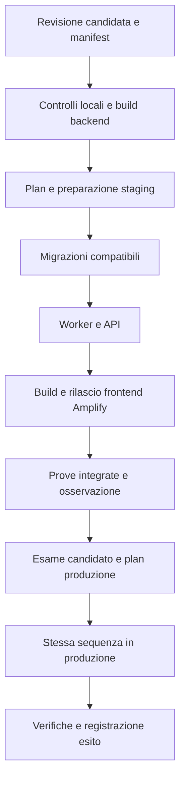

# Domora — Ambienti e rilascio

Questa parte definisce come preparare, verificare e distribuire le modifiche del progetto. Riprende [rete](11-regione-e-rete.md), [sicurezza](12-sicurezza-e-protezione-dati.md) e [piano operativo](13-osservabilita-e-piano-operativo.md).

**Stato:** progettazione documentale. Non sono creati account, nuove repository, pipeline o risorse. La documentazione viene versionata nel branch locale `domora-nuova-versione` della repository esistente; il percorso di rilascio applicativo qui descritto rimane una futura implementazione. Fonti tecniche consultate il **7 ottobre 2026**.

## 1. Ambienti necessari

| Ambiente | Scopo | Dati e caratteristiche |
| --- | --- | --- |
| Locale | Sviluppo, verifiche rapide e studio delle migrazioni | PostgreSQL e fixture sintetiche; integrazioni simulate dove necessario |
| Staging | Collaudo delle integrazioni AWS e del rilascio completo | Account AWS dedicato, risorse proprie, dati sintetici e destinatari email controllati |
| Produzione prevista | Erogazione del servizio nel progetto completo | Account AWS distinto, controlli e capacità coerenti con i requisiti |

La regione dei due ambienti cloud è **Francoforte, eu-central-1**. Non si introduce un ambiente cloud `dev` permanente: sviluppo locale e staging coprono le esigenze iniziali senza mantenere una terza copia dei servizi. Ambienti temporanei per ogni proposta di modifica non fanno parte della base.

Si adottano due account AWS distinti per staging e produzione, senza progettare una landing zone aziendale completa. Ruoli, credenziali temporanee e risorse restano separati. Nomi e tag identificano progetto, ambiente, componente e responsabile, ma non sostituiscono i permessi.

**Motivazione:** un errore di collaudo deve avere un confine diverso dal servizio operativo. La separazione per account aggiunge configurazione, ma evita di affidare l'isolamento soltanto a prefissi nello stesso account. Per un'eventuale dimostrazione scolastica si può realizzare solo staging: in quel caso la produzione resta un progetto, con costi e requisiti dichiarati separatamente.

## 2. Somiglianze e differenze dichiarate

Staging usa gli stessi moduli infrastrutturali e percorsi applicativi della produzione: Cognito con MFA, hosting SSR, API REST/WAF, Aurora e proxy, upload controllato, code, worker, notifiche e monitoraggio. Restano due zone, writer e reader separati e percorsi NAT/S3 equivalenti, per provare anche failover e rete. Non si sostituisce Aurora con un database locale durante queste prove.

| Aspetto | Regola |
| --- | --- |
| Capacità Aurora e concorrenza Lambda | Valori inferiori ammessi in staging; dichiarati nel verbale della prova |
| Versioni di runtime, PostgreSQL e dipendenze | Allineate fra ambienti per la versione candidata |
| Cognito, bucket, database, code, segreti e chiavi media | Risorse distinte; nessuna credenziale o identità riutilizzata fra ambienti |
| Email | Staging invia soltanto a recapiti di verifica autorizzati; quote e abilitazione SES verificate separatamente |
| Domini, callback OAuth e CORS | Valori specifici; nessuna callback di sviluppo ammessa nel client di produzione |
| Log, backup e controlli | Stesse regole di protezione; eventuali differenze di frequenza annotate |
| Dati di carico | Generati, senza importare messaggi o documenti reali dalla produzione |

Una prova funzionale su capacità ridotta dimostra il percorso, non il target di 200 richieste/s. Per una prova prestazionale o di recupero rappresentativa si adeguano temporaneamente capacità e volumi, annotando costo e differenze. Staging non assume lo SLO della produzione; la sua indisponibilità durante un esperimento è prevista e riconoscibile.

Lo sviluppo locale verifica le regole con PostgreSQL, ma non riproduce fedelmente IAM, Cognito, scanner, CloudFront o failover Aurora. Il collaudo cloud completa queste verifiche.

## 3. Infrastruttura riproducibile con Terraform

Terraform descriverà risorse, collegamenti, permessi e configurazioni per ambiente. Si preferiscono pochi moduli legati alle responsabilità: rete, identità/ingressi, dati, applicazione/media e operatività. I due ambienti richiamano gli stessi moduli con parametri distinti; non si copiano interi insiemi di file per modificarli separatamente.

Si prevede **uno state infrastrutturale per ambiente**, con radici di configurazione distinte e account atteso verificato prima di plan/apply. I workspace Terraform da soli non sono il confine di sicurezza. Versioni di Terraform/provider e lock file delle dipendenze vengono fissati nella futura repository e aggiornati con collaudo.

Il backend usa S3 privato, cifrato e versionato, in ciascun account, distinto dai bucket del portale. Si abilita il lock nativo S3 con `use_lockfile`, scegliendo una versione Terraform compatibile; non si aggiunge DynamoDB soltanto per il locking. State e plan possono contenere dati sensibili e sono accessibili ai soli ruoli di infrastruttura. [Backend S3 e locking — HashiCorp](https://developer.hashicorp.com/terraform/language/backend/s3).

Il backend e il primo ruolo di accesso richiedono un **bootstrap** documentato prima del primo utilizzo: non si assume che lo state remoto crei se stesso. Si conservano configurazione, procedura e riferimenti delle risorse iniziali, proteggendole dal teardown ordinario. Il recupero dello state è un intervento distinto dal ripristino dei dati applicativi.

Non si inseriscono password o chiavi private nei file di configurazione. Terraform gestisce le risorse Secrets Manager e i riferimenti; generazione e rotazione dei valori seguono il percorso protetto. Dichiarare un output `sensitive` non elimina il valore dallo state.

Le modifiche hanno un solo proprietario tecnico: Terraform gestisce anche versioni e alias Lambda attraverso gli identificativi degli artefatti. La pipeline non modifica gli stessi alias con comandi indipendenti. Migrazioni SQL, dati applicativi e job di build Amplify restano fuori dallo state infrastrutturale.

**Motivazione:** una sola modalità ordinaria di modifica evita divergenze fra configurazione dichiarata e risorse effettive. Un cambiamento di emergenza dalla console viene registrato e riconciliato prima del rilascio successivo, senza applicare automaticamente un plan che potrebbe annullarlo.

## 4. Pipeline futura e identità di rilascio

Si mantiene **GitHub Actions** come scelta per la futura pipeline, già presente nel materiale di riferimento. Coordina verifiche, Terraform, migrazioni e hosting; non si aggiungono CodePipeline o un orchestratore applicativo per il rilascio.

L'accesso AWS avviene tramite OIDC e ruoli temporanei separati per ambiente e responsabilità. La trust policy limita repository, contesto di rilascio e audience; codice di una proposta esterna non ottiene credenziali di produzione. Le restrizioni del contesto GitHub e le autorizzazioni AWS devono essere verificate insieme. [Federazione OIDC e GitHub — AWS IAM](https://docs.aws.amazon.com/IAM/latest/UserGuide/id_roles_create_for-idp_oidc.html).

Il percorso di produzione richiede un responsabile che esamini un candidato già collaudato e il plan effettivo dell'ambiente. È una regola del rilascio futuro, non una richiesta di approvazione per scrivere questi documenti. Si verifica prima dell'implementazione che il piano GitHub scelto supporti le protezioni necessarie.

| Identità | Permesso essenziale |
| --- | --- |
| Verifica | Esegue controlli senza accesso ai dati di produzione |
| Infrastruttura | Plan/apply dell'ambiente; permessi IAM necessari delimitati, incluso PassRole |
| Rilascio applicativo | Gestisce gli artefatti e avvia solo job e progetti previsti |
| Esecutore migrazioni | Modifica lo schema applicativo con ruolo SQL dedicato; non usa l'utenza normale delle API |

La pipeline serializza i rilasci per ambiente. Il lock Terraform protegge lo state, ma non sostituisce il blocco dell'intera sequenza, che comprende SQL e frontend. Un secondo rilascio non parte finché il primo non ha un esito registrato; un'emergenza interrompe il flusso in modo esplicito.

## 5. Versione candidata e artefatti

Ogni rilascio ha un identificativo e un manifest: revisione sorgente, dipendenze fissate, checksum dei pacchetti Lambda, migrazioni richieste, configurazione non segreta, versioni precedenti, prove ed esiti. Il commit locale dei Markdown non costituisce un rilascio applicativo; il manifest qui descritto verrà attuato in una futura implementazione.

I pacchetti backend vengono costruiti una volta e promossi conservando checksum e provenienza. Gli artefatti sono privati, immutabili per identificativo e conservati con le versioni necessarie al ritorno precedente. Una proposta iniziale è almeno gli ultimi cinque rilasci e trenta giorni; il materiale di un incidente resta soggetto alla conservazione delle evidenze.

Il frontend Next.js usa **Amplify collegato alla futura repository**, con applicazioni distinte nei due account. Amplify non supporta il normale upload manuale di un archivio per applicazioni SSR: non si promette di trasferire un semplice ZIP come per un sito statico. [Limite dei deploy manuali SSR](https://docs.aws.amazon.com/amplify/latest/userguide/manual-deploys.html).

Per il rilascio coordinato si disabilita l'autobuild indipendente: la pipeline avvia il job del candidato dopo la preparazione del backend e verifica revisione effettiva ed esito del job. Modalità di collegamento, selezione della revisione e permessi saranno collaudati prima dell'uso. Le build tra ambienti possono differire per URL API e configurazioni pubbliche: si promuove la stessa revisione sorgente, non si afferma che i file frontend siano identici. [Workflow per branch — Amplify](https://docs.aws.amazon.com/amplify/latest/userguide/multi-environments.html), [Avvio dei job Amplify](https://docs.aws.amazon.com/cli/latest/reference/amplify/start-job.html).

Le variabili pubbliche contengono soltanto identificativi e URL utilizzabili dal browser. Nessuna password, chiave di firma media o credenziale AWS entra nel bundle; il processo SSR riceve soltanto i permessi necessari, senza accesso SQL diretto.

## 6. Migrazioni senza esporre il database

Si aggiunge **un progetto CodeBuild per ambiente**, eseguito soltanto per migrazioni e verifiche SQL controllate. È un esecutore temporaneo, senza VM amministrata o bastion permanente. Si collega dalle subnet applicative al proxy con un security group dedicato e poi ad Aurora. Non si apre il database al runner GitHub o al computer personale.

CodeBuild richiede configurazione VPC e permessi di rete; l'eventuale uscita HTTPS usa il NAT già previsto e l'accesso S3 usa il gateway endpoint. Artefatti e comando di migrazione sono fissati dal manifest; il progetto di produzione non accetta comandi SQL arbitrari da input non controllati. [CodeBuild nella VPC](https://docs.aws.amazon.com/codebuild/latest/userguide/vpc-support.html).

Il ruolo SQL può operare sullo schema Domora e sul registro delle migrazioni, senza diventare superuser del cluster. Autenticazione, ruolo proxy e permessi IAM sono distinti dalle API. Tool e operazioni DDL devono essere provati attraverso RDS Proxy, compresi pinning, lock e timeout; non si assume che il proxy renda innocua una modifica pesante.

Le migrazioni hanno ordine, identificativo, checksum ed esito persistente. Un lock applicativo nel database impedisce esecuzioni concorrenti. Le modifiche transazionali vengono confermate insieme al loro registro; per operazioni non transazionali si registra il progresso e si riconcilia l'esito prima di riprendere. Un timeout non autorizza a ripetere alla cieca.

Si adotta il percorso **espandere → adeguare → rimuovere**:

1. Aggiungere strutture compatibili con il codice attuale, preferendo campi opzionali e indici preparati senza blocchi prolungati dove possibile.
2. Distribuire codice che funziona durante la transizione; convertire i dati per gruppi limitati e riprendibili.
3. Verificare completamento e utilizzo della nuova struttura.
4. Rimuovere la struttura precedente in un rilascio successivo, quando non serve più al codice ripristinabile o al lavoro pendente.

**Motivazione:** frontend già aperti, versioni Lambda e messaggi in coda possono attraversare il cambio di versione. I job conservano un formato riconoscibile; i nuovi consumer leggono anche gli eventi ancora pendenti. La rimozione di un formato richiede verifica di code, DLQ, outbox e percorsi di replay, non soltanto l'attesa di qualche ora.

Le migrazioni impostano limiti di attesa dei lock e di esecuzione, verificati sui volumi attesi. Prima di cambiamenti rischiosi si controllano punto recuperabile e prova di restore. Un backup non sostituisce compatibilità o analisi del blocco: se una trasformazione richiede manutenzione, si dichiara la finestra e l'interruzione conta nello SLO.

## 7. Sequenza del rilascio

Per ogni ambiente si applicano prima le aggiunte infrastrutturali necessarie, poi le migrazioni compatibili. Si aggiornano consumer, API e infine frontend, mantenendo disattivate nuove funzioni finché tutte le dipendenze richieste non sono pronte. Rimozioni e modifiche incompatibili non vengono mescolate in un unico apply con la preparazione.

Le API e i worker usano versioni Lambda pubblicate e alias dell'ambiente; integrazioni API e mapping SQS puntano agli alias. Una versione Lambda non rappresenta però l'intera infrastruttura: code, permessi, dati e altri parametri hanno un ciclo proprio. [Versioni Lambda](https://docs.aws.amazon.com/lambda/latest/dg/configuration-versions.html).

La base usa il passaggio controllato dell'alias alla versione candidata, una funzione alla volta secondo le dipendenze. Non introduce distribuzioni percentuali o un secondo intero sistema parallelo: sarebbero ulteriore complessità, da motivare con un bisogno effettivo. Possono coesistere invocazioni già avviate e quelle nuove; non si promette un cambio atomico dell'intero portale.

I controlli di uscita comprendono catalogo, MFA, permessi fra agenzie, contatto e messaggio ripetuto, invalidazione delle visite, upload/scansione, firme dei download e avviso SES controllato. Si verificano anche assenza di segreti nei log e stato di outbox/DLQ. Prove di carico o recupero si ripetono quando il cambiamento riguarda i relativi rischi; non si esegue ogni prova distruttiva a ogni correzione grafica.

Si prevede un'osservazione iniziale di almeno quindici minuti con controlli sintetici, errori, latenze e lavoro pendente, confrontata con il livello precedente. È una soglia operativa iniziale, non prova di stabilità a lungo termine. Un test fallito o una misura insufficiente ha un esito dichiarato; il rilascio non viene segnato riuscito soltanto perché la build termina.

## 8. Ritorno precedente e correzione

| Problema | Azione |
| --- | --- |
| Codice API o worker difettoso, schema compatibile | Ripristinare tramite Terraform i riferimenti agli artefatti precedenti e gli alias; verificare il lavoro già avviato |
| Frontend difettoso | Rilasciare la revisione precedente con configurazione dell'ambiente e controlli SSR; mantenere API compatibili con pagine già aperte |
| Configurazione infrastrutturale errata | Preparare un plan di correzione; esaminare sostituzioni e dipendenze, senza invertire automaticamente ogni cambiamento |
| Migrazione completata con problema funzionale | Preferire correzione compatibile; non rimuovere dati per far coincidere schema e vecchio codice |
| Corruzione dei dati | Attivare la procedura di recupero e riconciliazione del piano operativo |

Un rollback dell'applicazione non ritira email già inviate, file già scaricati o scritture confermate. Ripristinare un backup per annullare un normale rilascio perderebbe anche operazioni valide successive: è una decisione di incidente, con verifica di RPO e autorizzazione operativa.

Revoche, cancellazioni accolte e correzioni di sicurezza non vengono annullate automaticamente tornando indietro. Il manifest specifica il limite di compatibilità della versione precedente; se non è più valida, si corregge in avanti o si contiene il percorso coinvolto.

Le risorse persistenti hanno protezioni da cancellazione appropriate e modifiche distruttive evidenziate nel plan. La pipeline ordinaria non esegue `destroy` di produzione. Eliminare lo state o recuperare un suo file vecchio non è un modo per annullare un apply: lo state descrive risorse, non ripristina i loro dati.

## 9. Stato e verifiche ancora necessarie

Restano da collaudare OIDC e protezioni GitHub, provider Terraform e NAT regionale, bootstrap/state, selezione delle revisioni Amplify, migrazioni attraverso proxy e capacità necessaria alle prove. Nessuna pipeline è stata eseguita e nessun account è stato modificato.

Il costo comprende entrambi gli ambienti cloud previsti, build, artefatti, state, verifiche e progetto di migrazione a consumo. Il [dimensionamento e conto economico](15-dimensionamento-e-costi.md) distingue costo del sistema progettato, collaudo e possibile dimostrazione scolastica.
