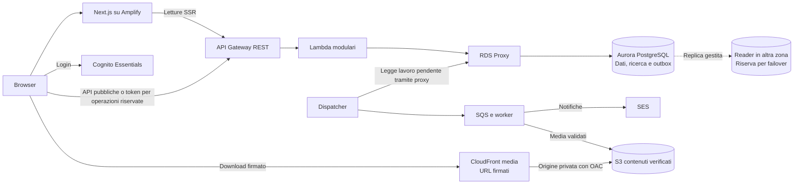

# Domora — Sintesi del progetto e base per la presentazione

Questo documento chiude la prima edizione della progettazione. Riassume la soluzione, collega le scelte ai requisiti e propone un percorso espositivo. Il dettaglio rimane nei [documenti di riferimento](README.md); la sintesi non introduce un'altra architettura.

**Stato al 7 ottobre 2026:** progetto documentato, senza applicazione implementata, risorse AWS, pipeline eseguite o benchmark. Costi e capacità sono stime; disponibilità e tempi di recupero sono obiettivi. Il percorso dei Markdown è completo per preparare la presentazione, con i punti aperti dichiarati sotto.

## 1. Il progetto in una pagina

Domora è un **portale immobiliare per più agenzie**, con catalogo pubblico di vendita e affitto. Le agenzie abilitate gestiscono immobili e annunci; gli interessati cercano offerte, salvano preferiti e aprono contatti con messaggi e richieste di visita. Il servizio termina alla gestione della richiesta, senza contratti, pagamenti o prenotazione automatica di slot.

La scelta funzionale centrale è distinguere **immobile, annuncio e contatto**. L'immobile è il bene gestito dall'agenzia, l'annuncio una specifica offerta pubblica e il contatto la pratica privata dell'interessato. Concludere un'offerta non cancella il bene e non trasferisce automaticamente richieste o preferiti a un nuovo annuncio.

La gestione professionale riguarda una sola agenzia attiva per account. Il catalogo è condiviso fra colleghi; i contatti sono accessibili al responsabile e all'operatore assegnato. L'amministratore abilita agenzie e tratta segnalazioni, senza accesso ordinario alle conversazioni private. I controlli sono nel backend, non nella sola interfaccia.

La soluzione usa frontend Next.js su Amplify, Cognito Essentials, API REST e Lambda modulari. PostgreSQL gestisce **sia le transazioni sia la ricerca**, attraverso Aurora Serverless v2 e RDS Proxy. I file sono separati in S3: scansione e preparazione precedono la disponibilità; CloudFront distribuisce le immagini verificate con firme brevi. Outbox e code separano email e lavoro recuperabile dalle operazioni confermate all'utente.

La regione applicativa è **Francoforte**, con rete privata e database su due zone. Non esiste una seconda regione di servizio. Osservabilità, backup e procedure sono progettati insieme ai rilasci; sviluppo locale, staging e produzione prevista restano distinti.

Lo scenario è di 1.000 agenzie, 100.000 account, 50.000 annunci pubblicati, 200.000 API al giorno e un picco straordinario di 200 richieste/s. Gli obiettivi principali sono letture entro un secondo e scritture entro due secondi al percentile 95, HTML entro due secondi e disponibilità mensile del 99,9% per ciascuna funzione principale.

Il conto centrale è circa **2.131 USD/mese per produzione** e **355 per staging permanente**, prima di imposte e franchigie. Il budget combinato con margine è circa **3.000 USD/mese**. Per una dimostrazione scolastica si propone solo staging, dati sintetici e una finestra limitata. Questi numeri descrivono un servizio progettato di dimensioni significative, non il costo dei Markdown o una spesa già sostenuta. [Ipotesi, tariffe e formule](15-dimensionamento-e-costi.md).

## 2. Un caso completo, dal bene alla visita

La presentazione può seguire un solo appartamento e due persone: un'operatrice dell'agenzia e un interessato. L'agenzia è già abilitata; entrambi gli account hanno completato email e MFA.

| Passaggio | Comportamento | Dove avviene la decisione |
| --- | --- | --- |
| Inserimento del bene | L'operatrice crea la scheda interna con caratteristiche e indirizzo | API verificano appartenenza e salvano in PostgreSQL |
| Caricamento di foto e PDF | Upload diretto nel bucket di ingresso; il file non è ancora pronto | Intento autorizzato, versione fissata, scanner e worker |
| Preparazione dell'offerta | L'operatrice seleziona immagini pronte, campi pubblici e prezzo; indirizzo esatto inizialmente riservato | Annuncio distinto dalla scheda interna |
| Pubblicazione | Contenuto e stato sono salvati insieme alla rappresentazione testuale | Transazione autorevole, nessun indice esterno da sincronizzare |
| Scoperta | L'interessato cerca comune, offerta e caratteristiche e apre il dettaglio | Query su writer con annuncio pubblicato e agenzia attiva |
| Contatto | Il messaggio crea o riutilizza la pratica per quella coppia utente–annuncio | Controlli e commit prima della conferma; identificativo di invio per retry |
| Presa in carico | Il responsabile assegna la pratica; l'operatrice risponde nel portale | Permessi correnti e assegnazione verificati a ogni operazione |
| Visita | Giorno e ora vengono concordati; l'agenzia accetta la richiesta | Un solo appuntamento attivo per contatto, con istante e fuso, senza calendario |
| Avviso | Un'email generica invita a consultare il portale | Outbox, dispatcher, coda notifiche e SES, con esiti monitorati |
| Uscita dal mercato | L'annuncio ritirato scompare dalle nuove query; le visite attive sono invalidate | Blocco logico immediato e aggiornamenti recuperabili in background |

Su un annuncio ritirato o concluso la conversazione esistente può continuare. Su un annuncio sospeso i nuovi messaggi sono bloccati. Se l'agenzia è disabilitata, il personale perde l'accesso professionale; l'interessato conserva il proprio storico. Ripubblicare o riabilitare non fa rivivere visite invalidate.

Il caso rende visibili tre conferme diverse: **file pronto**, **operazione salvata** e **visita accettata**. L'email non è nessuna di queste conferme: è un richiamo a uno stato già consultabile nel portale. [Pubblicazione](03-flusso-pubblicazione.md), [Contatti e visite](04-contatti-e-visite.md), [Media e notifiche](10-media-worker-e-notifiche.md).

## 3. Architettura da spiegare per responsabilità

Il diagramma riassume il percorso ordinario. Non rappresenta tutte le policy o tutti gli eventi tecnici: questi rimangono nelle parti dedicate.

Le API includono gli URL media nella risposta di catalogo/dettaglio dopo il controllo di visibilità; eventuali rinnovi sono raggruppati e ricontrollati. Il browser scarica poi i file dal percorso dedicato. Non si considera obbligatoria una nuova API distinta per ogni immagine visualizzata.

Prima di S3 verificato esiste il percorso di ingresso: **upload S3 privato → scanner → evento EventBridge → coda media → worker → contenuti verificati**. Il dispatcher gestisce il lavoro dell'outbox; gli eventi dello scanner arrivano dalla propria integrazione, non sono una seconda scrittura applicativa da sincronizzare. Worker che leggono o aggiornano dati passano anch'essi dal proxy.

WAF protegge separatamente hosting, stage REST e pool Cognito. La VPC ospita i percorsi di accesso privati a proxy e database, non tutti i servizi gestiti pubblici. NAT regionale su due zone e gateway endpoint S3 gestiscono le uscite delle risorse configurate nella rete. Il frontend SSR chiama le API e non accede direttamente al database.

| Responsabilità | Componenti | Perché servono |
| --- | --- | --- |
| Presentare e autenticare | Next.js, Amplify, Cognito | Catalogo consultabile e account personali con MFA |
| Applicare le regole | API REST, WAF e Lambda | Ingressi protetti, autorizzazioni e logica comune a browser/SSR |
| Conservare stato consistente | Aurora PostgreSQL e proxy | Vincoli, transazioni, ricerca e connessioni controllate |
| Verificare e distribuire file | S3, scanner, worker e CloudFront | Documenti privati e immagini pubblicabili soltanto dopo i controlli |
| Recuperare lavoro differito | Outbox, Scheduler, SQS/DLQ, EventBridge e SES | Retry e riconciliazione senza annullare il salvataggio principale |
| Gestire e rilasciare | CloudWatch/SNS, audit, backup, Terraform, Actions e job CodeBuild | Misurare, recuperare e cambiare il sistema in modo controllato |

Le Lambda condividono un codice organizzato per domini; non sono microservizi che si chiamano a catena per completare la stessa transazione. Non si aggiungono OpenSearch, Step Functions, container orchestrati o un cluster di raccolta della telemetria senza un requisito ulteriore.

## 4. Scelte da difendere e relativi compromessi

| Problema | Scelta | Beneficio | Compromesso |
| --- | --- | --- | --- |
| Scheda interna e offerta hanno cicli diversi | Immobile distinto dall'annuncio, campi pubblici espliciti | Nessuna pubblicazione implicita dei dati interni | Duplicazione controllata e aggiornamento pubblico esplicito |
| Dati di mille agenzie nello stesso portale | Schema comune, legami di agenzia e autorizzazioni backend | Una persistenza gestibile con isolamento verificabile | Un errore nei controlli ha impatto serio; vincoli e test indispensabili |
| Catalogo appena bloccato ancora visibile | Query autorevole e nessuna cache del contenuto applicativo | Nuove letture considerano lo stato confermato | Più accessi al writer; risposte già partite non sono ritirabili |
| Ricerca e catalogo da mantenere allineati | Filtri e full-text PostgreSQL | Un sistema in meno e aggiornamento transazionale | Carico condiviso con contatti; funzionalità di ricerca essenziali |
| Accessi professionali revocabili | Identità Cognito più stato/permessi applicativi correnti | Token valido non basta a conservare un ruolo revocato | Letture di autorizzazione e MFA per tutti gli account riservati |
| File non affidabili e documenti riservati | Ingresso separato, scanner e promozione controllata | Nessuna esposizione prima dei controlli | Attesa, costo e nessuna promessa di rilevare ogni minaccia |
| Email o job falliti dopo un salvataggio | Outbox transazionale e consumer idempotenti | Dati confermati e lavoro recuperabile | Duplicati possibili nel trasporto; esiti esterni incerti da riconciliare |
| Riabilitazione rapida dopo un blocco | Generazioni di disponibilità e annullamenti riprendibili | Le vecchie visite non tornano valide | Stato tecnico aggiuntivo, aggiornamento materiale asincrono |
| Failover senza perdita delle scritture confermate | Writer e reader in zone distinte | Riserva pronta nel guasto locale | Due compute sempre fatturati, nessun sito regionale alternativo |
| Modifiche che coinvolgono dati e codice | Migrazioni compatibili e manifest del rilascio | Transizione e ritorno precedente verificabili | Nessun rollback atomico di schema, email e file già consegnati |

La semplificazione più significativa è **eliminare la ricerca separata**. Le aggiunte rispetto alla sola catena frontend–API–database rispondono a necessità precise: controllo dei file, lavoro recuperabile, protezione dei dati e procedure operative. Non sono tutte funzionalità da mostrare nella demo, ma vanno conteggiate e giustificate nella soluzione completa.

## 5. Requisiti, scelte e prove richieste

Questa tabella è la traccia per spiegare come si intende soddisfare i requisiti. La colonna finale indica prove future, non risultati già ottenuti.

| Requisito | Risposta progettata | Evidenza necessaria | Riferimento |
| --- | --- | --- | --- |
| Isolamento fra agenzie e utenti | Controlli correnti, relazioni coerenti e ruoli SQL distinti | Accessi incrociati negati, anche dopo revoca/riassegnazione | [Permessi](02-attori-e-permessi.md), [Sicurezza](12-sicurezza-e-protezione-dati.md) |
| Blocchi coerenti con catalogo e visite | Query con visibilità, controlli transazionali e generazioni | Blocco concorrente e riabilitazione rapida senza nuove richieste o visite ripristinate | [Persistenza](09-persistenza-e-ricerca.md) |
| Letture p95 ≤ 1 s, scritture ≤ 2 s; SSR ≤ 2 s | Query indicizzate, capacità variabile, limiti compute e connessioni | Carico misto a 50/200 richieste/s con dati realistici e avvii inclusi | [Carico](07-carico-e-requisiti-qualita.md), [Dimensionamento](15-dimensionamento-e-costi.md) |
| Disponibilità 99,9% per funzione | Ridondanza locale, sonde e gestione degli incidenti | Serie mensili complete, errori reali e copertura dei controlli dichiarata | [Piano operativo](13-osservabilita-e-piano-operativo.md) |
| Guasto locale: RTO 10 min, RPO zero sulle scritture DB confermate | Failover Aurora, proxy e rete su due zone | Interruzione misurata e verifica delle operazioni con esito incerto | [Rete](11-regione-e-rete.md), [Piano operativo](13-osservabilita-e-piano-operativo.md) |
| Corruzione DB: RTO 4 h, RPO 15 min con punto identificabile | PITR e recupero su cluster separato | Restore, riconciliazione, cancellazioni e revoche prima della riapertura | [Persistenza](09-persistenza-e-ricerca.md), [Piano operativo](13-osservabilita-e-piano-operativo.md) |
| File: RTO/RPO 24 h | Versioning e backup periodico | Recupero, checksum e riconciliazione dei riferimenti/versioni | [Media](10-media-worker-e-notifiche.md) |
| Avvisi accettati entro 5 min ordinari nel 99% dei casi validi | Outbox, dispatcher, coda e SES | Tempi end-to-end, guasto fornitore e gestione degli esiti incerti | [Media e notifiche](10-media-worker-e-notifiche.md) |
| Immagini con esito entro 2 min ordinari nel 95% dei casi | Scanner e worker prima di promozione | File limite, attesa scansione e tasso di errori tecnici separato | [Media](10-media-worker-e-notifiche.md) |
| Ritardo straordinario ≤ 15 min, recupero arretrato ≤ 30 min | Consumer limitati, priorità e riconciliazione | Nuovi arrivi insieme al recupero, senza sovraccaricare il writer | [Dimensionamento](15-dimensionamento-e-costi.md) |
| Rilasci controllati | Ambienti separati, Terraform e schema compatibile | Stesso candidato, plan esaminato, prove integrate e ritorno precedente | [Rilascio](14-ambienti-e-rilascio.md) |

Una corruzione recuperata in quattro ore può superare i 43,2 minuti del budget mensile: non viene esclusa dalla disponibilità per far tornare il numero. Analogamente, perdere Francoforte non ha un RTO regionale promesso, ma il disservizio continua a contare.

## 6. Coerenza verificata e limiti residui

La revisione finale dei documenti ha riallineato i rimandi delle parti iniziali alle decisioni completate. Il controllo è documentale: non equivale a verificare il comportamento delle risorse AWS.

| Punto controllato | Regola finale coerente |
| --- | --- |
| Regione | Francoforte operativa; Irlanda solo alternativa storica e monitoraggio pubblico ausiliario |
| Ricerca | PostgreSQL sul writer; OpenSearch non adottato e vecchio target di sincronizzazione superato |
| Cache | Asset statici e varianti CDN ammessi; contenuto catalogo/privato senza cache condivisa; browser media con no-store |
| Revoca | Stato applicativo corrente; URL media già emessi con residuo massimo di cinque minuti per iniziare download |
| Annunci e visite | Conclusione definitiva, revoca sospensione verso ritirato; blocchi non fanno rivivere appuntamenti |
| Contatti | Un contatto per utente/annuncio; assegnazione privata distinta dal catalogo condiviso |
| Asincronia | Tre code funzionali con DLQ, outbox e stati riprendibili; nessuna garanzia exactly-once |
| Identità | Essentials, email/password/TOTP; token in memoria, onboarding e autenticazione recente controllati |
| Recupero | Obiettivi diversi per guasto locale, corruzione DB e file; nessuna seconda regione di servizio |
| Ambienti | Locale più due account cloud previsti; staging mantiene due zone, con capacità/frequenze dichiarate |
| Numeri | SSR già compreso nelle API; file e DB separati; MAU distinti dagli iscritti; sonde e staging nel costo |
| Versionamento | Documentazione nel branch locale domora-nuova-versione; main invariato e pipeline applicativa futura |

Restano questi punti da chiudere **prima dell'uso reale**, senza aggiungere altri capitoli obbligatori alla presente base:

| Punto aperto | Perché conta | Responsabilità/decisione successiva |
| --- | --- | --- |
| Paesi, lingue e fonte geografica | Dataset, ricerca testuale e copertura del prodotto non sono ancora fissati | Referente del prodotto sceglie primo mercato e fonte mantenibile |
| Evidenze per abilitazione agenzie e recupero MFA | Non basta conoscere un'email per verificare titolarità o organizzazione | Referente operativo definisce evidenze, accessi e tempi di gestione |
| Privacy e conservazione | Le durate sono proposte, con dati condivisi e restore da considerare | Referente dati valida finalità, ruoli e politica prima di dati reali |
| Schema fisico, runtime e policy | Modello concettuale e flussi non sono codice o configurazioni pronte | Implementazione completa vincoli, API, IAM/WAF/CSP e compatibilità provider |
| Capacità e convenienza Aurora/RDS | Listino più economico non prova throughput, latenza o failover | Collaudo comparabile e scelta collegata al budget reale |
| Quote e integrazioni dell'account | Prezzo pubblico non dimostra disponibilità di capacità o invio SES | Verifica dell'account in una futura fase autorizzata |
| Reperibilità e gestione incidenti | Un allarme senza presa in carico non soddisfa il recupero | Responsabile del servizio definisce copertura ed escalation |

Per i PDF interni si prevedono scansione e stato esplicito, ma non si è adottato uno SLO temporale distinto: il limite rimane dichiarato. Non si attribuisce automaticamente ai documenti il target delle immagini.

Non serve aggiungere adesso contratti, pagamenti, mappe, calendario o ricerca avanzata. Gli approfondimenti utili sono quelli che rendono verificabile il percorso già scelto: schema fisico, policy, prove e un budget sostenibile. Per la presentazione i punti aperti sono limiti motivati, non funzionalità da promettere.

## 7. Percorso della presentazione

Si propone una scaletta di **dieci passaggi**, comprimibile in otto unendo scenario/qualità e costi/limiti. È una base narrativa per le future slide, non un deck già creato.

| Passaggio | Messaggio da portare | Supporto consigliato |
| --- | --- | --- |
| 1. Problema e servizio | Agenzie e interessati condividono il catalogo, con lavoro privato separato | Un caso concreto e confini del prodotto |
| 2. Attori e dati | Immobile, annuncio e contatto hanno responsabilità diverse | Modello concettuale ridotto e matrice permessi essenziale |
| 3. Percorso completo | Pubblicazione, ricerca, contatto e visita sono collegati | Il caso dell'appartamento, con stati principali |
| 4. Scenario | I numeri sono scelti per dimensionare, non dichiarati come utenti già acquisiti | 1.000 agenzie, 50.000 annunci, 200 richieste/s di picco |
| 5. Qualità | Prestazioni, disponibilità e recupero hanno misure diverse | Pochi target con il loro confine |
| 6. Architettura | Ogni componente ha una responsabilità necessaria | Diagramma di questa sintesi, senza tutti i dettagli di rete |
| 7. Decisione centrale | Ricerca e stato autorevole nello stesso PostgreSQL semplificano il sistema | Prima/dopo concettuale: niente indice esterno da sincronizzare |
| 8. Errori e protezione | Un blocco o un guasto email non lascia stati ingannevoli | Visita invalidata, retry del messaggio e media non verificato |
| 9. Operatività e rilascio | Il servizio va misurato, ripristinato e aggiornato | Una procedura di recupero e schema della pipeline |
| 10. Costi e valutazione | Le garanzie progettate hanno un costo; demo e produzione sono diverse | Totale, voci principali, confronto Aurora/RDS e limiti |

Non è necessario elencare tutti i servizi nello stesso momento: prima la responsabilità, poi il nome del componente. I dettagli su subnet, timeout, ACU, retention e firme sostengono le risposte alle domande e possono restare nell'appendice della futura presentazione.

### Domande da preparare

| Domanda probabile | Risposta essenziale |
| --- | --- |
| Perché PostgreSQL invece di OpenSearch? | I filtri e il full-text richiesti sono essenziali; la stessa transazione evita la sincronizzazione. Si verifica il carico condiviso prima di aggiungere un motore. |
| Perché Aurora se RDS costa meno? | La base usa capacità variabile e riserva pronta; RDS è un candidato concreto da provare agli stessi picchi. Aurora non viene difesa come scelta più economica. |
| Perché MFA anche agli interessati? | Politica uniforme sugli account che possono acquisire ruoli; catalogo libero, con attrito dichiarato per preferiti e contatti. |
| Che cosa succede se l'email fallisce? | Il messaggio resta nel portale; il lavoro è recuperabile e l'esito incerto viene riconciliato. Non si promette consegna esattamente una volta. |
| Un'immagine sparisce subito dopo una sospensione? | Non si emettono nuove firme; quelle già emesse hanno residuo massimo di cinque minuti. Download avviati e copie ricevute non sono ritirabili. |
| Perché due zone e una sola regione? | Coprire il guasto locale mantenendo una base contenuta; l'interruzione regionale è un rischio residuo senza sito alternativo. |
| Come dimostrate il 99,9%? | È un obiettivo: sonde, richieste reali e incidenti produrranno una misura per funzione. Non ci sono misure già ottenute. |
| Quanto costa la demo? | La documentazione non crea risorse; una futura demo usa staging e durata limitata. Il costo effettivo dipende anche dai residui e dalle regole di fatturazione. |

## 8. Valutazione conclusiva e consegna

Domora ha una base funzionale definita e limitata: catalogo, gestione professionale, contatti e visite senza gestionale commerciale. La separazione fra dati pubblici e privati, immobile e annuncio, salvataggio e notifica rende il percorso spiegabile e le regole verificabili.

La complessità infrastrutturale è **più alta di quella di una semplice demo**, soprattutto per sicurezza dei file, continuità locale, backup, osservabilità e rilascio. È motivata nello scenario del servizio completo; non va presentata come l'unico modo di mostrare un portale scolastico. Costi e alternative sono parte della valutazione, compresa la possibilità di preferire RDS dopo le prove.

La prima edizione comprende **sedici documenti numerati**, indice e registro delle decisioni. I diagrammi hanno sorgenti Mermaid; questa revisione controlla collegamenti locali, blocchi Markdown e coerenza del testo, senza dichiarare una verifica grafica di tutti i diagrammi o test applicativi.

La base è pronta per costruire la presentazione. La fase successiva può scegliere durata, pubblico e livello tecnico delle slide utilizzando la scaletta; implementazione e deploy richiedono un mandato separato. Il referente ha autorizzato il versionamento della documentazione nel branch locale `domora-nuova-versione`; il materiale precedente resta su `main` e nella storia Git, senza merge o push.
